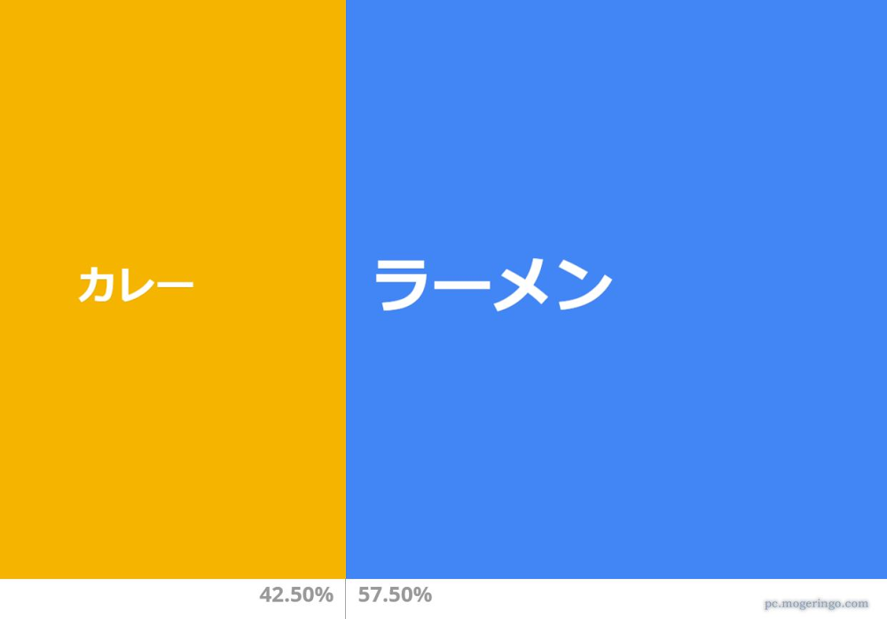
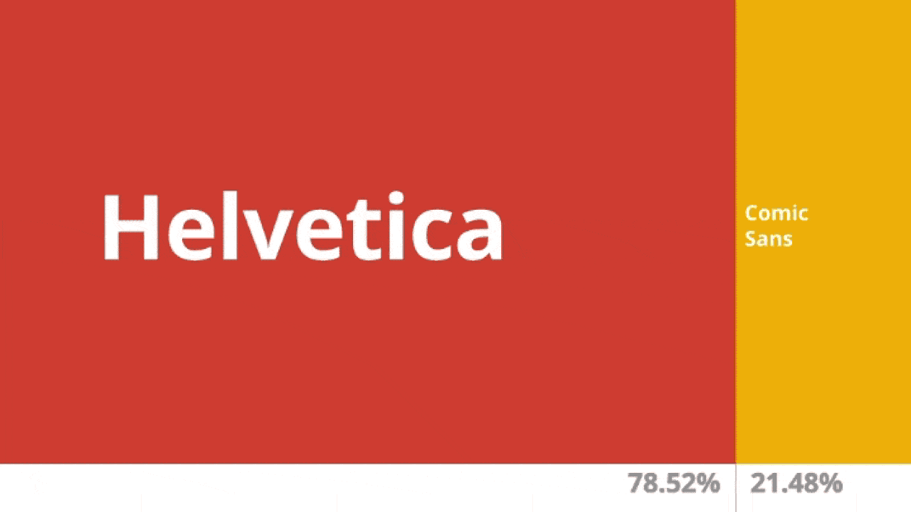
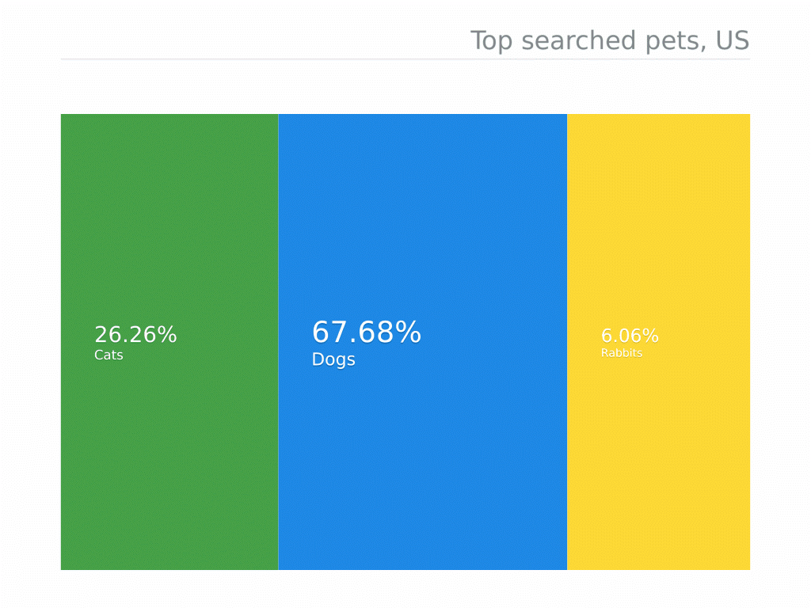
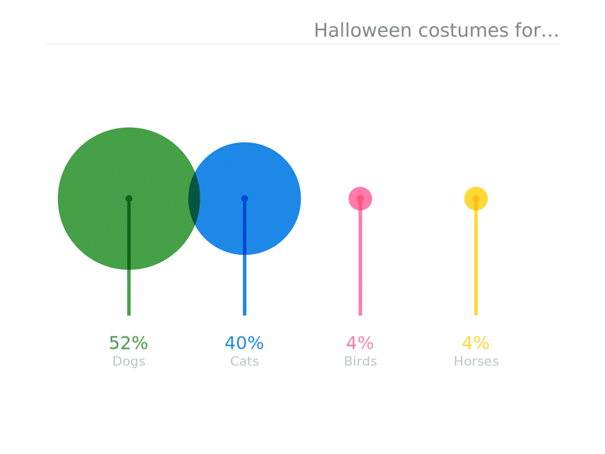
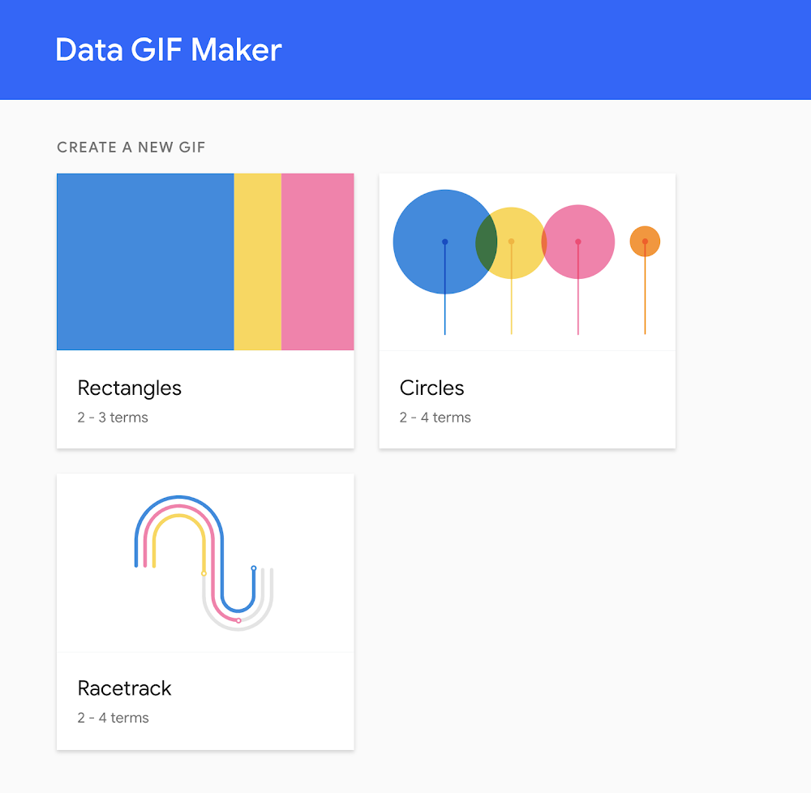
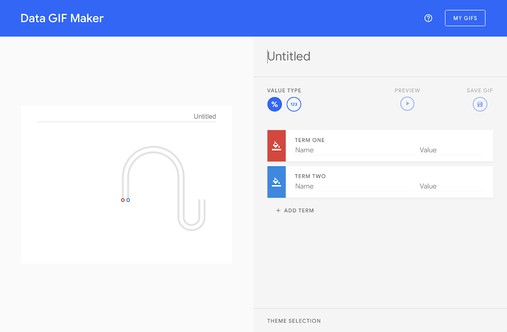

Using Data GIF Maker to compare data and tell stories

 [Google News Initiative](https://www.blog.google/outreach-initiatives/google-news-initiative/)

# Using Data GIF Maker to compare data and tell stories

 [](https://www.blog.google/outreach-initiatives/google-news-initiative/using-data-gif-maker-compare-data-and-tell-stories/mailto:?subject=Using%20Data%20GIF%20Maker%20to%20compare%20data%20and%20tell%20stories&body=Check%20out%20this%20article%20on%20the%20Keyword:%0A%0AUsing%20Data%20GIF%20Maker%20to%20compare%20data%20and%20tell%20stories%0A%0ALearn%20how%20to%20use%20the%20updated%20the%20Data%20GIF%20Maker%20with%20three%20new%20templates%20for%20creating%20data%20visual%20GIFs.%0A%0Ahttps%3A//www.blog.google/outreach-initiatives/google-news-initiative/using-data-gif-maker-compare-data-and-tell-stories/)

 

Simon Rogers

Data Editor, Google News Lab

 Published Mar 5, 2019

Beyond helping readers to compare and contrast numbers, data visualizations can be key to great storytelling. While telling stories with data might sound complicated, useful data visualizations don’t have to be complex.  In 2017, we [launched](https://www.blog.google/outreach-initiatives/google-news-initiative/make-your-own-data-gifs-our-new-too/) the [Data GIF Maker](https://datagifmaker.withgoogle.com/) tool that makes it easy for people to make simple visuals that compare two terms. Using the tool, people around the world made GIFs around everything from comparing two famous fonts to two favorite dishes.

 

A face off between curry and ramen on the Japanese website [mogeringo.com](https://pc.mogeringo.com/archives/65308)

 

Comparing Search terms around the fonts Helvetica and Comic Sans on [FastCompany.com](https://www.fastcompany.com/90127277/googles-new-data-viz-tool-makes-snappy-gifs-out-of-your-data)

While seeing how two numbers stack up against each other can be useful, we wanted to make it easier to tell even more stories. Let's say you're working on a story about pet ownership. Below, you can see three [new data GIF templates](https://datagifmaker.withgoogle.com/) in action for different examples of pet data.

## Rectangles

We’ve updated our classic template to let you add an item of comparison, taking the number up to three terms or issues.

 

The Rectangle template on top searched pets in the US based on Google Trends data.

## Racetrack

This visual is great for showing different terms speed along a racecourse layout.

 

The racetrack template used on US pet ownership data from the [AVMA](https://www.avma.org/KB/Resources/Statistics/Pages/Market-research-statistics-US-pet-ownership.aspx).

## Circles

The higher the number, the bigger the circle. This template works best when there is a contrast between the numbers—if they are too similar, then the values would be hard to see.

 

The circle template on top Halloween pet costumes in search over the past 12 months.

We’ve also made a few changes to make it even easier for you to create polished data visualizations in under a minute, with a simpler interface and quicker creation of the GIFs.

## Here's how it works:

**1. Select a template**

Think about the story you want to tell and the data you have available. Are you comparing percentages? If so, the rectangles make sense. Racetrack is great for comparing numerical lists, while circles puts an emphasis on big contrasts using size.

 

**2. Select your value type**

We typically use the tool to represent competing search interest, but it can show whatever you want it to—polling numbers, sales figures or goals scored in a season. If you want to show search interest, you can compare two terms in the [Google Trends explore tool](https://trends.google.com/trends/explore), which will give you an average number (of search interest over time) for each term. Then input those numbers in the Data GIF Maker.

 

**3. Enter data points
4. Add your text
5. Pick your colors
6. Name your data GIF
7. Save the GIF**

That’s it! You can now make a new animated data GIF. If you want to check if it’s right before you’re done, press the preview button before exporting your data GIF. While the high resolution download takes a bit  longer, it’s better quality for sharing on social media. Pro-tip: leave the window open on your desktop while it’s creating the GIFs to make the process faster.

What data visualizations will you create? Email us at [newslabtrends@google.com](https://www.blog.google/outreach-initiatives/google-news-initiative/using-data-gif-maker-compare-data-and-tell-stories/mailto:newslabtrends@google.com) or tag us on Twitter at @GoogleTrends to share what you make!

 Posted in:

- [Google News Initiative](https://www.blog.google/outreach-initiatives/google-news-initiative/)  —