Using SVG as placeholders — More Image Loading Techniques

# Using SVG as placeholders — More Image Loading Techniques

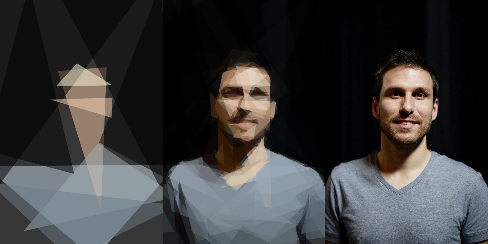

Generating SVGs from images can be used for placeholders. Keep reading!

I’m passionate about image performance optimisation and making images load fast on the web. One of the most interesting areas of exploration is placeholders: what to show when the image hasn’t loaded yet.

During the last days I have come across some loading techniques that use SVG, and I would like to describe them in this post.

In this post we will go through these topics:

- •Overview of different types of placeholders
- •SVG-based placeholders (edges, shapes and silhouettes)
- •Automating the process.

### Overview of different types of placeholders

In the past [I have written about placeholders and lazy-load of images](https://jmperezperez.com/lazy-loading-images), and also [talked about it](https://www.youtube.com/watch?v=szmVNOnkwoU). When doing lazy-loading of images it’s a good idea to think about what to render as a placeholder, since it can have a big impact in user’s perceived performance. In the past I described several options:

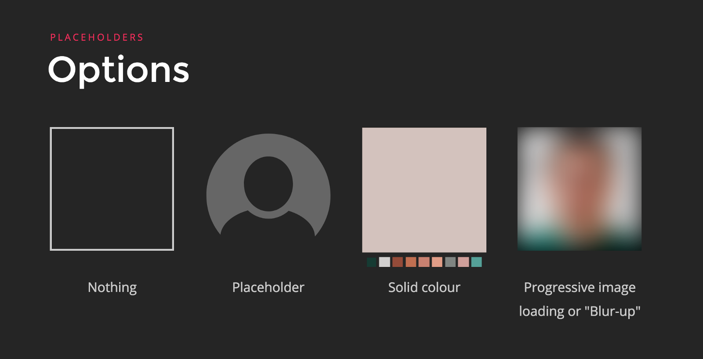

Several strategies to fill the area of an image before it loads.

- •**Keeping the space empty for the image**: In a world of responsive design, this prevents content from jumping around. Those layout changes are bad from a user’s experience point of view, but also for performance. The browser is forced to do layout re calculations every time it fetches the dimensions of an image, leaving space for it.
- •**Placeholder**: Imagine that we are displaying a user’s profile image. We might want to display a silhouette in the background. This is shown while the main image is loaded, but also when that request failed or when the user didn’t set any profile picture at all. These images are usually vector-based, and due to their small size are a good candidate to be inlined.
- •**Solid colour**: Take a colour from the image and use it as the background colour for the placeholder. This can be the dominant colour, the most vibrant… The idea is that it is based on the image you are loading and should help making the transition between no image to image loaded smoother.
- •**Blurry image**: Also called blur-up technique. You render a tiny version of the image and then transition to the full one. The initial image is tiny both in pixels and kBs. To remove artifacts the image is scaled up and blurred.

Turns out there are many other variations and lots of smart people are developing other techniques to create placeholders.

One of them is having gradients instead of solid colours. The gradients can create a more accurate preview of the final image, with very little overhead (increase in payload).

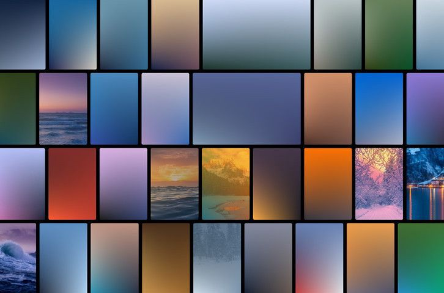

Using gradients as backgrounds. Screenshot from Gradify, which is not online anymore. Code [on GitHub](https://github.com/SilverStripers/gradify).

Another technique is using SVGs based on the image, which is getting some traction with recent experiments and hacks.

### SVG-based placeholders

We know SVGs are ideal for vector images. In most cases we want to load a bitmap one, so the question is how to vectorise an image. Some options are using edges, shapes and areas.

#### Edges

In [a previous post](https://medium.com/@jmperezperez/drawing-images-using-edge-detection-and-svg-animation-16a1a3676d3) I explained how to find out the edges of an image and create an animation. My initial goal was to try to draw regions, vectorising the image, but I didn’t know how to do it. I realised that using the edges could also be innovative and I decided to animate them creating a “drawing” effect.

[**Drawing images using edge detection and SVG animation** *Back in the days SVG was barely used and supported. Some time after we started using them as an alternative to classic…*medium.com](https://medium.com/@jmperezperez/drawing-images-using-edge-detection-and-svg-animation-16a1a3676d3)[(L)](https://medium.com/@jmperezperez/drawing-images-using-edge-detection-and-svg-animation-16a1a3676d3)

#### Shapes

SVG can also be used to draw areas from the image instead of edges/borders. In a way, we would vectorise a bitmap image to create a placeholder.

Back in the days I tried to do something similar with triangles. You can see the result in my talks [at CSSConf](https://jmperezperez.com/cssconfau16/#/45) and [Render Conf](https://jmperezperez.com/renderconf17/#/46).

The codepen above is a proof of concept of a SVG-based placeholder composed of 245 triangles. The generation of the triangles is based on [Delaunay triangulation](https://en.wikipedia.org/wiki/Delaunay_triangulation) using [Possan’s polyserver](https://github.com/possan/polyserver). As expected, the more triangles the SVG uses, the bigger the file size.

#### Primitive and SQIP, a SVG-based LQIP technique

Tobias Baldauf has been working on another Low-Quality Image Placeholder technique using SVGs called [SQIP](https://github.com/technopagan/sqip). Before digging into SQIP itself I will give an overview of [Primitive](https://github.com/fogleman/primitive), a library on which SQIP is based.

Primitive is quite fascinating and I definitely recommend you to check it out. It converts a bitmap image into a SVG composed of overlapping shapes. Its small size makes it suitable for inlining it straight into the page. One less roundtrip, and a meaningful placeholder within the initial HTML payload.

Primitive generates an image based on shapes like triangles, rectangles and circles (and a few others). In every step it adds a new one. The more steps, the resulting image looks closer to the original one. If your output is SVG it also means the size of the output code will be larger.

In order to understand how Primitive works, I ran it through a couple of images. I generated SVGs for the artwork using 10 shapes and 100 shapes:

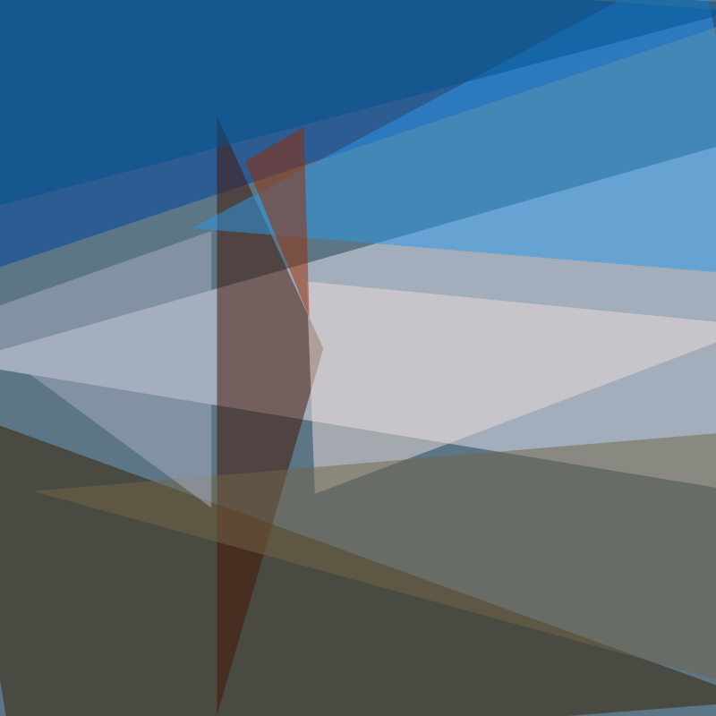

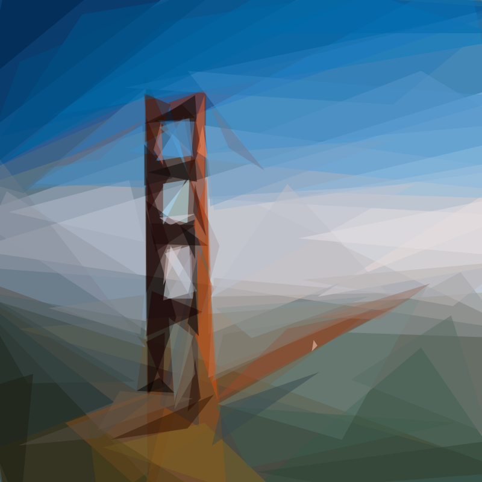

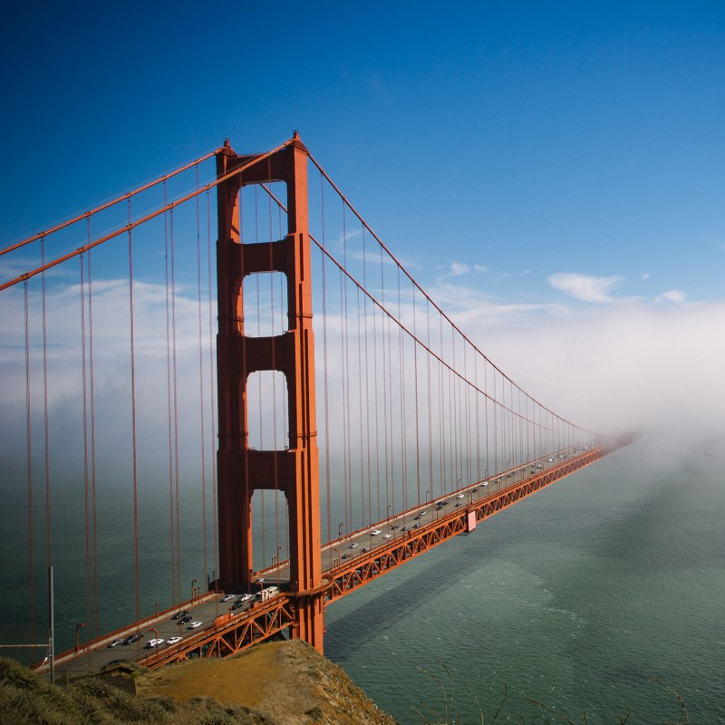

Processing [this picture](https://jmperezperez.com/assets/images/posts/svg-placeholders/pexels-photo-281184-square.jpg) using Primitive, using [10 shapes](https://jmperezperez.com/assets/images/posts/svg-placeholders/pexels-photo-281184-square-10.svg) and [100 shapes](https://jmperezperez.com/assets/images/posts/svg-placeholders/pexels-photo-281184-square-100.svg).

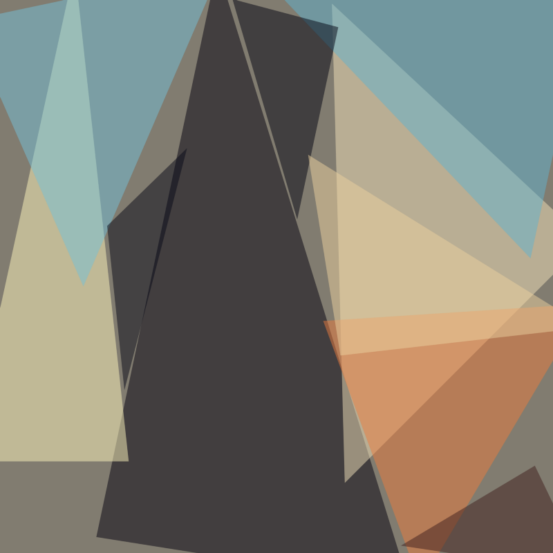

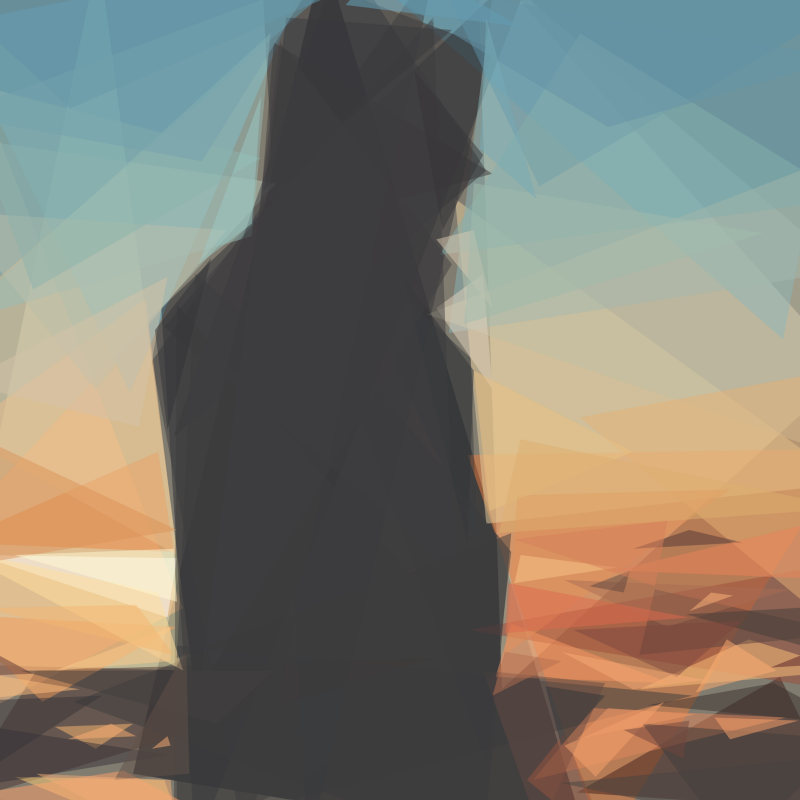

Processing [this picture](https://jmperezperez.com/assets/images/posts/svg-placeholders/pexels-photo-618463-square.jpg) using Primitive, using [10 shapes](https://jmperezperez.com/assets/images/posts/svg-placeholders/pexels-photo-618463-square-10.svg) and [100 shapes](https://jmperezperez.com/assets/images/posts/svg-placeholders/pexels-photo-618463-square-100.svg).

When using 10 shapes the images we start getting a grasp of the original image. In the context of image placeholders there is potential to use this SVG as the placeholder. Actually, the code for the SVG with 10 shapes is really small, around 1030 bytes, which goes down to ~640 bytes when passing the output through SVGO.

<svg xmlns=”http://www.w3.org/2000/svg" width=”1024" height=”1024"><path fill=”#817c70" d=”M0 0h1024v1024H0z”/><g fill-opacity=”.502"><path fill=”#03020f” d=”M178 994l580 92L402–62"/><path fill=”#f2e2ba” d=”M638 894L614 6l472 440"/><path fill=”#fff8be” d=”M-62 854h300L138–62"/><path fill=”#76c2d9" d=”M410–62L154 530–62 38"/><path fill=”#62b4cf” d=”M1086–2L498–30l484 508"/><path fill=”#010412" d=”M430–2l196 52–76 356"/><path fill=”#eb7d3f” d=”M598 594l488–32–308 520"/><path fill=”#080a18" d=”M198 418l32 304 116–448"/><path fill=”#3f201d” d=”M1086 1062l-344–52 248–148"/><path fill=”#ebd29f” d=”M630 658l-60–372 516 320"/></g></svg>

The images generated with 100 shapes are larger, as expected, weighting ~5kB after SVGO (8kB before). They have a great level of detail with a still small payload. The decision of how many triangles to use will depend largely on the type of image (eg contrast, amount of colours, complexity) and level of detail.

It would be possible to create a script similar to [cpeg-dssim](https://github.com/technopagan/cjpeg-dssim) that tweaks the amount of shapes used until a [structural similarity](https://en.wikipedia.org/wiki/Structural_similarity) threshold is met (or a maximum number of shapes in the worst case).

These resulting SVGs are great also to use as background images. Being size-constrained and vector-based they are a good candidate for hero images and large backgrounds that otherwise would show artifacts.

#### SQIP

In [Tobias’ own words](https://github.com/technopagan/sqip):

*> SQIP is an attempt to find a balance between these two extremes: it makes use of *> [*> Primitive*](https://github.com/fogleman/primitive)*>  to generate a SVG consisting of several simple shapes that approximate the main features visible inside the image, optimizes the SVG using *> [*> SVGO*](https://github.com/svg/svgo)*>  and adds a Gaussian Blur filter to it. This produces a SVG placeholder which weighs in at only ~800–1000 bytes, looks smooth on all screens and provides an visual cue of image contents to come.*

The result is similar to using a tiny placeholder image for the blur-up technique (what [Medium](https://medium.com/@jmperezperez/how-medium-does-progressive-image-loading-fd1e4dc1ee3d) and [other sites](https://medium.com/@jmperezperez/more-examples-of-progressive-image-loading-f258be9f440b) do). The difference is that instead of using a bitmap image, eg JPG or WebP, the placeholder is SVG.

If we run SQIP against the original images we’ll get this:

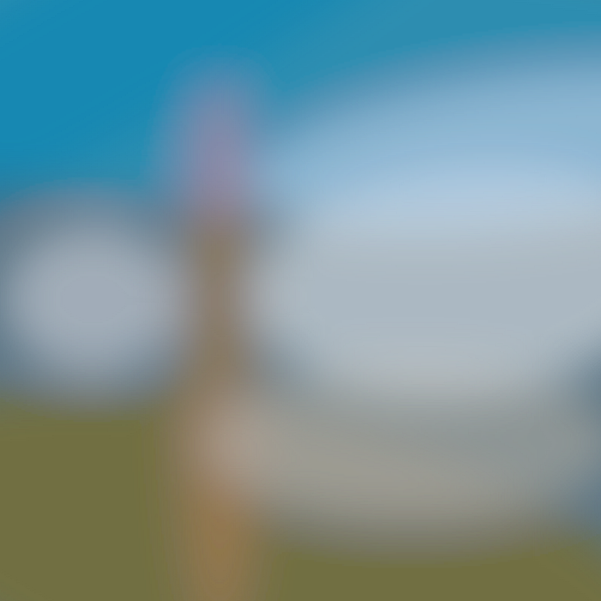

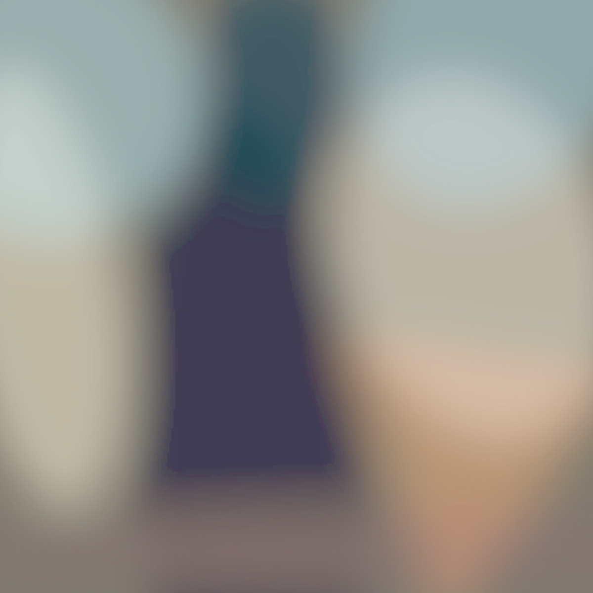

The output images using SQIP for [the first picture](https://jmperezperez.com/assets/images/posts/svg-placeholders/pexels-photo-281184-square-sqip.svg) and [the second one](https://jmperezperez.com/svg-placeholders/%28/assets/images/posts/svg-placeholders/pexels-photo-618463-square-sqip.svg).

The output SVG is ~900 bytes, and inspecting the code we can spot the `feGaussianBlur` filter applied to the group of shapes:

<svg xmlns=”http://www.w3.org/2000/svg" viewBox=”0 0 2000 2000">**<filter id=”b”><feGaussianBlur stdDeviation=”12" /></filter>**<path fill=”#817c70" d=”M0 0h2000v2000H0z”/><g filter=”**url(#b)**” transform=”translate(4 4) scale(7.8125)” fill-opacity=”.5"><ellipse fill=”#000210" rx=”1" ry=”1" transform=”matrix(50.41098 -3.7951 11.14787 148.07886 107 194.6)”/><ellipse fill=”#eee3bb” rx=”1" ry=”1" transform=”matrix(-56.38179 17.684 -24.48514 -78.06584 205 110.1)”/><ellipse fill=”#fff4bd” rx=”1" ry=”1" transform=”matrix(35.40604 -5.49219 14.85017 95.73337 16.4 123.6)”/><ellipse fill=”#79c7db” cx=”21" cy=”39" rx=”65" ry=”65"/><ellipse fill=”#0c1320" cx=”117" cy=”38" rx=”34" ry=”47"/><ellipse fill=”#5cb0cd” rx=”1" ry=”1" transform=”matrix(-39.46201 77.24476 -54.56092 -27.87353 219.2 7.9)”/><path fill=”#e57339" d=”M271 159l-123–16 43 128z”/><ellipse fill=”#47332f” cx=”214" cy=”237" rx=”242" ry=”19"/></g></svg>

SQIP can also output an image tag with the SVG contents Base 64 encoded:

…PjwvZz48L3N2Zz4=);”>

#### Silhouettes

We just had a look at using SVGs for edges and primitive shapes. Another possibility is to vectorise the images “tracing” them. [Mikael Ainalem](https://twitter.com/mikaelainalem) shared [a codepen](https://codepen.io/ainalem/full/aLKxjm/) a few days ago showing how to use a 2-colour silhouette as a placeholder. The result is really pretty:

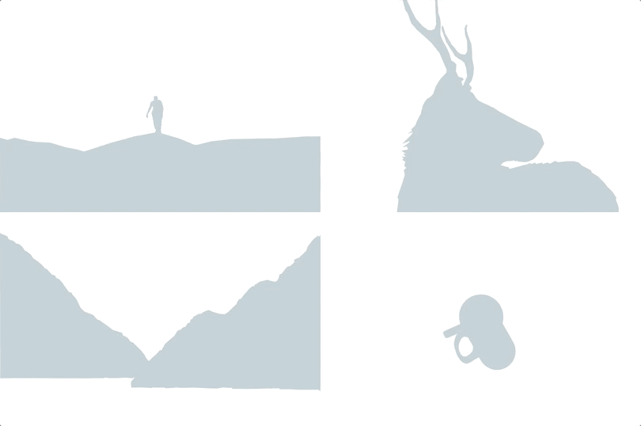

The SVGs in this case were hand drawn, but the technique quickly spawned integrations with tools to automate the process.

- •[Gatsby](https://www.gatsbyjs.org/), a static site generator using React supports these traced SVGs now. It uses [a JS PORT of potrace](https://www.npmjs.com/package/potrace) to vectorise the images.

> Excited to announce that Gatsby now has super simple support for traced SVG! Thanks to > [> @fk](http://twitter.com/fk)>  for his great work! > [https://t.co/XfgEDbSILA>   > [https://t.co/wTwOgT8C5V

>  — > [> @gatsbyjs](https://twitter.com/gatsbyjs/status/923304195666485248)

- •[Craft 3 CMS](https://craftcms.com/), which also added support for silhouettes. It uses [a PHP port of potrace](https://github.com/nystudio107/craft3-imageoptimize/blob/master/src/lib/Potracio.php).

> Cool video of using inline SVG images as lazy loading placeholders w/ ImageOptimize &amp; Craft 3 from > [> @slebbo](http://twitter.com/slebbo)>   > [https://t.co/E1dYA4ayow>  #craftcms > [https://t.co/ruf8i6URCT

>  — > [> @nystudio107](https://twitter.com/nystudio107/status/920673966091534338)

- •[image-trace-loader](https://github.com/EmilTholin/image-trace-loader), a Webpack loader that uses potrace to process the images.

> I just released image-trace-loader, a #webpack loader that exports traced outlines as image/svg+xml data. > [https://t.co/2VZaKVaE4p>   > [https://t.co/vRma67R7zb

>  — > [> @Tholle1234](https://twitter.com/Tholle1234/status/920423596346019840)

It’s also interesting to see a comparison of the output between Emil’s webpack loader (based on potrace) and Mikael’s hand-drawn SVGs.

> Comparison of > [> @mikaelainalem](http://twitter.com/mikaelainalem)>  's SVG lazy-loading technique > [https://t.co/mbqVpxzn72>  with > [> @Tholle123](http://twitter.com/Tholle123)> 's webpack loader > [https://t.co/3jxjtNP8dm

>  — > [> @nemtsovy](https://twitter.com/nemtsovy/status/920647706799955970)

I assume the output generated by potrace is using the default options. However, it’s possible to tweak them. Check [the options for image-trace-loader](https://github.com/EmilTholin/image-trace-loader#options), which are pretty much [the ones passed down to potrace](https://www.npmjs.com/package/potrace#parameters).

### Summary

We have seen different tools and techniques to generate SVGs from images and use them as placeholders. The same way [WebP is a fantastic format for thumbnails](https://medium.com/@jmperezperez/using-webp-to-create-tiny-preview-images-3e9b924f28d6), SVG is also an interesting format to use in placeholders. We can control the level of detail (and thus, size), it’s highly compressible and easy to manipulate with CSS and JS.