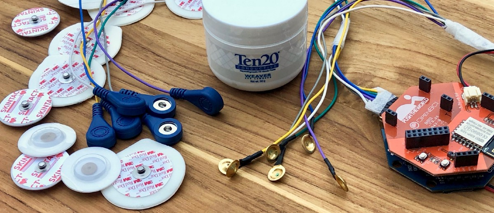
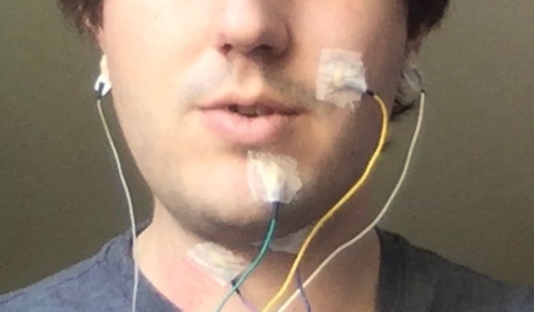
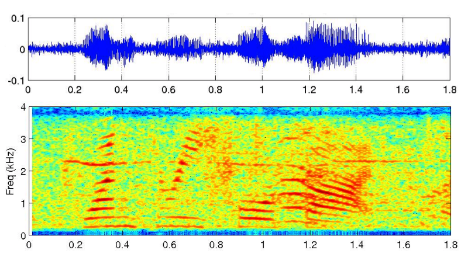
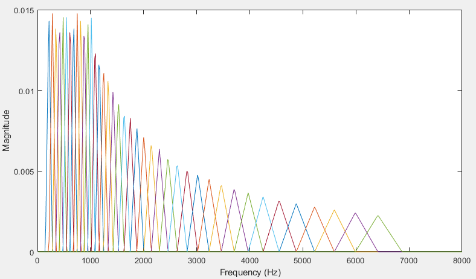
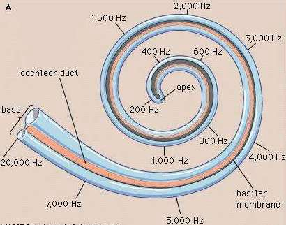
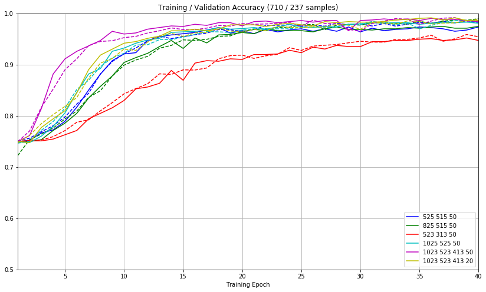
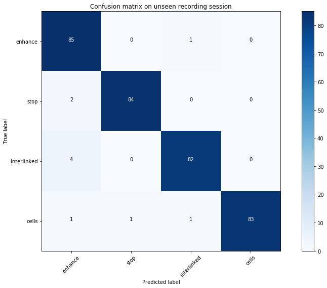

Using deep learning to “read your thoughts” — with Keras and an EEG sensor

# Using deep learning to “read your thoughts” — with Keras and EEG

[Justin Alvey](https://medium.com/@justlv)
Mar 5·11 min read

**> In my **> [**> previous article**](https://medium.com/@justlv/how-to-build-a-brain-interface-and-why-we-should-connect-our-minds-35003841c4b7)**> , I looked at some approaches to creating a brain-computer interface. While most required nothing less than your own research lab, what I’ll demonstrate here can convert “imagined words” into text, and be achieved in less than a day with some readily available electronics and using the neural-network library Keras.**

How? We’ll use a phenomenon whereby “sub-vocalizing”, or saying a word in one’s mind, *even if not spoken aloud,* can result in the firing of the nerves controlling the muscles involved in speech.

In this article, I’ll describe how to use these signals and deep learning to classify sub-vocalized words — specifically by reading the electrical nerve activity using an EEG/EMG sensor, setting up a pipeline for processing and acquiring labelled training data, and creating a custom 1D Convolutional Neural Network (CNN) for classification.

* * *

*...*

*While this approach would be limited in its ability to provide us with extra bandwidth we’d expect from a brain-computer interface, it is nevertheless an impressive and educational example of processing and interpreting thought-driven biosignals. Let’s dive in…*

* * *

*...*

#### How exactly does one sense sub-vocalized words?

When saying a word in your mind, your brain does not fully decouple the process of “sub-vocalizing” that word from speaking it, which can result in either minor or imperceptible movements of the mouth, tongue, larynx or other facial muscles.* The act of activating a muscle is not just a single “command” as we’d imagine in the digital world, but involves the repeated firing of multiple motor units (collections of muscle fibers and neuron terminals), at a rate of somewhere between 7–20 Hz, depending on the size and structure of the muscle. These firings will be providing us the electrical signal we are looking for, which we can read using an EMG sensor.

** Privacy concerned folks: this is not saying that any fleeting thought of the top of your head can be captured — you have to consciously focus on silently saying the word, sometimes noticeably, depending on the quality of your setup*

### The Hardware

To read the signals I used an OpenBCI board, technically designed for EEG, which I had on hand from some previous biofeedback experiments. EEG typically requires higher resolution, so if anything, this should help in picking up the weaker EMG signals we are looking for.

To make contact with the skin, we will need electrodes. These convert the ion current at the surface of the skin to electron current to be delivered through the lead wires, and so often have a particular chemistry.

The two options here are typically Ag-AgCl adhesive electrodes, or gold cups used with a conductive paste. I used the latter, but attempting another recording session with the former performed just as well. Reveiwing some literature, I was able to make some pretty good guesstimates at where the electrodes should be placed.

Aesthetics could use some work. And only a little bit more wearable in public than Google Glass was…

### Training on words

To gather data for training a network, we would need segments of processed and labelled sensor readings for the set of words we would want the network to be able to recognize. For this article, I will use four words to sub-vocalize: **enhance**, **stop**, **interlinked** & **cells**. *(Hopefully you’ll note the Blade Runner reference)*

“Enhance, Stop” — Blade Runner (1982), “Interlinked, Cells” — Blade Runner 2049 (2017)

#### Marking words for labelling

A significant chunk of machine learning efforts is gathering and labelling data, so thinking up quick and easy ways to streamline this can go a long way. In this case, we’ll need a way to mark the start of the subvocalization of each word so we can programmatically segment the data.

Initial ideas were to build a pulse generator to encode markers into the EEG signal itself, (ensuring we don’t interfere with the signal compression scheme and analog front-end) or more reliably, attach a button to an input of the RF module and customize the firmware to add this value to the data stream. I didn’t have time to do either, so noticing the OpenBCI had a built in accelerometer, I decided to use gentle taps to mark the start of a word.

With four words, we would need to obtain at least 1000 samples to use as the training, validation and test data, so in total I recorded about 20 minutes of subvocalized words, across multiple sessions.

Using the OpenBCI Wifi shield, we can log recordings for each session directly into a text file at a sampling rate of 1600Hz. From these, we can then pull in the 4 channels of EMG data, and the 3 channels of accelerometer data.

|     |     |
| --- | --- |
| 1   | # Pull in logs from OpenBCI (macOS) |
| 2   | subprocess.call([str('cp /Applications/SavedData/OpenBCI-RAW-* %s'  % folder) ], shell=True) |
| 3   | files =  sorted([i for i in listdir(folder) if i.endswith(".txt") ], key=str.lower) |
| 4   | # Read in a recording session for processing |
| 5   | session = pd.read_csv(folder+files[0],skiprows=6, index_col=None,header=None, |
| 6   |  names=["ix","1","2","3","4","ax","ay","az","time","epoch"]) |

 [view raw](https://gist.github.com/justLV/7206558527d453ae8ffe76e44192d00d/raw/5ea84d86cbacfa503258e8bf7f364aecd75c48e7/import.py)  [import.py](https://gist.github.com/justLV/7206558527d453ae8ffe76e44192d00d#file-import-py) hosted with ❤ by [GitHub](https://github.com/)

The first thing we’ll do with the EMG data is filtering, to remove mains interference (60Hz in the US), the slowly changing DC offset due to natural potential differences at the electrode/skin interface as well as any high frequency noise.

For this we’ll use a Butterworth filter with a passband of 2 to 45Hz. This filter is designed to be maximally flat in the passband at the sacrifice of roll-off. This means the 60Hz interference was not completely removed, so I applied an extra notch filter. Once filtered, we can perform a simple normalization, subtracting the mean and scaling by the standard deviation.

FFT from a single EMG channel showing filtering steps

|     |     |
| --- | --- |
| 1   | from scipy.signal import butter, lfilter, iirnotch |
| 2   |     |
| 3   | def  filter_emg(dataset): |
| 4   | bpf = butter(4, [2/(fs/2), 45/(0.5*fs)], btype='band') |
| 5   | nf = iirnotch(60/(fs/2),30) |
| 6   | lfilter(nf[0], nf[1], lfilter(bpf[0],bpf[1], dataset)) |
| 7   |     |
| 8   | def  feature_normalize(dataset): |
| 9   |  return (dataset - np.mean(dataset, axis=0))/np.std(dataset, axis=0) |

 [view raw](https://gist.github.com/justLV/b9173a8dc259700bf7b8dcdc53c71221/raw/ac4f226a20750c16392d07181fe13051eeb5059a/filter_emg.py)  [filter_emg.py](https://gist.github.com/justLV/b9173a8dc259700bf7b8dcdc53c71221#file-filter_emg-py) hosted with ❤ by [GitHub](https://github.com/)

***A note on dimensionality reduction techniques

****A common step here could also be source signal isolation, (using a technique such as Linear Discriminant Analysis or Principal Component Analysis), which can help create more efficient learning and feature detection, and for e.g. isolate muscle groups in the case where multiple electrodes may be picking up signal from the same source. This could also be helpful in removing dependance on exact electrode placement between sessions, if a calibration phase is included. As I only had 4 electrodes, there are likely have more muscle groups than sensor channels, so can omit this step without serious performance losses.*

### Segmenting data and creating labels

From here we will need to segment the data from each of the EMG channels, using the peaks in the accelerometer data as an index.

Using a peak finding algorithm on the calculated magnitude of the accelerometer, we can easily gather the starting points of the subvocalized words, and quickly handpick valid regions using a simple [span selector](https://matplotlib.org/gallery/widgets/span_selector.html), omitting the few occasions where some latency caused some samples to be dropped or where taps were not properly detected.

To estimate the envelopes for subvocalized words, I initially recorded audio of speaking the words including an audible tap, and looked at the waveform to get the time intervals I would need for splicing the EMG signal.

EMG envelope of 750ms, at 350ms from tap

In each session, the words were repeated in clusters, yet in a different ordering to prevent the network from learning on features that could be related to the order of repetition, such as blinks, breathing, transients or any regularly repeated EMI from the board.

To prepare the data for training, we will store the segments from each session in a tensor of shape:

x.shape => (# of segments, length, # of channels)

We can then create corresponding label vectors for each session depending on the ordering of the four words as a one-hot vector, for e.g.

`y = np_utils.to_categorical(np.array([3,2,1,0] * x.shape[0]//4), 4)`

We can then save data and labels for each session into a dictionary which we can pull from later when training.

### Feature extraction (or not)

Now that we have the data prepared, we typically will need to perform feature extraction to make sense of the data, to create a more representable and reduced set of features that a classifier could train on.

To look at how this is typically done, we should look to the example of speech recognition from audio data, in which a time domain signal is first converted to the frequency domain, and then relative signal powers are calculated at various frequency intervals corresponding to those detectable by the cochlea in the human ear.

[MFCC’s](https://en.wikipedia.org/wiki/Mel-frequency_cepstrum) represent the magnitude of different frequencies in a signal, binned according to a model of the human cochlea

A typical technique such as this involves:
a) converting to the frequency domain then

b) filtering and weighting based on**  **some**  **prior understanding of what features are important

But from math, we also know that **filtering in the frequency domain** is equivalent to **convolution in the time domain**.

What I’m leading to is that with the stacked convolutional layers of a CNN, we can a) perform the same feature recognition options directly from the time series data without having to convert to the frequency domain, and b) have the network learn filters that are able to best identify these features itself.

This does still require careful network architecture design and sufficient training data or even pre-training, but by doing this, we can take away the manual process of finding out the most informative spectra and waveforms, letting the neural network learn and optimize these filters itself. Seeing as we’re not exactly sure what optimal features we should be looking for, this is a sound place to start.

### Creating the Convolutional Neural Network

For our CNN, we will borrow from the structure of those used for image classification, yet instead of using **two** spatial dimensions with a depth of 3 (for each color), we will have **one** dimension (time) with a depth of 4 (for each EMG channel).

With a CNN, each successive convolutional layer will develop filters that will be able to recognize successively more complex features in the EMG data. Another benefit of CNN’s for this application is shift invariance, thanks mostly due to the max pooling in-between convolutional layers, which will allow relevant features to be detected irrespective of their placement in time, alignment or speed at which they are “said”.

Knowing the firing rate of motor neurons, we can guess the frequencies at which the most helpful features are likely to be present, we can make some educated guesses at a network structure to detect frequencies and later phonemes.

|     |     |
| --- | --- |
| 1   | # Load labelled EMG sessions to train on |
| 2   | selected = ['esic_82','cise_38','iecs_45'] |
| 3   | x, y = np.empty((0, L, 4), np.float32), np.empty((0, 4), np.float32) |
| 4   | for k in selected: |
| 5   | x = np.append(x,sessions[k][0],axis=0) |
| 6   | y = np.append(y,sessions[k][1],axis=0) |
| 7   |     |
| 8   | # Downsample, shuffle and split (from sklearn.cross_validation) |
| 9   | x_train, x_val, y_train, y_val = train_test_split((x[:,::ds,:]), y, test_size=0.25) |
| 10  |     |
| 11  | # Create the network |
| 12  | model = Sequential() |
| 13  | model.add(Conv1D(40, 10, strides=2, padding='same', activation='relu', input_shape=(x_train.shape[0]//ds, 4))) |
| 14  | model.add(Dropout(0.2)) |
| 15  | model.add(MaxPooling1D(3)) |
| 16  | model.add(Conv1D(40, 5, strides=2, padding='same', activation='relu')) |
| 17  | model.add(Dropout(0.2)) |
| 18  | model.add(MaxPooling1D(3)) |
| 19  | model.add(Conv1D(40, 4, strides=1, padding='same', activation='relu')) |
| 20  | model.add(Dropout(0.2)) |
| 21  | model.add(MaxPooling1D(3)) |
| 22  | model.add(GlobalAveragePooling1D()) |
| 23  | model.add(Dense(50, activation='relu')) |
| 24  | model.add(Dropout(0.2)) |
| 25  | model.add(Dense(4, activation='softmax')) |
| 26  |     |
| 27  | model.compile(loss='binary_crossentropy', |
| 28  |  optimizer='adam', |
| 29  |  metrics=['accuracy']) |
| 30  |     |
| 31  | # Train and save results for later plotting |
| 32  | history[ '40 1023 523 413 50 :'+'-'.join(selected)] = model.fit(x_train, y_train, |
| 33  |  batch_size=100, epochs=40, validation_data=(x_val,y_val)) |

 [view raw](https://gist.github.com/justLV/3ba57f5a211b5e120b5786a4a5a76fd7/raw/e7d39daf41c5cb75e50828a58478a0a742224e9d/model.py)  [model.py](https://gist.github.com/justLV/3ba57f5a211b5e120b5786a4a5a76fd7#file-model-py) hosted with ❤ by [GitHub](https://github.com/)

Example of a 1D CNN model used

Firstly, we can downsample the data from 1600Hz by a factor of 4 as it is unlikely there will be helpful features we will miss, and training at this resolution will likely take up excessive compute time and overfit.

The first layer can have filters to cover around 25ms (i.e. kernel size of 5–10), using a balance of stride and max-pooling to reduce the width for the next layer, equivalent to taking roughly 15ms steps. The number of filters was chosen to be around 50, which should be enough to represent all the different frequencies.

We can then experiment with a couple more convolutional layers, reducing the width through decreasing stride and max-pooling, before global max pooling, and feeding the extracted features into two fully-connected layers, to perform the classification.

As we have limited data and no pre-training, dropout is a good practice to avoiding overfitting and ensure lower layers learn to recognize features.

We can track how the training and validation accuracy develops to get an intuition as to whether the network is complex enough to classify the data yet without overfitting.

To start, we can load some sessions and then shuffle and split this into our training and test data. Within a few quick runs, we can already start to settle on some hyperparameters that provide some good enough results.

Training (- - -) and Validation (—) accuracy for a few different network shapes *(Not shown — experiments with varying dropout, downsampling, number of convolutional filters, learning rates, epoch sizes…)*

To validate further, we can train the model on a selected few of the sessions, and then use the model to predict the labels of a separate, unseen session, recorded with different electrodes. To compare the actual and predicted labels, we can plot a confusion matrix, showing some decent results, proving the classifier is working well on unseen, session-independent data:

The most “confusion” here was between the two syllable words. Lastly, I had recorded a session that I had forgotten the ordering of the four words I used. Using the model to predict the probabilities for each class, we can plot a visualization and pretty quickly figure out the ordering…

### Where to from here?

These are some exciting results, but further work can definitely be done to optimize electrode placement, neural network architecture, gather more data across multiple users, and expand the vocabulary.

The hardware to do this is fairly commoditized. The OpenBCI EEG setup I used, without electrodes, would set you back $350, which admittedly is quite high. A small form factor PCB with a wifi module, 16-bit analog frontend, some instrumentation amplifiers and ESD protection could have an assembled cost of under $15. But the kit did come with some helpful software, and this allowed me to do this in one day, versus taking a couple of weeks.

Data processing and classification could theoretically be done on the device before sending via Bluetooth, yet as the bandwidth limitation is fairly low compared to audio, this can be offloaded to a phone which will have more accessible frameworks for processing, training and updating models for individual users.

This approach would admittedly not make significant gains in increasing the bandwidth of output from our brains beyond that of a voice assistant like Siri. But it could help people who have lost the ability to talk, or enable new hands-free and discreet ways to communicate for specific applications, or for where a reduced vocabulary set of short phrases is acceptable. For these applications alone, this could be extremely promising.

We can expect that the rapid uptick in offerings of edge AI platforms will allow the interpretation of biosignal data from wearables to open up plenty of exciting new insights and use cases. I hope this was a valuable intro into what can be done with some open source hardware, deep learning and a few lines of code, and that sharing this can inspire some to build more beneficial uses of AI and sensors to create a better world for all.

⚡️

*If hope you enjoyed this article or found it helpful — if so please share or clap below, or follow me on *[*Medium*](https://medium.com/@justlv)* or *[*Twitter*](https://twitter.com/justLV)*. Feel free to comment below or contact me at j@justinalvey.com*