Venezuela crisis - in nine charts

# Venezuela: All you need to know about the crisis in nine charts

 By the Visual Journalism team  BBC News

- 4 February 2019

- [      Share this with Facebook](https://www.bbc.com/news/world-latin-america-46999668#)

- [      Share this with Messenger](https://www.bbc.com/news/world-latin-america-46999668#)

- [  ![](data:image/svg+xml,%3csvg xmlns='http://www.w3.org/2000/svg' class='extracted-svg ex-twitter js-evernote-checked' viewBox='-13 -15 44 44' enable-background='new 0 0 44 44' width='44px' height='44px' aria-hidden='true' focusable='false' data-evernote-id='1170'%3e %3cg%3e%3cpath d='M5.80573373%2c15 C12.7721527%2c15 16.581877%2c9.22887915 16.581877%2c4.22385671 C16.581877%2c4.06002242 16.581877%2c3.89618812 16.5714931%2c3.73466135 C17.3122088%2c3.19816171 17.9525471%2c2.53359441 18.4602026%2c1.77326482 C17.7690988%2c2.08016568 17.0364595%2c2.28092039 16.28536%2c2.36976011 C17.0756874%2c1.89671742 17.6675677%2c1.15138674 17.9502395%2c0.274527115 C17.2072164%2c0.715264453 16.3938137%2c1.02678037 15.5457981%2c1.19407596 C14.1105174%2c-0.331198284 11.7118448%2c-0.405039095 10.1865706%2c1.0290879 C9.20241101%2c1.95440555 8.78590269%2c3.33315194 9.09049603%2c4.64844138 C6.04571636%2c4.4961447 3.20861397%2c3.05740266 1.28529161%2c0.691035437 C0.280364327%2c2.42167943 0.793788713%2c4.63574999 2.45751448%2c5.74682343 C1.85525036%2c5.72951699 1.26567764%2c5.56683646 0.738408105%2c5.27262698 L0.738408105%2c5.32108501 C0.739561868%2c7.12441605 2.00985456%2c8.67622684 3.77741896%2c9.03389326 C3.2201516%2c9.18618993 2.63519393%2c9.20811142 2.06754269%2c9.09850397 C2.56366064%2c10.6410847 3.98509624%2c11.6979313 5.60613279%2c11.7290828 C4.26430681%2c12.7824682 2.60750362%2c13.3547344 0.902242404%2c13.3535807 C0.601110348%2c13.3524269 0.299978293%2c13.3339667 7.10542736e-15%2c13.2982001 C1.73295152%2c14.4104273 3.74742113%2c15 5.80573373%2c14.9965387'%3e%3c/path%3e%3c/g%3e %3c/svg%3e)    Share this with Twitter](https://www.bbc.com/news/world-latin-america-46999668#)

- [      Share this with Email](https://www.bbc.com/news/world-latin-america-46999668mailto:?subject=Shared%20from%20BBC%20News&body=https%3A%2F%2Fwww.bbc.com%2Fnews%2Fworld-latin-america-46999668)

- [Share](https://www.bbc.com/news/world-latin-america-46999668#share-tools)

Related Topics

- [Venezuela crisis](https://www.bbc.com/news/topics/cp3mvpm3933t/venezuela-crisis)

   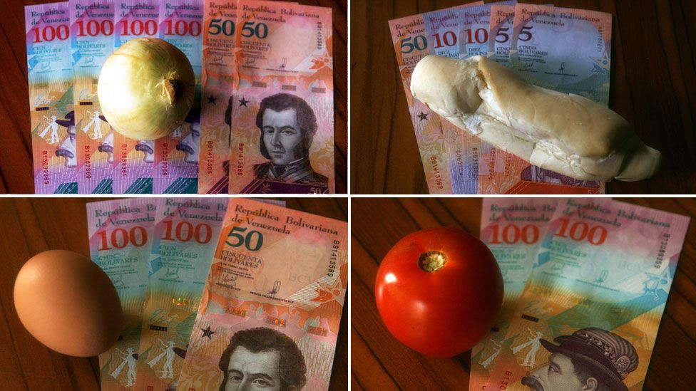  Image copyright  Getty Images

 Image caption   Inflation has spiked in Venezuela, making it difficult for people to afford basic essentials

**Growing discontent in Venezuela, fuelled by hyperinflation, power cuts and food and medicine shortages, has led to a political crisis.**

Opposition leader Juan Guaidó has declared himself interim president following large protests, galvanising opponents of current socialist President Nicolás Maduro.

At least 40 people are believed to have died since 21 January and the UN has warned that the situation could spiral out of control.

More than three million Venezuelans have fled their country over recent years, blaming hunger, lack of medical care, rising unemployment and violent crime.

Here are nine charts that try to explain what's going on.

## 1. Inflation is ridiculous

The biggest problem facing Venezuelans in their day-to-day lives is hyperinflation.

   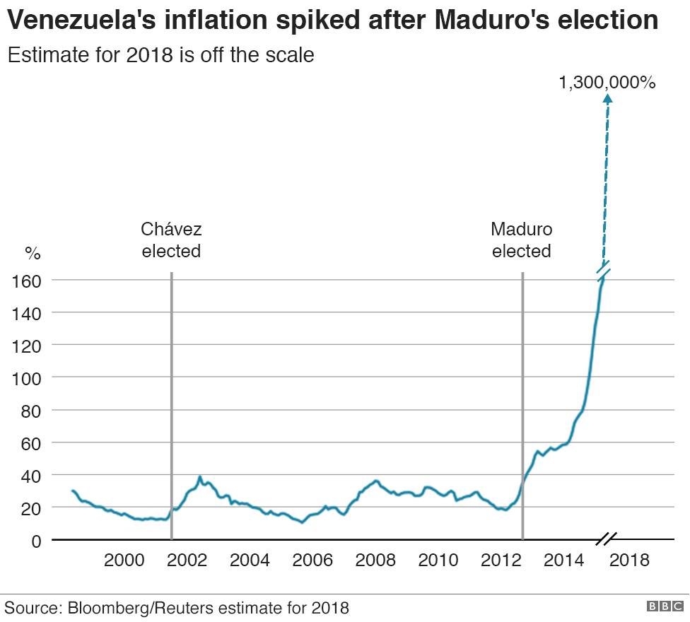

According to a study by the opposition-controlled National Assembly, the annual inflation rate reached 1,300,000% in the 12 months to November 2018.

By the end of last year, prices were doubling every 19 days on average. This has left many Venezuelans struggling to afford basic items such as food and toiletries.

The number of bolivars - the national currency - needed to buy US$1 has also rocketed.

   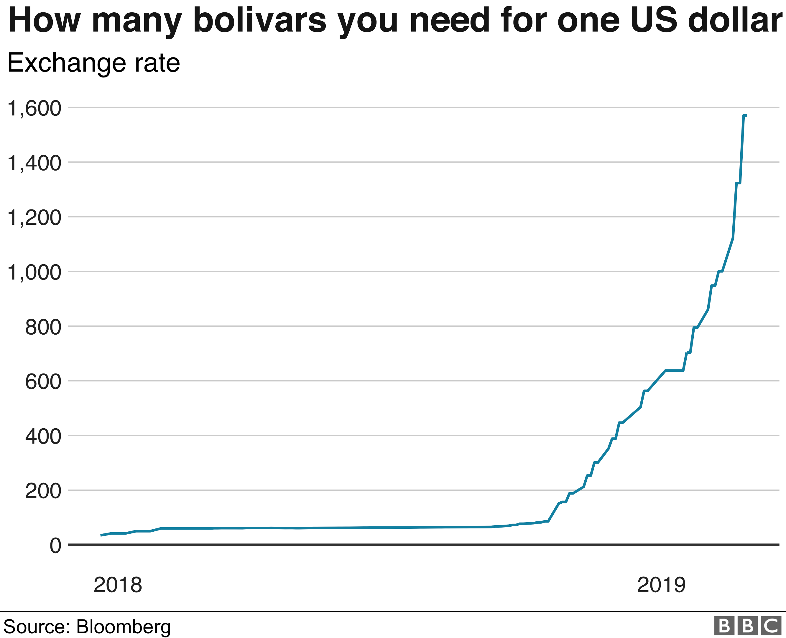

- [What is happening in Venezuela?](https://www.bbc.co.uk/news/world-latin-america-46997555)
- [Who is Juan Guaidó?](https://www.bbc.co.uk/news/world-latin-america-46985389)
- [What will happen next?](https://www.bbc.co.uk/news/world-latin-america-46991976)

   

## 2. GDP is falling

Venezuela once boasted Latin America's richest economy - boosted by the biggest oil reserves on the planet.

But under former president Hugo Chávez, who died in 2013, and current President Maduro, corruption, mismanagement and high levels of debt have seen the country's economy collapse.

   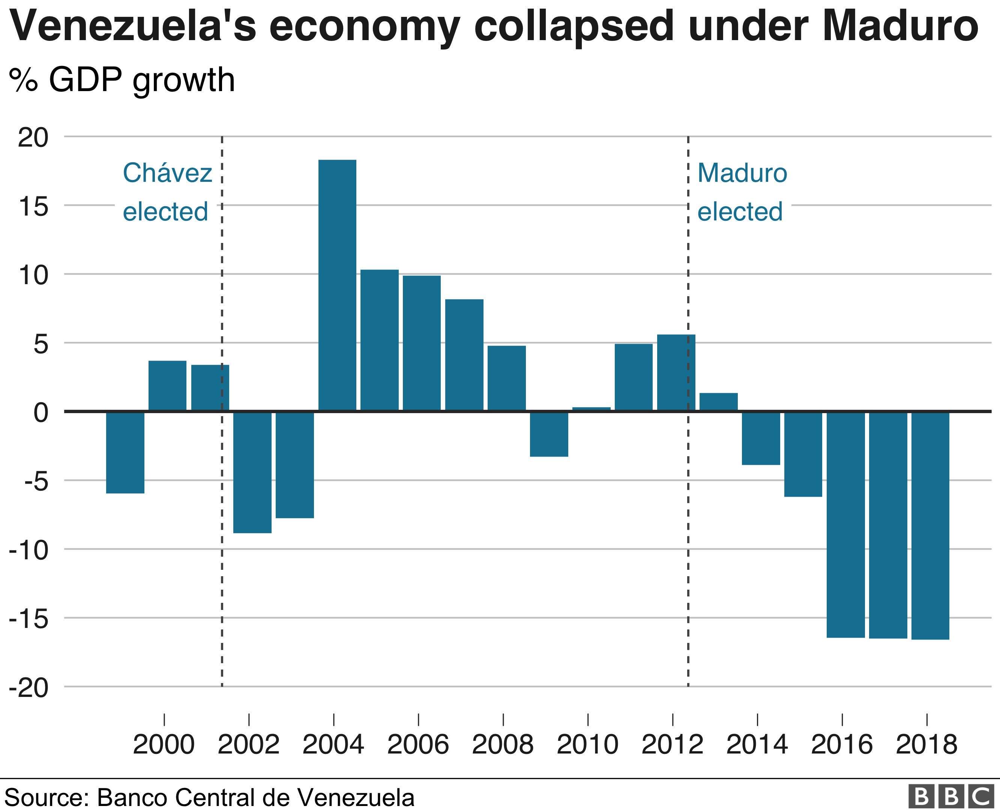

President Chávez took advantage of the oil boom in the 2000s to borrow heavily and government spending soared.

Then, during President Maduro's first term in office, the Venezuelan economy went into freefall.

Many blame him and his socialist government for worsening the country's decline.

President Maduro blames "imperialists" - the likes of the US and Europe - for waging "economic war" against Venezuela and[imposing sanctions](https://www.bbc.co.uk/news/world-latin-america-46524248) on many members of his government.

Plummeting oil prices in 2016 compounded the oil-dependant country's crisis.
   

## 3. People don't have enough food...

Venezuelans are going hungry.

Of those questioned for the country's annual living conditions survey (Encovi 2017), eight out of 10 said they were eating less because they did not have enough food at home.

Six out of 10 said they had gone to bed hungry because they did not have the money to buy food.

   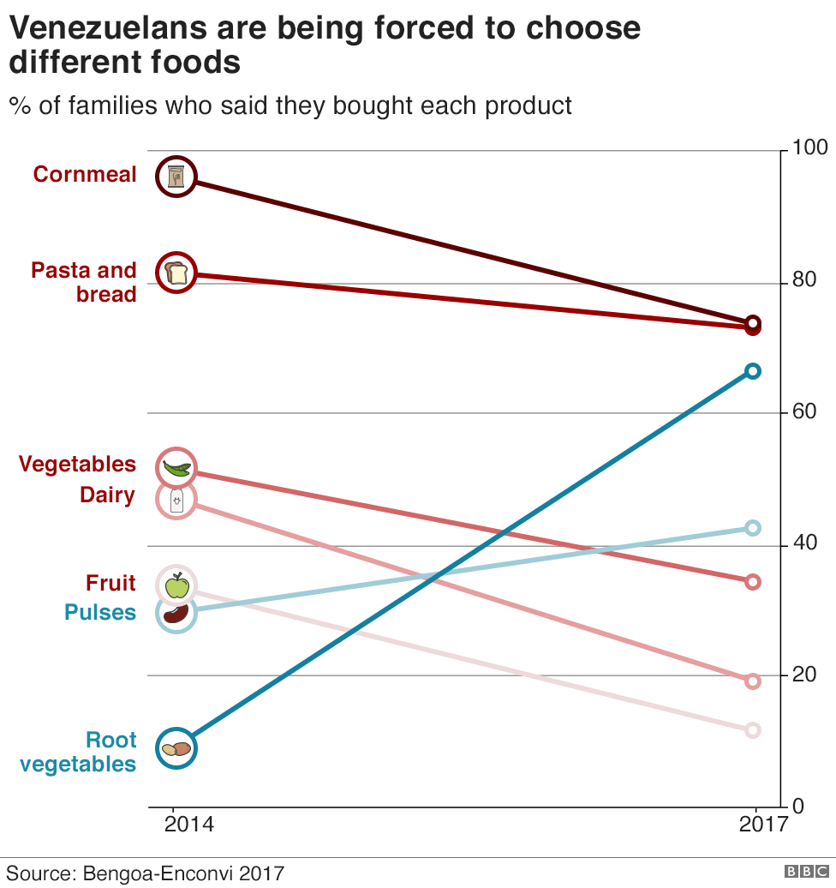

And this is taking its toll on the nation's health.

Most people (64.3%) said they had lost weight in 2017 - 11.4kg on average, with the poorest losing most.

Other key findings of the study included:

- Traditional meals were decreasing in size and quality
- Nine out of 10 people couldn't afford their daily food
- 8.2 million had two meals a day or fewer
- Sources of iron, vitamins and other nutrients were lacking from people's diet

   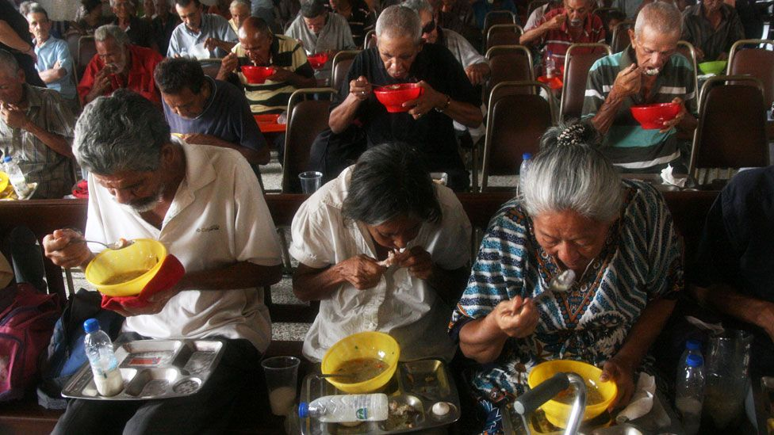  Image copyright  Getty Images

 Image caption   Some Venezuelans have turned to charity for food

As a result, Venezuelans are turning to forgotten vegetables and foodstuffs that were once considered a "poor people's food".

The yuca - or cassava - root vegetable, for example, is versatile, cheap and a traditional substitute for potatoes.

It can be boiled or fried - which fast food chain McDonald's used to its advantage in 2015, changing their Venezuelan menu from potato fries to yuca fries.

## 4. ...they also don't have enough medicine

Venezuela has suffered a huge rise in the number of malaria cases in recent years - in stark contrast to neighbouring countries in Latin America, where numbers are falling.

   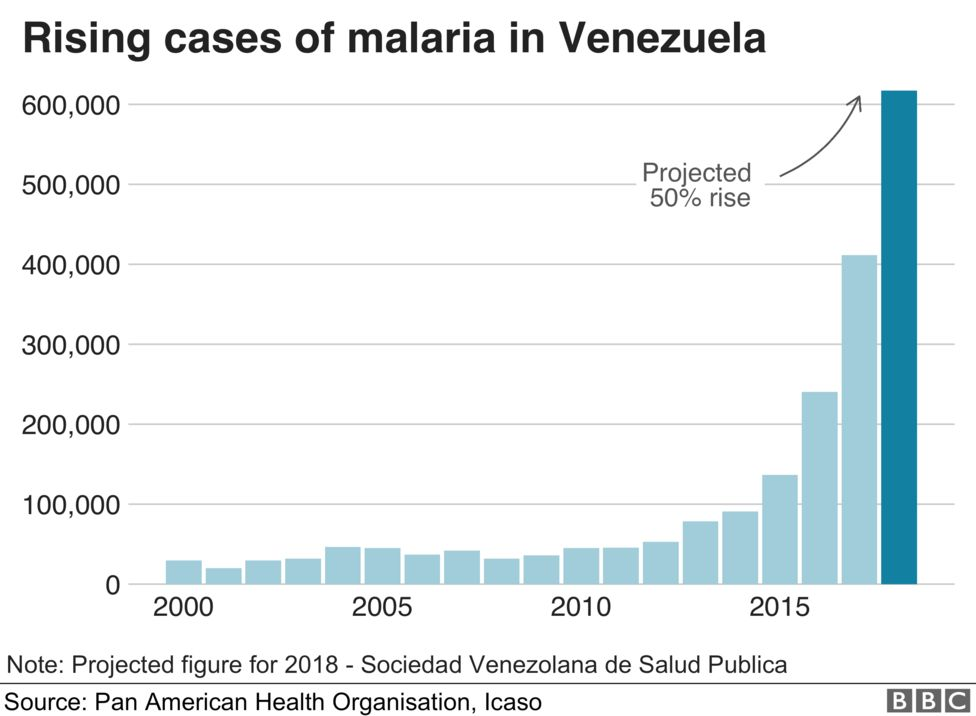

Having been the first country certified to have eliminated the disease in 1961, [Venezuela now has cases in at least 10 out of 24 states.](http://www.paho.org/data/index.php/en/analysis/health-profiles/293-profile-national-aids-tb-malaria.html)

Canadian NGO Icaso has said leaked government reports show the spread includes the hard-to-eradicate form of malaria - plasmodium vivax.

The Venezuelan Health Observatory has reported widespread shortages of antimalarial drugs - for all strains.

Jose Felix Oletta, infectious disease specialist and former health minister, says projections for 2018 suggest an increase of 50% in the number of cases on 2017.

"At this pace, we will have more than one million cases in one year," he told Icaso. "These were numbers Venezuela had at the beginning of the 20th Century. Malaria is out of control in Venezuela."

[Measles and diphtheria have also returned with a vengeance.](http://icaso.org/wp-content/uploads/2018/06/icaso-triple-threat-redesigned.pd)

## 5. Oil output is on the decline

Venezuela holds the world's largest supply of crude oil, and petroleum products make up the vast majority of the country's exports.

Production held virtually steady from 2002 - just before the national strike - to 2008, when global oil prices peaked. Figures from the Organization of the Petroleum Exporting Countries (Opec) show the country earned bout $60bn from oil that year.

But the collapse in oil prices towards the end of 2014 - a year after Mr Chávez died from cancer - decimated the country's already-struggling oil-dependant economy.

   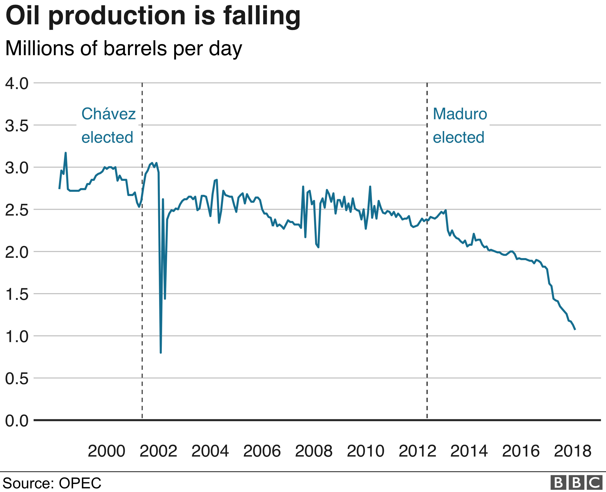

The country hit crisis levels the following year, with GDP shrinking by almost 6% and inflation soaring.

Oil output has been declining since.

Venezuela is heavily reliant on the US for its oil revenue - sending 41% of its oil exports there.

On 29 January, the US imposed sanctions on Venezuela's state-owned oil firm PDVSA, saying proceeds of the purchase of Venezuelan oil would now be withheld from Mr Maduro's government.

But US Treasury Secretary Steven Mnuchin said the company could avoid sanctions by recognising opposition leader Mr Guaidó.

   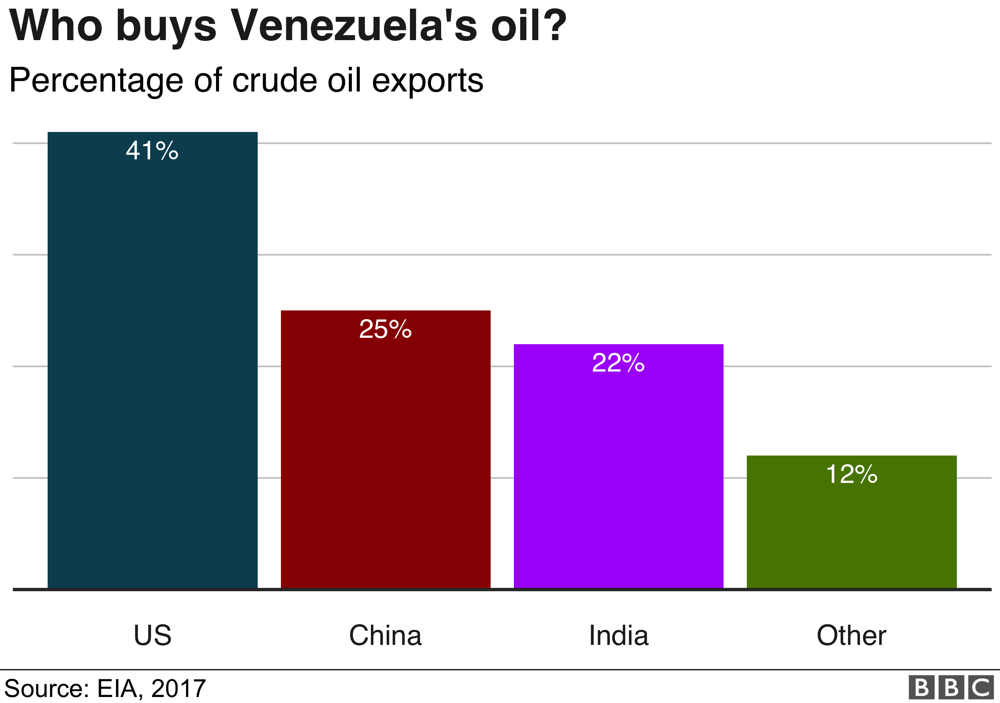

## 6. Many Venezuelans are leaving

Three million Venezuelans have left their home country since 2014, according to the UN.

The majority of those leaving have crossed into neighbouring Colombia, some then move on to Ecuador, Peru and Chile. Others have gone south to Brazil.

   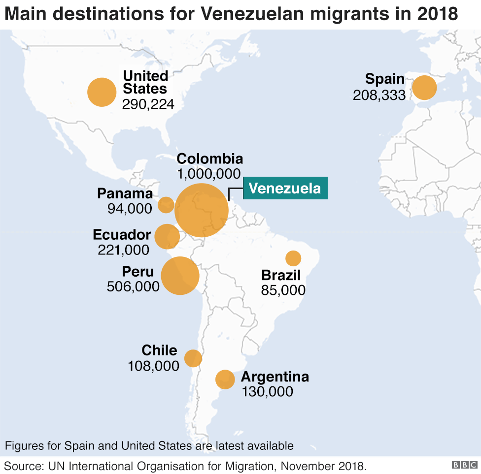

Vice-President Delcy Rodríguez has disputed the UN's figures, saying they are inflated by "enemy countries" trying to justify a military intervention.

## 7. Countries are split over who to support

The US, more than a dozen Latin American countries, and Canada have already backed Mr Guaidó - leader of Venezuela's elected National Congress - undermining President Maduro, who began a second term in office just a fortnight ago.

   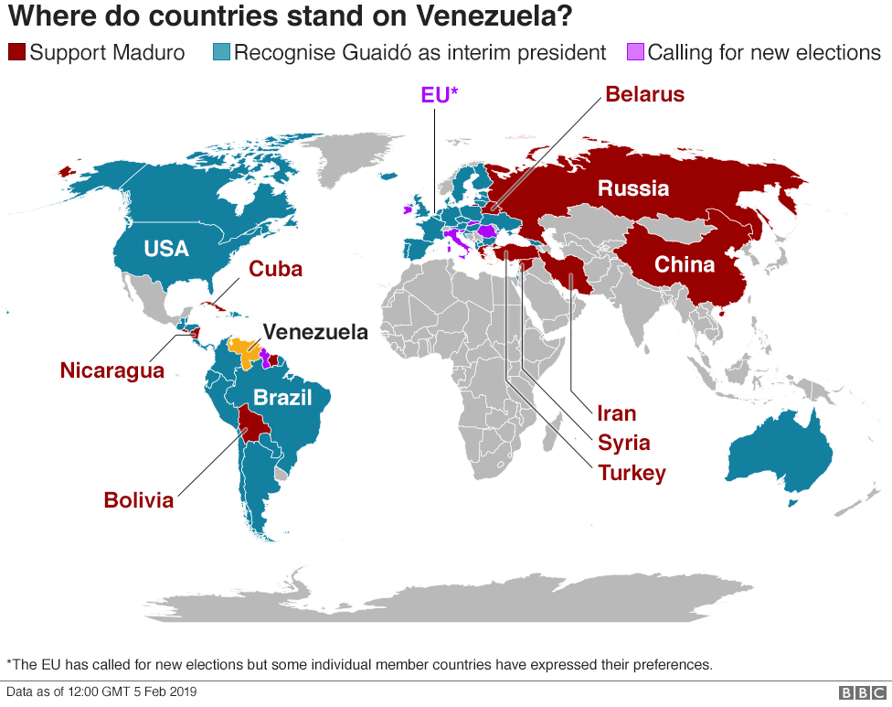

On Monday, the UK, France, Germany, Spain and other European countries officially recognised Mr Guaidó as interim president of Venezuela.

It comes after President Nicolás Maduro rejected the EU's Sunday deadline to call snap elections.

Russia has condemned foreign support for Mr Guaidó, saying it violates international law and is a "direct path to bloodshed". China and Turkey also back Mr Maduro.

By Dominic Bailey, David Brown, Daniele Palumbo, Lucy Rodgers, Olesya Volkova, Sean Willmott.