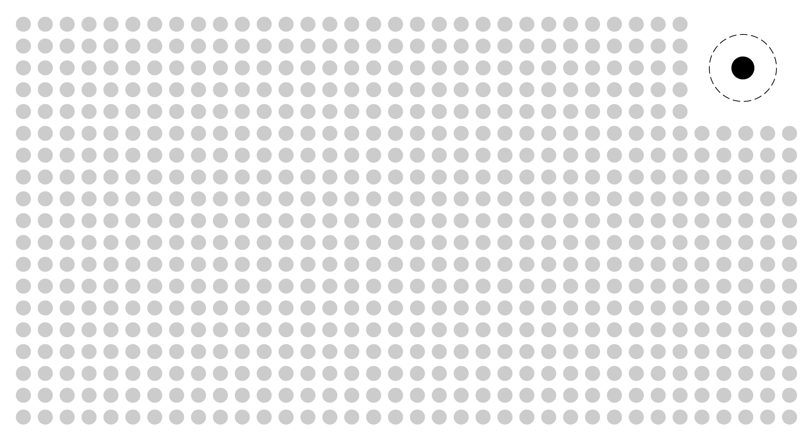
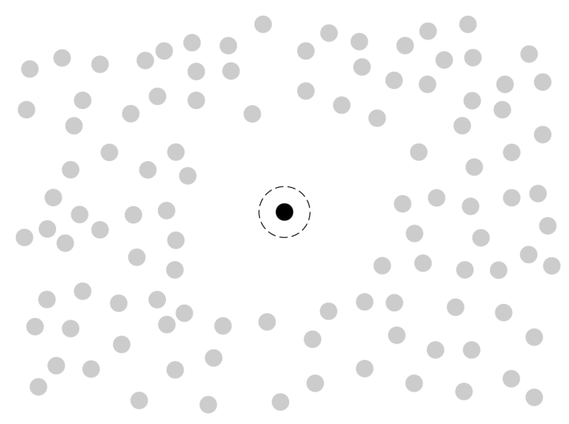
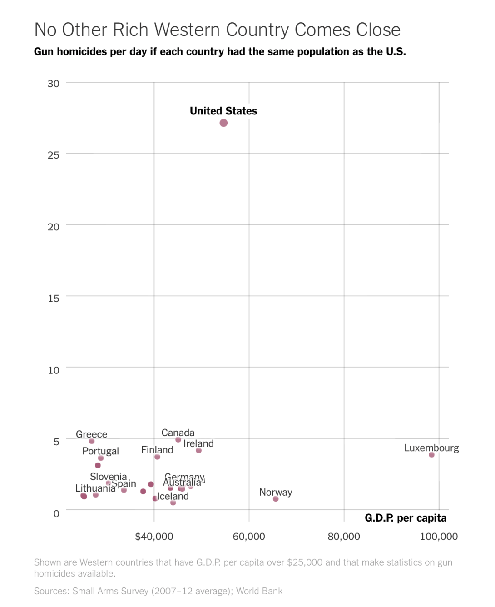
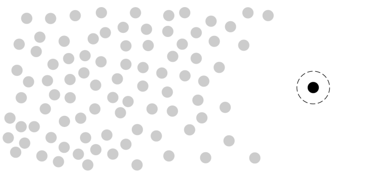
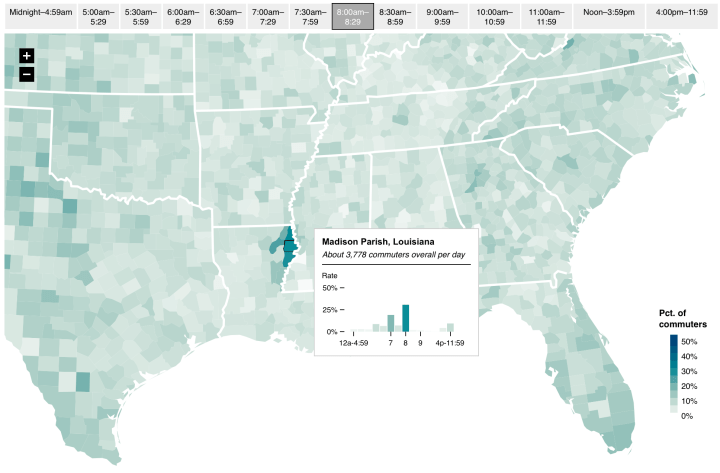
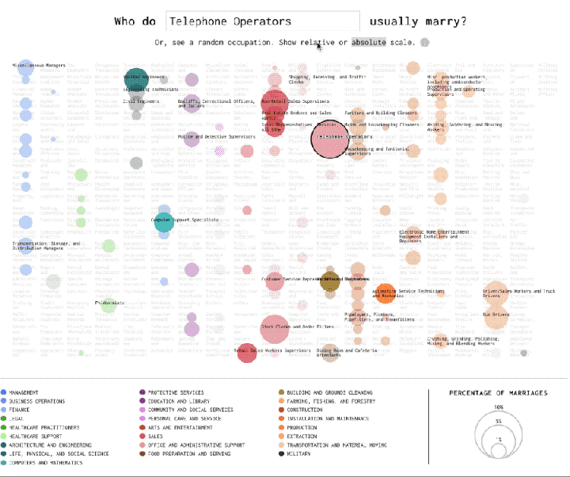
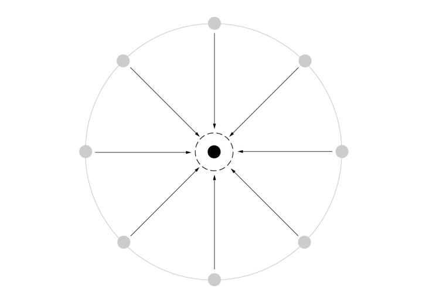
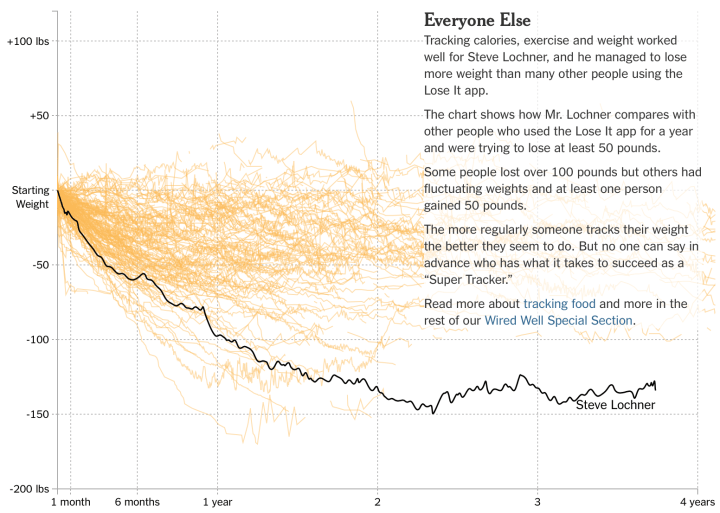
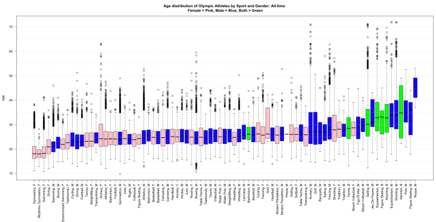

Visualizing Outliers

# Visualizing Outliers

Visualizing data that looks like it came straight out of Statistics 101 text book is nice and all — for teaching and learning purposes. You gotta learn to stand before you can run a marathon. Once you’re ready for the real data though, which is [fuzzier](https://flowingdata.com/2018/01/08/visualizing-the-uncertainty-in-data/) and more [irregular](https://flowingdata.com/2018/01/30/visualizing-incomplete-and-missing-data/), you run into data points that don’t quite fit in with the rest. The outliers.

There are various ways to incorporate outliers into your visualization, but you have to understand them first.

Why is the outlier there in the first place? Maybe it’s a recording error or a kink in methodology. For example, PornHub claimed that a disproportionate percentage of traffic came from Kansas. However, location was based on IP addresses, and any locations that could not be identified [defaulted to the center of the country](https://source.opennews.org/articles/distrust-your-data/). That spot was in Kansas.

Sometimes outliers might be an exception or something extraordinary. We see this in sports a lot, like when Stephen Curry broke the [single-season three-point record](http://flowingdata.com/2016/04/18/stephen-curry-3-point-record-ridiculousness/). Or when Usain Bolt [ran faster than everyone](http://flowingdata.com/2016/08/16/every-fastest-man-on-one-track/).

In one case, the outlier is noise relative to the rest of the data. In another the outliers deserve a closer look.

With your own data, figure out which is which first. Then decide if the outlier belongs in the background or foreground. The visualization options below will be much more useful.

## Point of Focus

Focus on the outlier directly and show how it stands out from the rest. Visually, differences outweigh similarities.

#### Pros

The outlier — or as my mom would say, the thing that sticks out like a sore thumb — draws attention away from the averages. Instead, the reader’s eyes head straight to a single point.

#### Cons

Showing an outlier on the same scale can overly obscure the rest of the data. Maybe a distribution gets squished into a few bins or a scatter plot shows most of the data squished into a corner. If you don’t want to highlight an outlier, try a different visualization route.

#### Examples

Outliers are about major differences from the norm, so they tend to come up on the news a lot. For example, The Upshot [highlighted gun homicides per day](https://www.nytimes.com/2016/06/14/upshot/compare-these-gun-death-rates-the-us-is-in-a-different-world.html) in the United States, as compared to other Western democracies:

[(L)](https://www.nytimes.com/2016/06/14/upshot/compare-these-gun-death-rates-the-us-is-in-a-different-world.html)

See also: [calendar dates](http://flowingdata.com/2016/01/25/missing-11th-of-the-month/) by xkcd and [all the things that get stuck](https://flowingdata.com/2016/02/16/million-to-one-shot-doc/) with emergency room as proxy.

## Breakout

Visualize the data as you normally would for an overview, and then zoom in or highlight outliers to explain.

#### Pros

You can get a sense of the overall distribution of the data instead of immediately focusing on what doesn’t belong.

#### Cons

The outliers might end up in obscurity or overlooked. If you present the data, it’s your job to draw attention to outliers if they’re not obvious.

#### Examples

When I mapped [commute times by county](http://flowingdata.com/2015/02/04/when-do-americans-leave-for-work/), some tended to start the day a lot earlier or later than the rest. So I mapped the country first, and then zoomed in what stood out.

[(L)](http://flowingdata.com/2015/02/04/when-do-americans-leave-for-work/)

The overview first, zoom in later is a common mechanism in online maps. See also: [the United Sates of oil and gas](https://www.washingtonpost.com/graphics/national/united-states-of-oil/), [The Year in Language](https://googletrends.github.io/year-in-language/), and [U.S. Culture through show popularity](https://www.nytimes.com/interactive/2016/12/26/upshot/duck-dynasty-vs-modern-family-television-maps.html).

## Scale Adjustment

Sometimes outliers are viewed better on a different scale that allows for extremes and averages to display at the same time. For example, a logarithmic scale is often useful with large counts. Or, with a color scale, the outlier might fall into the last bin by default.

#### Pros

You can show the full dataset without obscuring too much, if anything at all. An outlier on one scale might be normal on another, so it’s worth trying.

#### Cons

Fuss around too much, and what was a pro might end up a con. You don’t want to visualize an outlier as average if it’s an outlier.

#### Examples

I can also be useful to let users switch between scales to see how the result changes. [With the occupation matchmaker](https://flowingdata.com/2017/08/28/occupation-matchmaker/), I looked for how those with one job were more likely to be married to others. On an absolute scale, the occupations with the a lot of workers (such as cashiers) always stand out. On a relative, the specificity is unique to each occupation.

[(L)](https://flowingdata.com/2017/08/28/occupation-matchmaker/)

See also: Using a logarithmic scale to [show emergency room visits](http://flowingdata.com/2016/02/09/why-people-visit-the-emergency-room/).

## Reference Point

Use the outlier as a point of comparison for a sense of scale or to make the data more relatable.

#### Pros

Outliers are often really large or really small, so the scale can sometimes get lost in the mix. By using the outlier as a reference point against something familiar, the data also becomes more familiar.

#### Cons

This route highlights differences between the outlier and the other data points. Be careful not to lose the overall distribution in the process.

#### Example

In the [Diary of a Food Tracker](https://www.nytimes.com/interactive/2015/11/17/health/wiredwell-food-diary-super-tracker.html), the story focuses on the weight loss of an individual over three years. But as many weight loss stories go, readers can easily relate to the data. At the end of the scrolly-telling, the individual’s time series is plotted against a sample of others’ experience with food tracking.

[(L)](https://www.nytimes.com/interactive/2015/11/17/health/wiredwell-food-diary-super-tracker.html)

See also: [a search for food deserts](https://flowingdata.com/2013/08/27/in-search-of-food-deserts/) and the comparison of 2017’s [biggest wildfire against geographic areas](http://flowingdata.com/2018/01/12/scale-comparison-of-wildfires/).

## Providing Context

Maybe you don’t want to highlight the outlier. Maybe it’s not as important as the rest of the dataset. In this case, use it as context or background.

#### Pros

The patterns in the full dataset don’t get lost in scale adjustments, which can make for easier reading.

#### Cons

The outlier could become a side thought or ends up too far in the background that it is forgotten. Use your best judgement.

#### Example

In this barebones chart that shows [age distribution for Olympic sports](https://statsinthewild.com/2012/07/09/olympics-boxplot/), there are obvious outliers with really young or old competitors. But the main point is the general differences across sports.

[(L)](https://statsinthewild.com/2012/07/09/olympics-boxplot/)

See also: [Distributions of divorce by occupation](http://flowingdata.com/2017/07/25/divorce-and-occupation/) and [Alone Tim](https://flowingdata.com/2017/06/26/alone-time/)e.

## Wrapping Up

The general theme here is about purpose. Figure out what aspect of the outlier you want to show, and then choose your visualization accordingly. Your design choice should stem from the meaning behind the outlier. Is it statistical noise? Is it worth a deeper look? Once you figure this out, the visualization of the outlier is much easier.