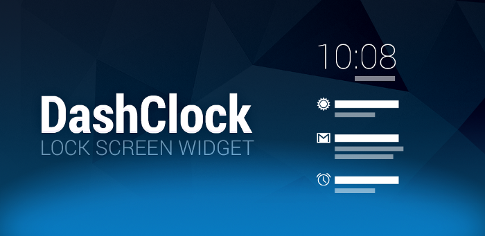

Walk then talk - Google Developers - Medium

#### Top highlight

# Walk then talk

[Roman Nurik](https://medium.com/@romannurik?source=post_page---------------------------)

[Aug 14, 2014](https://medium.com/google-developers/walk-then-talk-3b935bfe5484?source=post_page---------------------------) · 4 min read

*My guiding philosophy on developer advocacy*

This June marked my 6 year anniversary on the Developer Relations team at Google. In those 6 years, I’ve helped web developers build with the Google Earth API more rapidly, Android developers build higher-quality, more usable mobile apps and UI designers make better design decisions for their Android and Android Wear apps. And now, after 6 years, I think I’ve finally found a pretty good, basic formula for getting people excited to build great stuff on your platform.

Here’s the basic recipe:
1. Make Really Cool Thing™ with Platform.
2. Share source for Really Cool Thing™.

3. Blog, tweet, and talk about Really Cool Thing™, how you made it, all the decisions along the way, and most importantly, how Platform enables Really Cool Thing™ to exist in the first place.

4. Rinse and repeat.

Now, this is pretty different from what I think is a more traditional recipe for dev advocacy:

1. Blog, tweet, and talk about how Platform enables really cool things to exist.

2. Maybe at some point, make a bunch of small, somewhat cool things and talk about them.

3. Rinse and repeat.

I think the difference is that with the first pattern, you end up building a lot of **credibility** — so people have a reason to listen. Furthermore, you’re not just building a toy, but rather **a real thing **— one that people can hopefully draw some inspiration from to generate new ideas, or improve their existing ones.

* * *

*...*

So I’ve used this pattern a couple times now, and anecdotally, I think it resonates really, really well with developers and designers. Below are some anecdotes.

A while back, I built, open sourced, and talked a lot about DashClock. Along the way, I actually learned a whole lot more about Android’s innards that helped build my credibility. To this day I’m still floored by the results — it’s been downloaded over a million times and more importantly, *hundreds* of developers have published extensions on Google Play. I don’t know how many more looked at the source code and used it in their own apps, but at least one [very awesome] developer has adopted the extension mechanism in his own app.

Earlier this year, I built, open sourced, and talked a lot about Muzei, a project that really let me explore and express my passions for art and technology. Working on something you so deeply care about makes it incredibly easy and fulfilling to write about it, and makes it far more likely that you’ll inspire someone along the way. Like DashClock, I’m pretty humbled by the response from the developer community in extending the app.

My team has also been working on the ever-evolving Google I/O Android app since 2010. Pouring our collective heart and soul into the app over the years has allowed us to present our work pragmatically, with richness and depth. For the I/O app, we’re constantly hearing stories of developers treating the source as their go-to for Android best practices, which makes all that work worthwhile.

* * *

*...*

So at least in my opinion, this pattern works really well. You put in the hours to make *one* really good thing on the platform at a time, and then you tell people about it. If the thing you made is good enough, folks will want to hear about how you did it. It’s that simple.

By the way, if this kind of thing excites you, check out our [DevRel careers page](https://developers.google.com/careers/?source=post_page---------------------------). And if you’re also a designer in NYC, **we’re hiring for design folks here in Google New York.** Hit me up on [Twitter](http://twitter.com/romannurik?source=post_page---------------------------) or [Google+](http://plus.google.com/+romannurik?source=post_page---------------------------) if you’re interested.