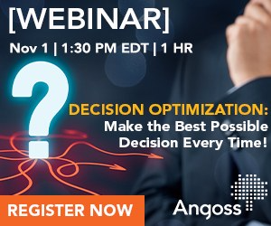
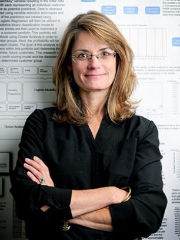

Want to Become a Data Scientist? Read This Interview First

# Want to Become a Data Scientist? Read This Interview First

[  **Previous post**](https://www.kdnuggets.com/2017/10/anaconda-webinar-data-science-big-data.html)

[**Next post**  ](https://www.kdnuggets.com/2017/10/3-popular-courses-deep-learning.html)

[

|     |
| --- |
|     |

]()[

[(L)](https://www.facebook.com/sharer/sharer.php?app_id=172525162793917&kid_directed_site=0&sdk=joey&u=https%3A%2F%2Fwww.kdnuggets.com%2F2017%2F10%2Fbecome-data-scientist-read-interview-first.html&display=popup&ref=plugin&src=share_button)]()[

[**600**inShare](https://s7.addthis.com/static/linkedin.html#)]()[

[**Tweet](https://twitter.com/intent/tweet?original_referer=https%3A%2F%2Fwww.kdnuggets.com%2F2017%2F10%2Fbecome-data-scientist-read-interview-first.html&ref_src=twsrc%5Etfw&text=Want%20to%20Become%20a%20Data%20Scientist%3F%20Read%20This%20Interview%20First%3A&tw_p=tweetbutton&url=https%3A%2F%2Fwww.kdnuggets.com%2F2017%2F10%2Fbecome-data-scientist-read-interview-first.html%23.WefCEjqSyJA.twitter)]()[

[(L)](https://plus.google.com/share?app=110&url=https%3A%2F%2Fwww.kdnuggets.com%2F2017%2F10%2Fbecome-data-scientist-read-interview-first.html)]()[[Share]()[95](https://www.kdnuggets.com/2017/10/become-data-scientist-read-interview-first.html#)](https://www.kdnuggets.com/2017/10/become-data-scientist-read-interview-first.html#)

Tags: [Data Science](https://www.kdnuggets.com/tag/data-science), [Data Science Education](https://www.kdnuggets.com/tag/data-science-education), [Data Scientist](https://www.kdnuggets.com/tag/data-scientist)

There’s been a lot of hype about Data Science... and probably just as much confusion about it.

[ **Decision Optimization: Make the best possible decision every time  Nov 1 Webinar**](http://bit.ly/2ywhRZ8)

* * *

**By [Kevin Gray](https://www.kdnuggets.com/author/kevin-gray), Cannon Gray.**

  [comments](https://www.kdnuggets.com/2017/10/become-data-scientist-read-interview-first.html#comments)

Marketing scientist Kevin Gray asks Jennifer Priestley, Associate Dean of The Graduate College and Professor of Statistics and Data Science at Kennesaw State University, what Data Science really is, what makes a good Data Scientist, and how to become one.

**Kevin Gray: Can you define Data Science for us in simple, layperson’s terms?**

**Jennifer Priestly:** I like the definition that was tweeted (appropriately) by Josh Wills, Director of Data Engineering at Slack - “(It’s the) Person who is better at statistics than any software engineer and better at software engineering than any statistician”. I like to add what I call “The Priestley Corollary” – “(It’s the) Person who is better at explaining the business implications of analytical results than any scientist and better at the analytical science than any MBA”.

**What’s the difference between a statistician and a data scientist?**

It’s a great question. I am also frequently asked What’s the difference between a computer scientist and a data scientist? The fact that both disciplines question if there is effectively anything new here is telling. While both domains are contributing in important and meaningful ways to this nascent discipline, neither is independently sufficient.

Data is not only growing in size, but the definition of what we even consider to be data is expanding. For example, text and image are increasingly common forms of data to be integrated into analytical methodologies like classification and risk modelling. This expanding definition of data is pushing both statistics and computer science out of their traditional cores and into their respective fringes – and it’s at those fringes where the new thinking is taking place – and the fusion of the fringes is forming the basis of Data Science. Much of the traditional core of statistics does not readily accommodate problems defined by billions of records and/or by unstructured data. Similarly, while the core of computer science enables the efficient capture and storage of massive amounts of structured and unstructured data, the discipline is ill equipped to accommodate to the translation of that data into information through modelling, classification and then visualization.

I do agree that in Data Science circles, statisticians are more likely to get the short end of the stick. I think this is unfortunate. A few years ago, there was an article on the Simply Statistics blog, “[Why Big Data Is in Trouble: They Forgot About Applied Statistics](https://simplystatistics.org/2014/05/07/why-big-data-is-in-trouble-they-forgot-about-applied-statistics/)”. The article highlighted the issue of how a rush to the excitement of machine learning, text mining, and neural networks missed the importance of basic statistical concepts related to the behavior of data—including variation, confidence, and distributions. Which lead to bad decisions. While Data Science is NOT statistics, statistics contributes in a foundational way to the discipline.

**Until a few years ago, few of us had ever heard of Data Science. Can you give us a snapshot of its history?**

The term has been traced back to computer scientist Peter Naur in 1960, but “Data Science” also has evolutionary seeds in Statistics. In 1962 John W. Tukey (one of the best known and respected Statisticians of our time) wrote: “For a long time I thought I was a statistician, interested in inferences from the particular to the general. But as I have watched mathematical statistics evolve, I have … come to feel that my central interest is in data analysis… data analysis is intrinsically an empirical science.”

A reference to the term “Data Science” was made in the Proceedings of the Fifth Conference of the International Federation of Classification Societies in 1996. The article was titled “Data Science, Classification, and Related Methods”. In 1997, during his inaugural lecture as the H. C. Carver Chair in Statistics at the University of Michigan, Professor C. F. [Jeff Wu](http://www2.isye.gatech.edu/~jeffwu/) (currently at the Georgia Institute of Technology), actually called for statistics to be renamed data science and statisticians to be renamed data scientists.

A critical milestone for Data Science occurred in 2002 with the launch of the first academic, peer review journal dedicated to Data Science – Data Science Journal…followed the next year by The Journal of Data Science. Since then several other journals have emerged to promote and disseminate academic research specifically in this space.

The emergence of dedicated academic journals is particularly important to the academic community – these journals now provide emerging doctoral programs (like ours) and emerging academic departments to establish unique platforms for research, scholarship and publication. Now Data Science faculty and doctoral students can engage in the production of knowledge and thought leadership within their own community – not Statistics, not Computer Science, not Mathematics, not the Business School.

**A 2011 study by [McKinsey](http://www.mckinsey.com/business-functions/digital-mckinsey/our-insights/big-data-the-next-frontier-for-innovation) that has been widely publicized predicted that by 2018 “…the United States alone could face a shortage of 140,000 to 190,000 people with deep analytical skills as well as 1.5 million managers and analysts with the know-how to use the analysis of big data to make effective decisions.” How accurate has this forecast proven to be? Are there now other projections we should use instead?**

I get asked this question a lot – specifically, I have a lot of corporate executives who ask questions like “Is this Data Science thing a fad?”. I think we need to reframe the discussion.

My [opinion](https://www.linkedin.com/pulse/next-generation-data-scientists-better-than-you-priestley-ph-d-/) is that we don’t need “190,000 people” or “1.5 million managers” who have deep analytical skills. I think everyone needs to have some level of analytical skills. I think that basic data literacy should be as foundational in our education system as reading and math. It’s encouraging to see basic coding skills increasingly being taught in elementary schools. At the university level, my opinion is that Data Science should be part of the General Education curriculum (right now I can hear our Academic Affairs office gasping).

So, while the current talent gap is very real, it’s a function of an education system that has been misaligned with the demands of the market. Education at all levels is still pivoting and likely will continue to do so for the foreseeable future. I would expect that within a generation, the demand for these skills will not diminish, but the supply will be more closely aligned.

> The Priestley Corollary – (It’s the) Person who is better at explaining the business implications of analytical results than any scientist and better at the analytical science than any MBA.

**Many people, including those contemplating a mid-career change, have set their career sights on Data Science. It may not be right for everyone, though. What sorts of aptitudes and skills do you need to work in Data Science? What are the best ways to become a Data Scientist?**

It’s an excellent question. We can talk about the generation coming up behind us…and what we need to do to get them ready…but the reality is that there are a lot of people in their late 20s, 30s, 40s who are looking for opportunities to pivot their career towards Data Science.

I see a lot of these people in my office. I have had more than one conversation that goes like this “I just paid $10,000 to XX university to complete a certificate in Data Science…and I still can’t get a job”. While some of these “certificates” are well developed and are good value, sadly, many are not.

First, you cannot go from being a poet to a Data Scientist by going through a 5 day certificate program. Or worse, an online certificate program.

Second, I think people need to have realistic expectations about what it truly takes to accomplish their career goals. These skills are in high demand and are well paid because they are HARD – or at least take initiative to develop and refine.

Third, I think people need to take an inventory of where their skills are now and where they want to go. The answer to that question of course will dictate how to get there. Those that fall into the lure of the easy online certificate programs should be mindful of the Cheshire Cat from Alice in Wonderland – “if you don’t know where you are going, it really does not matter what path you take”.

I tell people who ask my advice in this area this –

(1) If you are a poet and you are looking to get into Data Science – REALLY get into Data Science as a career in a deep and meaningful way – you need to put away your plumed pen and pull out your jeans and your backpack, and go back to school. Full time. Most graduate programs in Data Science are less than two years and most offer some form of graduate research assistantship. You should be looking for programs that include programming, statistics, modeling. But also ample opportunity to work on REAL world projects with local companies, nonprofits, local governments…etc. I can’t emphasize strongly enough how critical applied, hands on, real experience is to any Data Science program. This is why online/short term certificate programs don’t work for people who are starting from scratch in this area. It’s through hands on experience that will help people understand the more latent aspects of data science – like the role of story telling, creativity (which is woefully underappreciated) and project management.

(2) If you are a computer scientist/programmer, look for a business school program with an analytics track or a strong applied statistics program. Presumably your coding and math skills are where they need to be – you likely need the statistics/modeling/analytics – and the training (again) to tell the story and learn how to work in teams of people who think differently than you do.

(3) I would encourage everyone/anyone to consider learning basic visualization tools like Tableau. I would also encourage anyone/everyone to consider taking online/asynchronous programming courses periodically. These are typically inexpensive (even free) and enable you to continue to keep your skills sharp.

I get the argument that not everyone wants to become a computer programmer – I do not particularly enjoy programming. I had to learn to program to get answers to the research questions that were posed to me. If I could have found the answers using my trusty HP-12C and a mechanical pencil I would have. You have to know basic math, you have to be able to read and write and, increasingly, you have to be competent in some basic programming in the 21st century.

**Data Scientists frequently comment that, in many organizations, management doesn’t really know how to use analytics for decision making. Decisions are still mostly made by gut and heavily influenced by organizational politics. Is that also your experience?**

I frequently give talks at corporate events, where this issue is present in the room – even if it is not vocalized. I frame the conversation like this – organizations can be roughly categorized as native and non-native to data.

Examples of the “natives” are the companies that dominate the headlines – as well as the stock market – Amazon, Google, Facebook. These companies could not have existed 30 years ago. Not only did the data that is so foundational to who they are and what they do did not exist, but even if it did, we did not have the computing power to capture it or to execute the deep analytical methodologies related to AI, machine learning, deep learning…that enable them to do what they do.

However, another dimension to these companies that is often overlooked is that because they are native to data, this has HUGE cultural implications. These are data-driven companies from the top to the bottom of the org chart. They have data running through their DNA. Most everyone who comes into these companies has a data centric orientation – and likely studied a computational discipline – increasingly Data Science. The median age of an employee at Facebook is 29. At Google, it’s also 29 and at Amazon its 30 (not including warehouse employees).

Companies that are non-native to data are the companies that were successful long before we heard terms like “Data Science” and “Big Data.” Examples might include Walmart and Arby’s. These are very successful companies that did not initially have data running through their DNA. And although these companies now lean heavily into data to inform their decision making and delivery of their products and services, there is a great deal of variation across the org chart in terms of computational literacy. But their leadership has been very forward thinking in terms of making these companies leaders in their markets because of the cultural shifts in becoming fact-based, data-driven organizations. Others in their respective markets (Sears, Macys…McDonald’s, Wendy’s) have not.

**Lastly, what impact do you think Artificial Intelligence and automation will have on Data Science in the next 10-15 years?**

I’m not really an expert in this area, but I would say that any forecasting of the death of Statistics, Computer Science or Data Science because of automation is premature. Calculators “automated” mathematics…but mathematics is broader and more complex now than it was before calculators. I expect that same will be true in Data Science.

**Thank you, Jen!**

**[Kevin Gray](https://www.linkedin.com/in/cannongray)** is president of [Cannon Gray](http://cannongray.com/home), a marketing science and analytics consultancy.

[**Jennifer Lewis Priestley**](http://facultyweb.kennesaw.edu/jpriestl/) is Associate Dean, The Graduate College, and Professor of Statistics and Data Science at Kennesaw State University.

[Original](https://www.linkedin.com/pulse/want-become-data-scientist-read-first-kevin-gray/). Reposted with permission.

*This article was first published in Greenbook in July, 2017.*
**Related:**

- [Statistical Modeling: A Primer](https://www.kdnuggets.com/2017/03/statistical-modeling-primer.html)
- [Time Series Analysis: A Primer](https://www.kdnuggets.com/2017/01/time-series-analysis-primer.html)
- [Regression Analysis: A Primer](https://www.kdnuggets.com/2017/02/regression-analysis-primer.html)

* * *

[**Previous post**](https://www.kdnuggets.com/2017/10/anaconda-webinar-data-science-big-data.html)

[**Next post**](https://www.kdnuggets.com/2017/10/3-popular-courses-deep-learning.html)

* * *

## Top Stories Past 30 Days

| **Most Popular** |
| --- |
| 1.   [**30 Essential Data Science, Machine Learning & Deep Learning Cheat Sheets**](https://www.kdnuggets.com/2017/09/essential-data-science-machine-learning-deep-learning-cheat-sheets.html) 2.   [**Understanding Machine Learning Algorithms**](https://www.kdnuggets.com/2017/10/understanding-machine-learning-algorithms.html) 3.   [**How To Become a 10x Data Scientist, part 1**](https://www.kdnuggets.com/2017/09/become-10x-data-scientist-part1.html) 4.   [**Introduction to Blockchains & What It Means to Big Data**](https://www.kdnuggets.com/2017/09/introduction-blockchain-big-data.html) 5.   [**Python overtakes R, becomes the leader in Data Science, Machine Learning platforms**](https://www.kdnuggets.com/2017/08/python-overtakes-r-leader-analytics-data-science.html) 6.   [**The 10 Algorithms Machine Learning Engineers Need to Know**](https://www.kdnuggets.com/2016/08/10-algorithms-machine-learning-engineers.html) 7.   [**Data Science and the Imposter Syndrome**](https://www.kdnuggets.com/2017/09/data-science-imposter-syndrome.html) |

| **Most Shared** |
| --- |
| 1.   [**Understanding Machine Learning Algorithms**](https://www.kdnuggets.com/2017/10/understanding-machine-learning-algorithms.html) 2.   [**Introduction to Blockchains & What It Means to Big Data**](https://www.kdnuggets.com/2017/09/introduction-blockchain-big-data.html) 3.   [**Top 10 Active Big Data, Data Science, Machine Learning Influencers on LinkedIn, Updated**](https://www.kdnuggets.com/2017/09/top-10-big-data-science-machine-learning-influencers-linkedin-updated.html) 4.   [**Using Machine Learning to Predict and Explain Employee Attrition**](https://www.kdnuggets.com/2017/10/machine-learning-predict-employee-attrition.html) 5.   [**Keras Cheat Sheet: Deep Learning in Python**](https://www.kdnuggets.com/2017/09/datacamp-keras-cheat-sheet-deep-learning-python.html) 6.   [**XGBoost, a Top Machine Learning Method on Kaggle, Explained**](https://www.kdnuggets.com/2017/10/xgboost-top-machine-learning-method-kaggle-explained.html) 7.   [**Want to Become a Data Scientist? Read This Interview First**](https://www.kdnuggets.com/2017/10/become-data-scientist-read-interview-first.html) |