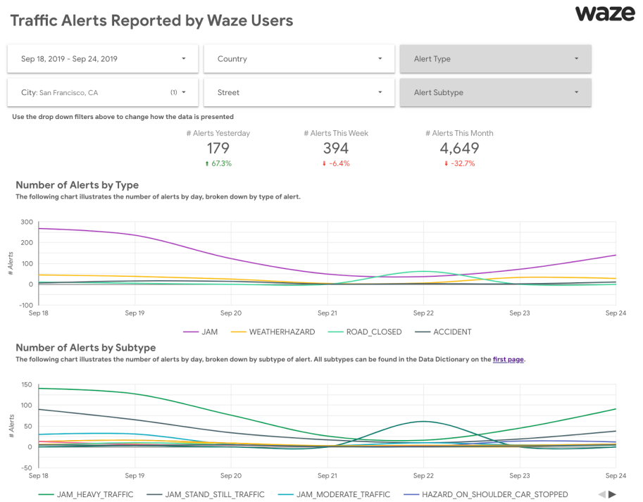

Waze integrates city data-sharing program with Google Cloud

Waze has announced that [its data-sharing program for cities](https://venturebeat.com/2019/04/05/how-waze-is-using-data-pacts-beacons-and-carpools-to-win-over-cities/) will now be made available on the Google Cloud Platform, making it easier for end users to derive insights from the data.

The [Google-owned](https://venturebeat.com/2013/06/09/google-buys-waze-rumor/) navigation company introduced its Connected Citizens Program (CCP) back in 2014, [with 10 initial partners](https://www.prnewswire.com/news-releases/waze-launches-connected-citizens-program-debuts-inaugural-w10-277867931.html) spanning the U.S., Brazil, Spain, Indonesia, and Costa Rica. Among the original launch partners were the New York Police Department, Los Angeles County, the states of Florida and Utah, and the city of Boston, though in the intervening years Waze has added more than 1,000 new organizations from around the globe.

Recommended videos
Powered by [AnyClip](https://anyclip.com/)

 [        Now Playing     Waze Brings Beacon Tech to NYC to Clear Tunnel Congestion](https://venturebeat.com/2019/10/01/waze-integrates-city-data-sharing-program-with-google-cloud/)

 [           Waze`s Newest Update Gives You Toll Prices on Your Route](https://venturebeat.com/2019/10/01/waze-integrates-city-data-sharing-program-with-google-cloud/)

 [           Silicon Valley Examines Building a Better IPO Process](https://venturebeat.com/2019/10/01/waze-integrates-city-data-sharing-program-with-google-cloud/)

 [           Esports Viewership To Surge By 2023](https://venturebeat.com/2019/10/01/waze-integrates-city-data-sharing-program-with-google-cloud/)

 [           How To Naturally Track Your Fertility](https://venturebeat.com/2019/10/01/waze-integrates-city-data-sharing-program-with-google-cloud/)

 [           In Landmark Trial, Experimental Drug Delays Type 1 Diabetes](https://venturebeat.com/2019/10/01/waze-integrates-city-data-sharing-program-with-google-cloud/)

 [           Dating Apps Users More Likely To Have Unhealthy Eating Habits](https://venturebeat.com/2019/10/01/waze-integrates-city-data-sharing-program-with-google-cloud/)

The program doesn’t involve any direct financial exchange — the transaction is purely based on sharing data between Waze and its partners. Aside from the data it crowdsources from its own consumer-focused apps, Waze also collects data from myriad external sources, [including event organizers](https://venturebeat.com/2016/08/11/waze-launches-events-partner-program/), which may help avert traffic congestion through improved communication around major events. Waze has also struck partnerships [with private bodies,](https://venturebeat.com/2018/04/26/waze-and-waycare-strike-data-sharing-pact-to-improve-city-traffic/) such as traffic management platform Waycare, which collates data from countless sources, including connected car platforms, telematics, road cameras, construction projects, and public transit. At its core, the CCP has been about helping cities improve infrastructure projects while enabling Waze to improve its own navigation app and the CCP’s value to other potential partners.

Today, the CCP is known as [Waze for Cities Data](https://www.waze.com/ccp), and the company is looking to improve its usability by leveraging the computational power of Google Cloud.

“Waze has been a pioneer in sharing data with cities and working with them to improve infrastructure and fight traffic,” said Dani Simons, head of public sector partnerships at Waze. “But over the past five years the landscape has changed. Cities have more data than ever, but they want better tools to analyze it and be able to put it to use to improve their streets.”

## Heavy lifting

Until now, Waze’s partners have only been able to access data via an API feed Waze has provided. The cities themselves have had to do all the heavy lifting, in terms of ingesting the data feed and storing it locally or through a separate cloud service. Crucially, cities have also had to know how to interpret raw data. But now Waze will take care of it all through a user-friendly dashboard powered by Google.

In real terms, this means cities and other partners will be able to access the full gamut of data warehouse analytics and visualization tools offered by BigQuery and Data Studio.

Above: Waze for Cities Data dashboard

This is a notable evolution for the Waze data-sharing program, as making it easier to interpret data opens things up to more non-experts.

“Waze for Cities Data partners will no longer need to build their own tools or have different systems for different data sources,” added Sudhir Hasbe, director for product management at Google Cloud. “The integration with Google Cloud will make it easy to view Waze for Cities Data and layer in other transportation-related data sources to see the full picture of mobility trends in one place.”

What this integration also delivers is a potentially lucrative inroad for Google, which may want to nab more public bodies in the fiercely competitive cloud market. Waze for Cities Data partners will receive 10 gigabytes of data storage and a 1-terabyte allowance for analyzing data — anything above that will require a paid account. Moreover, Waze said it’s providing the most commonly used data reports — such as roadway hazards, accident reports, and traffic alerts — for free.

Users can  go further, however, by opening a paid account, the company said. This will effectively mean that they are able to create their own custom dashboards using the raw data from BigQuery, with costs varying depending on the data and visualizations required.

Waze first announced plans to launch its data-sharing program on Google Cloud earlier this year, but the program is now open to any public agency through [an application process](https://www.waze.com/ccp). Existing Waze for Cities Data partners will be contacted separately about how they can switch from their existing account.

While Waze will store all the data in Google Cloud regardless, its partner organizations will still be free to use Waze for Cities Data as a raw data feed if that’s what they prefer. It’s worth noting here, however, that the historical data in Google Cloud commences only from April, 2019.