What 24 hours in a diner taught me about New York

 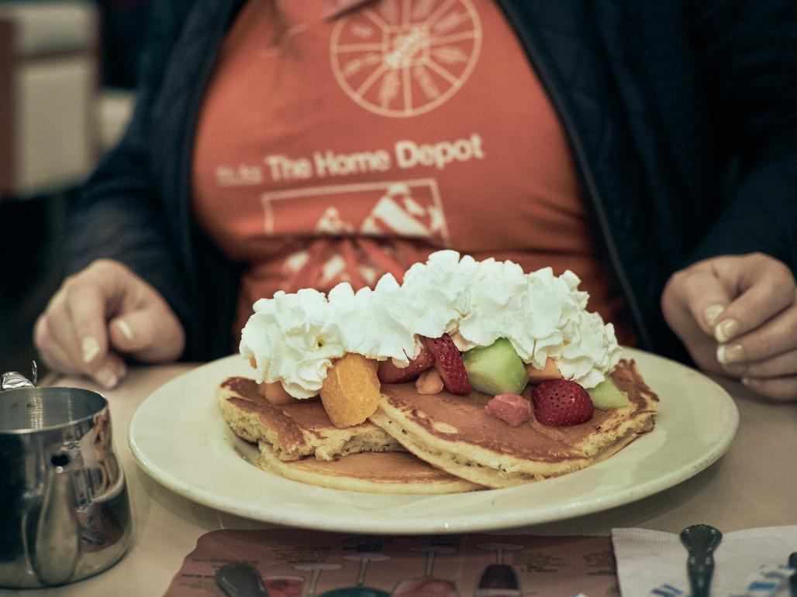

[America](https://www.1843magazine.com/america-0)

#  What 24 hours in a diner taught me about New York

To stay up all night is the ultimate way to experience the city that never sleeps

 [Tara Isabella Burton](https://www.1843magazine.com/contributor/2326) | March 8th 2018

   

Londoners have their pubs. Parisians have their cafés. New Yorkers have diners – altars to cheap coffee and mayo-spackled pastrami, where you can order a mug at dawn and stay until dusk, where you can hurl invective at the waiters and where they’ll hurl them right back. New Yorkers may be brusque, but at the diner counter, they’ll tell you every one of their secrets before the second cup of coffee.

Edward Hopper described his painting “Nighthawks” (1942) – perhaps the most famous diner scene after the orgasmic pastrami sandwich in “When Harry Met Sally” – as a process of “painting the loneliness of a large city”.

The diner, after all, is at once the result of New York’s loneliness and its solution. It’s a place where social rules among strangers – no eye contact, no smiling, especially no conversation – are suspended. The greatest diners, like Chelsea Square, are the 24-hour ones that cater to morning workers and midnight drunks, and to the people who find themselves in those sunrise spaces in between.

I’d petitioned the owner of the Chelsea Square, John Lapsadis, to let me spend 24 hours at one of his booths, to see life here from sunrise to sunrise. He’d shrugged. “Do what you want.”

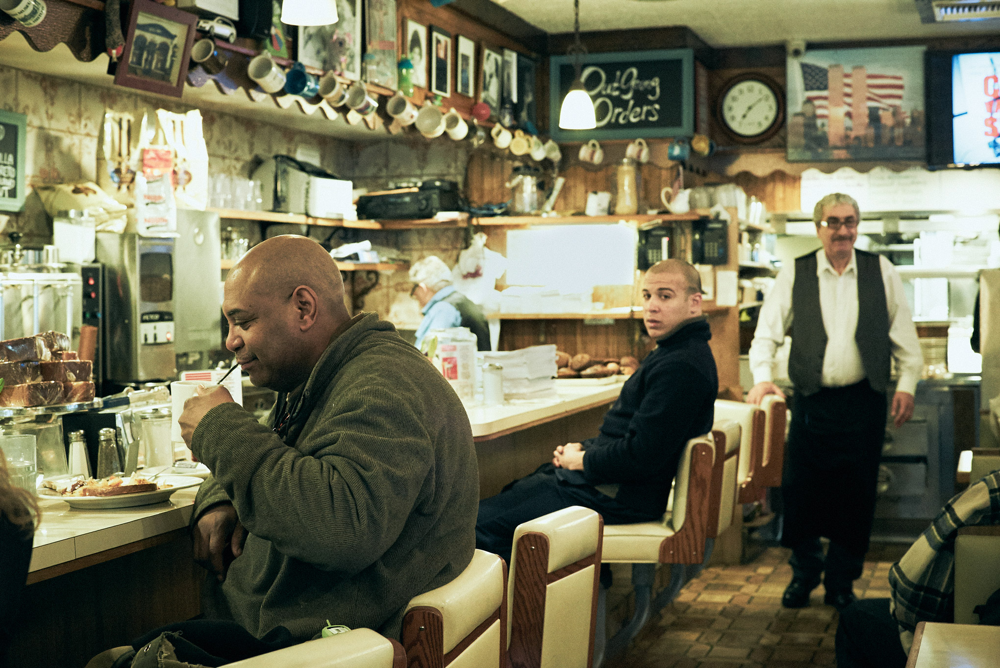

**“Nobody wants a party anymore”** George Maxy is known as Brother Love to his colleagues

**6am**

John and the rest of the staff have forgotten that I’d planned to come – or else they never cared in the first place. They shoot me dirty looks every time I approach a customer.

One man – black, in a beret, his glasses tied around his neck, seated directly under a signed photo of the cast of “Sex and the City” – is laughing to himself. “Happy day,” he said to nobody in particular as he shakes salt onto his eggs.

Soon he’s talking to me.

“People in New York,” he says, are “cruel, cantankerous, vicious and vile.” He moved to Pennsylvania to get away from them, he tells me. Once, he used to party down here, back when Chelsea was home to all the old nightclubs. “Nobody wants a party anymore.”

His name is George Maxy, but the men at the construction site he’s working on now call him Brother Love. It’s because he’s so happy, he says. He talks to everybody – even strangers. Especially strangers. It’s his personality; he’s an Aquarius. Talking makes him happy. He used to think money made him happy, but then he realised: “You can’t eat a Lexus.”

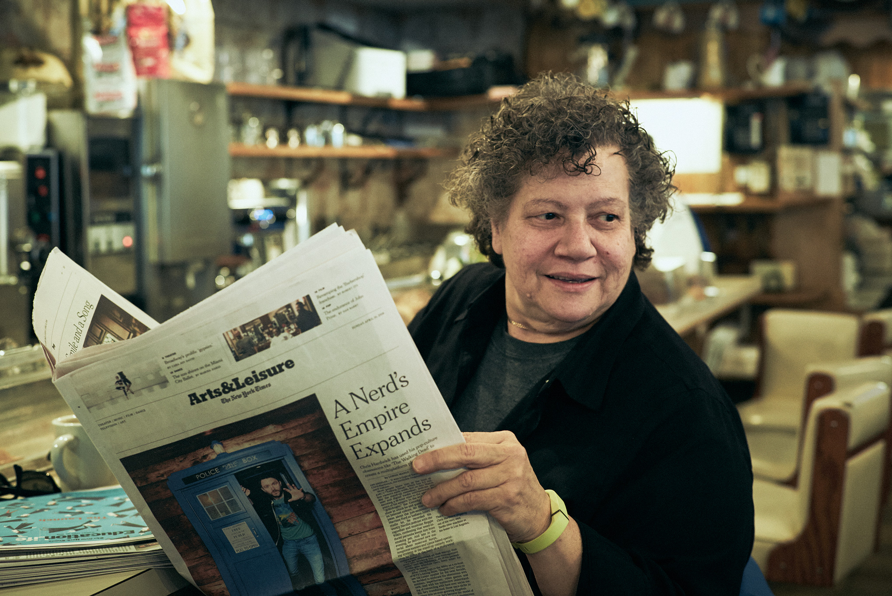

**“The best place in New York” **Lynn Mazza has been a regular at the diner since day one

**7am**

Lynn Mazza keeps her sunglasses on indoors. Her cane is slung around one of the counter stools. She has been a regular at the Chelsea Square since the day it opened – “August 10, 1980,” in case I doubt her. She produces classical music CDs – not that young people care about classical music anymore. “They’ve got the attention spans of a wet bean.”

This place is different, she says. “It’s the best place in New York.” You don’t have to dress up, make an effort. You just come in; they know you. Just last week was her birthday – she shows me the video on her phone. Teddy the Greek – the owner – and the waiters all made her a cake; they sang her happy birthday.

“I spend more time here than with my own family,” she says.

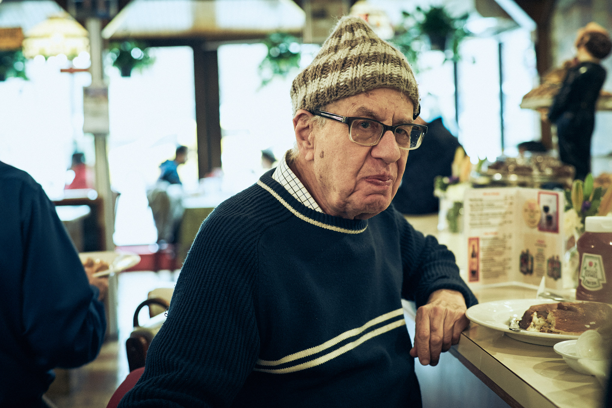

**Old favourite** Michael Rossenwasser comes for matzoh ball soup every lunchtime

**11am**
Each hour, at the Chelsea Square, I come to learn, brings its own regulars.

There’s the dawn crowd, the breakfast geriatrics, the gay couples at brunch. They all have their own stools – a retired Irish cop called Ed tells me he “goes into a frenzy” if an unsuspecting tourist takes his spot.

There’s Michael Rossenwasser – in his eighties – who used to be an energy consultant. He lived in a $150-a-month rent-controlled apartment on the prosperous Upper East Side, but now lives in the subsidised housing unit on the corner. He comes for matzoh ball soup each lunchtime, though the prices have gotten ridiculous now. He doesn’t talk to a single one of his neighbours – “it’s better that way” – but he knows everybody here.

There’s Steve Horton, a graphic designer in his forties, who moved here from Miami five years ago and walks his dog Olive in the shadow of the High Line, who had Thanksgiving dinner here and who feels, for the first time in his life, that he’s finally put down roots.

Then there’s the unfinished stories: the people I don’t talk to, or who won’t talk to me, or whom I only ever see out of the corner of my eye. The gay couple eating brunch, dressed in immaculate, crisp white. One of them keeps moving his partner’s waffles away from the edge of the table. Only when they stand up do I realise the partner is blind.

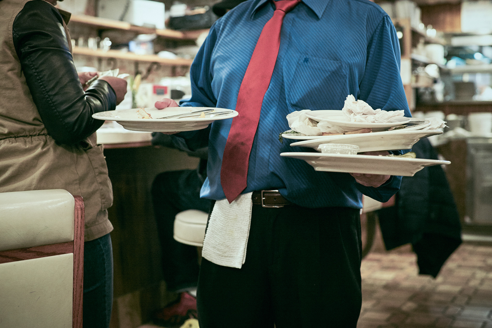

**Clearing the tables** Diner food is best consumed when drunk

**12pm**

I’ve eaten so much that I can’t stand. Diner food, as a rule, is hearty, salty: best consumed when drunk. Menus tend to include a blend of American standbys, Greek food – most diner owners in New York are Greek – and Jewish dishes.

I tried Chelsea Square’s speciality: disco fries, grease-dappled French fries swimming in a moreish combination of Mozzarella and brown gravy.

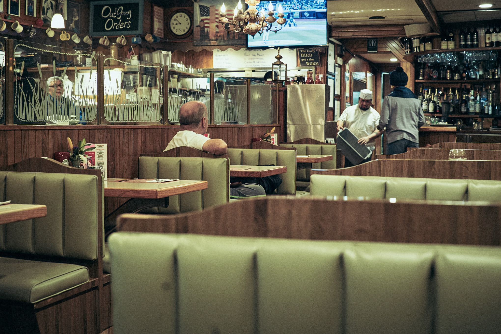

**The American dream?** A career in a diner means gruelling work for little reward

**1pm**

The staff introduce themselves: Herman – who worked on a cruise ship before coming here and speaks a little bit of every language in the world – and René, beloved of the diner’s old ladies and gay men. There’s Old George, who is Egyptian, and Young George, who is Greek.

“You’re going to have a sour face, you know,” one of them tells me, “If you make it all the way to six.” He gets me a fresh mug of coffee for free.

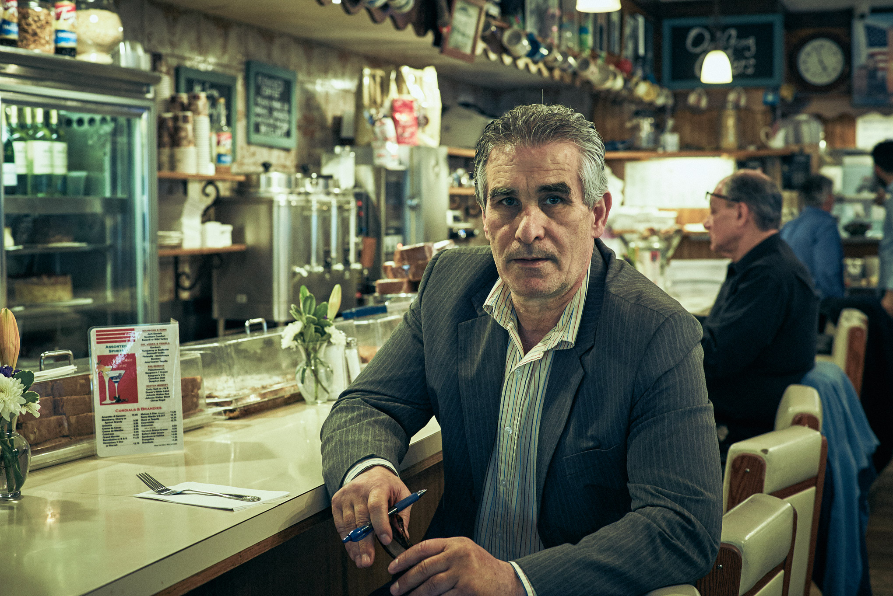

**“I’m a troublemaker”** Owner John Lapsadis is a first-generation immigrant from Greece

**3pm**

John’s decided he remembers me. He’s finished hassling some tourists over their use of credit cards – “only plastic money in America,” he spits – and so it’s time for him to come explain his philosophy of life.

“They don’t like me here,” he says. “I’m a troublemaker.” He makes the staff nervous. But it’s for their own good – don’t I see? It’s like when you’re a child in school and you have a perfectionist teacher. You think they’re terrible – until you grow up, realise how far they pushed you. “Each individual, I hope,” he announces, “will become better than me.” After all, that’s the American dream. He came here from Evia, in Greece, to work – and work hard. Now one of his daughters is a lawyer. Now he owns the diner.

John has a riddle for me. He gives me a piece of paper and asks me to write down his level of formal education. If I get it right, he’ll buy me dinner.

I respond with something polite and vague.

ADVERTISING

[inRead invented by Teads](http://inread-experience.teads.tv/)
He slams the table.

“I left high school,” he says. “No college. But in the sidewalks of life, from my daughters, I learn things. I trick people. I make them think I went to Duke University!”

Whether John will stay for long, however, is another matter. Rents are rising in New York – especially in Chelsea, with its proximity to the gentrification along the High Line park – and one by one, diners, with their low profit margins and neglible cool factors, are shutting down. Younger generations are less willing than than their parents to put up with gruelling, low-profit work. And New York’s foodie craze has rendered traditionally comfort-driven diner fare less commercially desirable.

Ten years ago there were 1,000 diners in New York. Now there are fewer than 400.

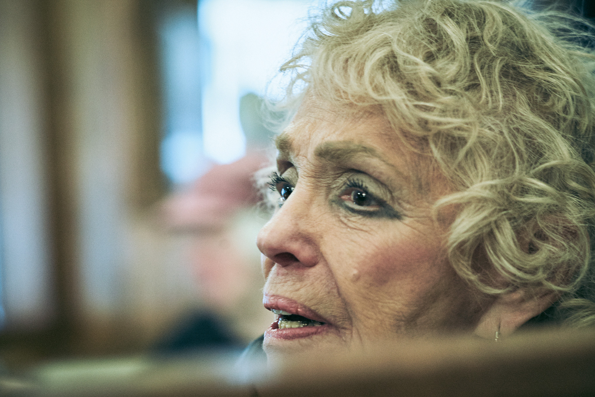

**“New York’s always fabulous”** Dolores used to be an actress

**4pm**

Dolores – in her eighties, in pink furs and tattooed eyeliner – is from Manhattan, she says. Of course, she was born in the Bronx – so much less fashionable – but Manhattan is where she’s really from. “From the get-go,” she says.

She was on the stage once. She lived in a studio over on 19th Street and directed a production of Lillian Hellman’s “The Little Foxes”. Then she got married, moved into the London Terrace building next door. She stopped acting.

“Can you imagine getting married, doll? If I still had that apartment” – $50 a month – “I’d have been a millionaire!” She comes to the diner every day – for lunch, for dinner, for drinks. And every day John tries to get her to run away with him.

But Dolores isn’t interested in men, not since her husband died. Maybe not even before then. She loves her life here – the Cosmos she drinks without fail at her favorite table, the artists she gets to talk to.

“New York is fabulous,” she says. “It was always fabulous. Everyone says it’s changing – getting too expensive.” But Dolores doesn’t care. “To me, it doesn’t change, doll.” She flutters her darkened eyelids. “To me, New York’s always fabulous.” She turns to go – she’s left a half-finished drink at the bar next door.

“You know she was a big Broadway star, yeah?” says John. “40 or 50 years ago.”
“40 or 50 years ago?” replies Dolores, incredulous. “John, be nice.”

**6pm**

After dusk, some of the regulars – including Dolores – return. They take their customary booths, their usual stools. Herman the waiter brings me another cup of coffee, a slice of pie that takes me four hours to eat.

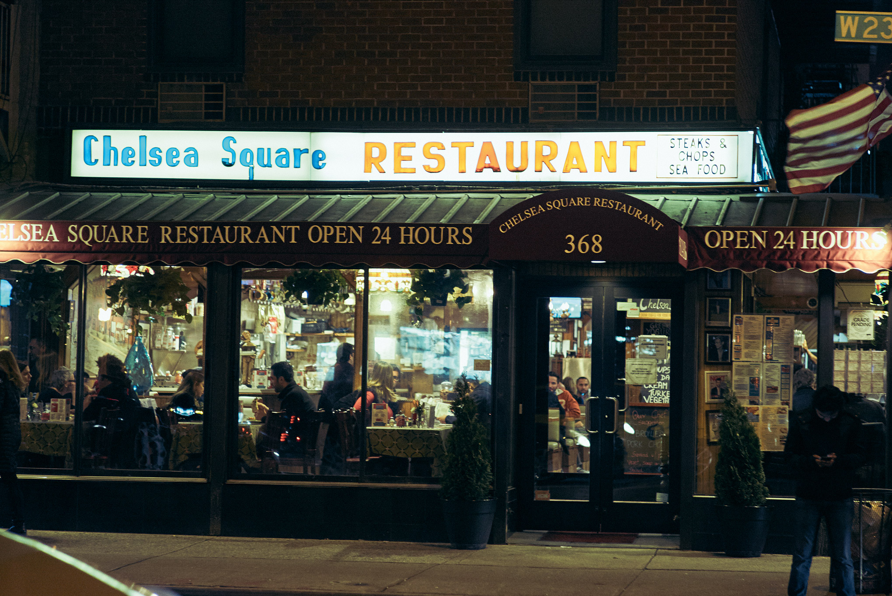

** When the old men go home, the drunks come out** The Chelsea Square at night

**10pm**

John moves my table. It’s safer that way, he says. I’ll be able to see the fights from the distance. When the old men go home, the drunks come out. Back in the day there used to be gang shootings, here – over drugs, money, prostitutes. He’s seen two men killed in this diner: both were shot, one through the window. He shows me a surveillance video from just a few weeks ago: four woman leaping over the counter in a brawl.

Now the air is thick with the smell of marijuana. The bald man at the counter is talking to himself and twitching. Another man stumbles in, reeking. Soon he is banging on the table for another drink. His name is Kevin McElduff and he is the third person to tell me he was Chelsea Square’s first customer, back on that August day in 1980. He comes in “when he’s drunk,” which is “all the time.” They’re good to him, here. Sure John beat him up, once, for getting too drunk; sure, he threw John through a window that one time. But he went to John’s wedding. And when his brother, Robin, died suddenly – tears drip into his cherry rum and coke – John was there for him, too. They sent flowers. They cared like he was their own. He drunkenly left a bag with $10,000 in it here, once, after winning big at the bookie’s. They returned the money to him: every cent. Now his niece is marrying John’s business partner’s nephew.

Nobody fights, tonight. Kevin pounds drinks at the counter: $10 cocktails I can smell from my seat. A couple in weaves and short shorts sit at one of the booths; a girl in an evening dress totters in high heels.

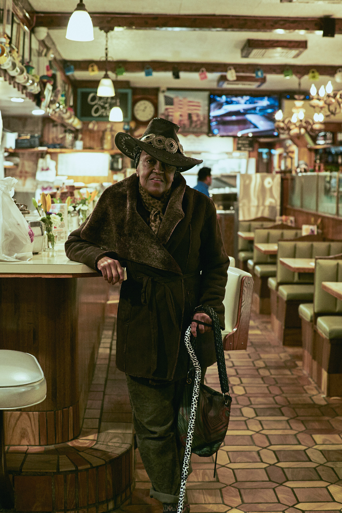

**“If I’d done half the stuff I said I did I’d be dead” ** Stephanie Johnson used to write erotica

**1.30am**

A couple breaks up: the woman calm, the man yelping. Another man graphically details his sex life over the phone.

A black woman with a leopard-print cane and gold-trimmed cowboy hat points at one of the celebrity photos that line the wall: a beauty queen in sequins.

“That,” she says lightly, “was me.”

Her name is Stephanie Johnson, but she went by Tanqueray, then, back when she was one of the first black go-go dancers in the city, back when all the strip joints were run by an Italian mobster called Matty the Horse. She did all kinds of things for money back then – burlesque, corralling her “girls” for gentlemen callers, writing erotica for “High Society” magazine. “I made that stuff up, got $500 every other month. If I’d have done half the stuff I said I did I’d have been dead by now.” She’s stopped by for a witching-hour drink, but she doesn’t have long. She has to go home to finish sewing one of the pinafores she makes for men with a fetish for dressing in French maid’s uniforms.

She introduces me to the night-shift waiter, Jesse, whose birthday she celebrated only last month by sending a stripper – with birthday candles on her breasts – to give him a lap dance in the diner’s back rooms.

One day, Stephanie says says, she’ll write a memoir. Tattletales of Tanqueray. She was always so concerned about her clients’ privacy, she says. “But so many of them are dead now.”

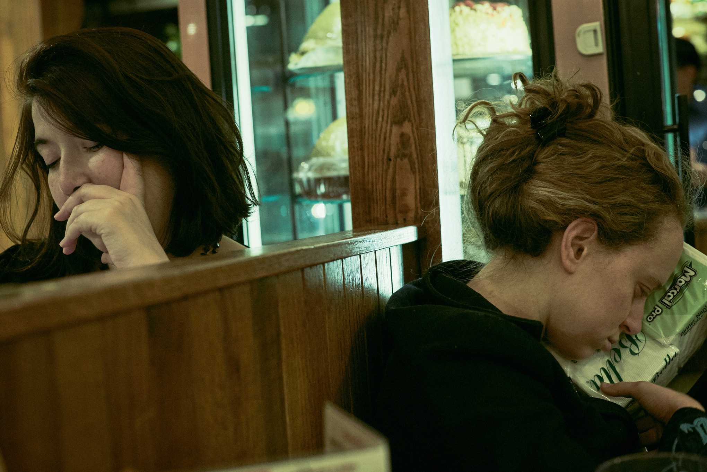

**Sleep tight** A box of paper napkins acts as a makeshift pillow

**4am**

The happy drunks give way to the sad drunks, the lonely drunks. The disco fries give way to pancakes, waffles, eggs. Irish coffee – noxious whiskey with a shot of espresso, globules of whipped cream, neon peppermint syrup – closes the gap between the two. I start to doze off in my corner.

Jesse comes by with a box of paper napkins: a makeshift pillow. He cuts off my coffee supply: 21 cups, we agree, were probably too many.

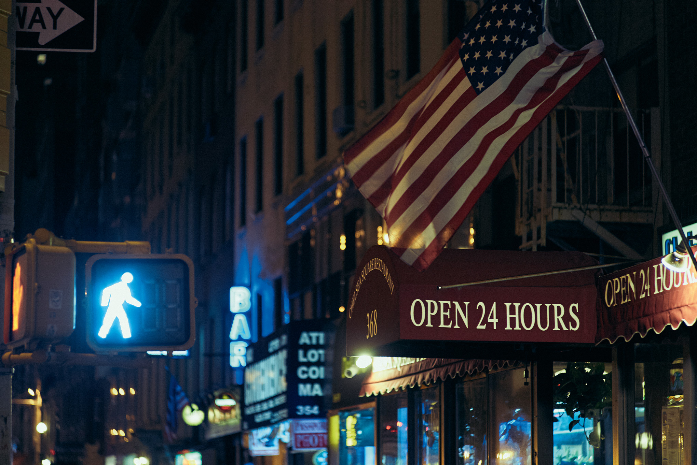

**The sunrise space in between** Diners are to New York what pubs are to London

**6am**

One of the waiters – one of the ones who seemed most irritated by my presence the previous dawn – opens up one of the booths, takes out plastic bag from underneath his seat, stashes parts of his uniform. He taps me on the shoulder to say goodbye.

**[Tara Isabella Burton](https://www.1843magazine.com/contributor/2326)**lives in New York. Her first novel, “Social Creature”, will be published by Bloomsbury on June 14th

Photographs **Flora Hanitijo**

#### More From The Author

[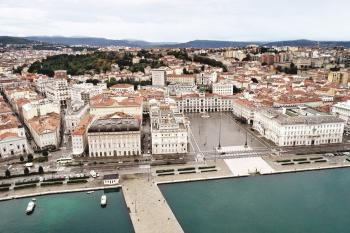](https://www.1843magazine.com/travel/glory-daze-in-trieste)

### [Glory daze in Trieste](https://www.1843magazine.com/travel/glory-daze-in-trieste)

 [Tara Isabella Burton](https://www.1843magazine.com/contributor/2326) | April/May 2018

A city where cultures and empires once collided longs for its vaunted past

### [Take the high road](https://www.1843magazine.com/travel/take-the-high-road)

 [Tara Isabella Burton](https://www.1843magazine.com/contributor/2326) | May 3rd 2017

The old Georgian Military Highway is luring travellers to the Caucasus with its grand landscapes, warm welcome and fine moonshine. Tara Isabella Burton drinks it all in

## More From [America](https://www.1843magazine.com/america-0)

[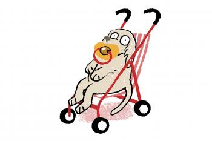](https://www.1843magazine.com/dispatches/for-the-love-of-dog)

[America](https://www.1843magazine.com/america-0)

### [For the love of dog](https://www.1843magazine.com/dispatches/for-the-love-of-dog)

When Alexandra Suich, *The Economist*’s US technology editor, bought a puppy and gave it a baby name, she joined a growing pack of pet owners

[America](https://www.1843magazine.com/america-0)

### [Dreams of their forefathers](https://www.1843magazine.com/features/dreams-of-their-forefathers)

A journey across South Dakota commemorates the biggest mass execution in American history and exemplifies a cultural re-awakening among native Americans. James Astill joined the ride