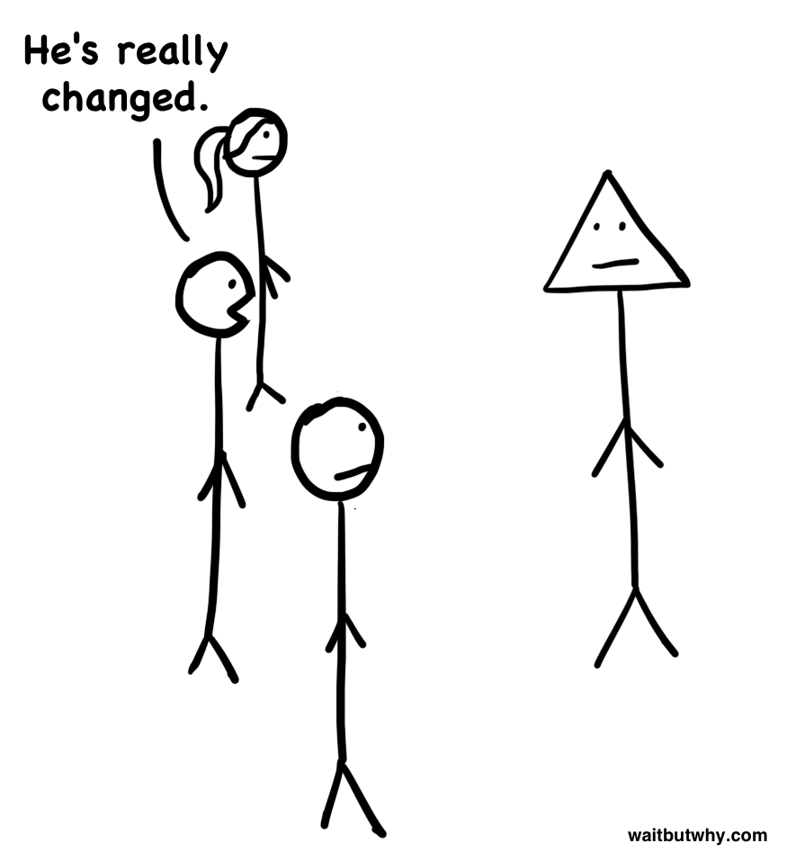
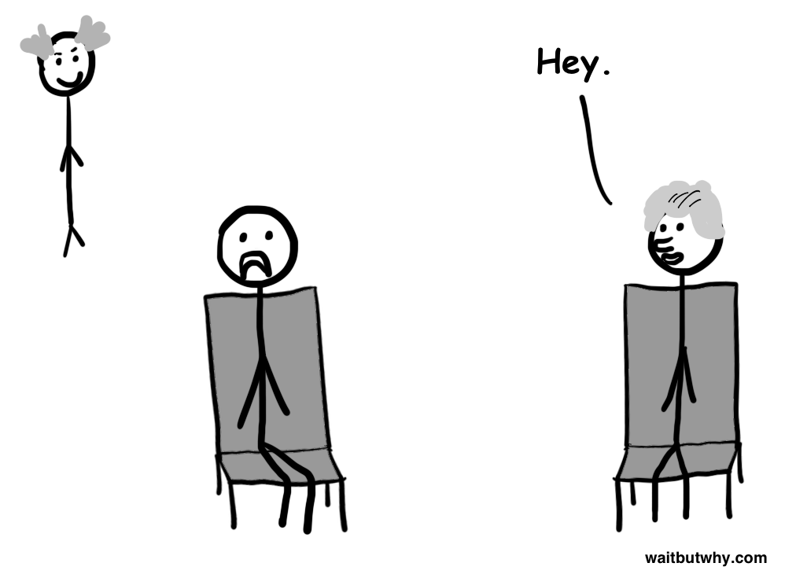
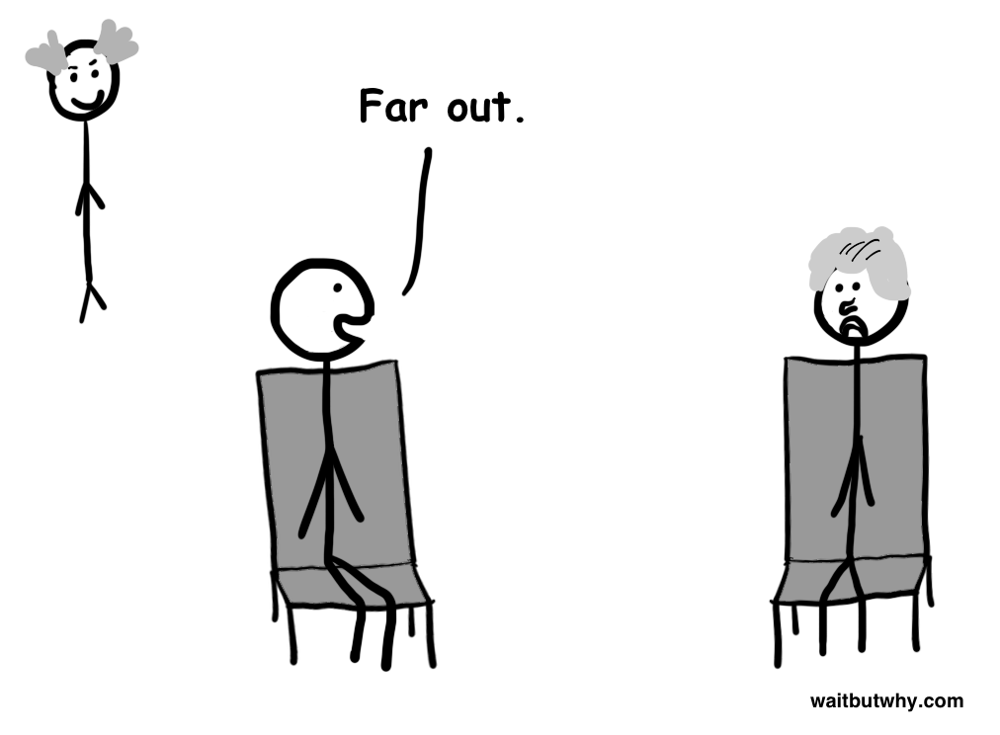
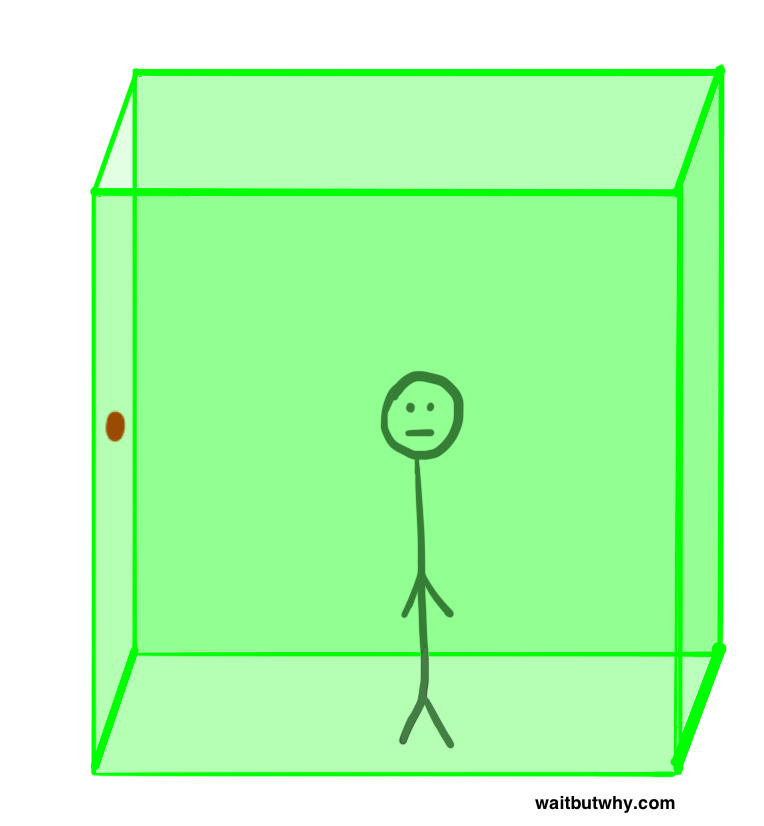
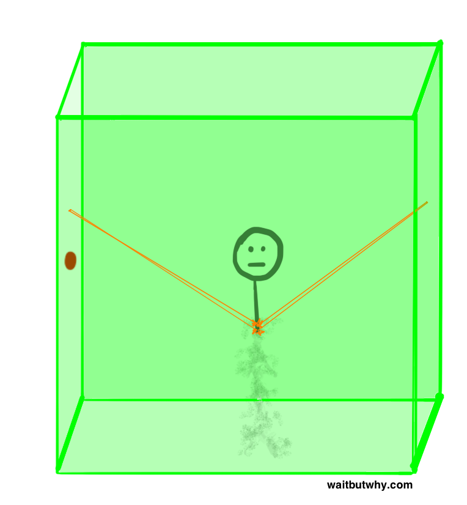
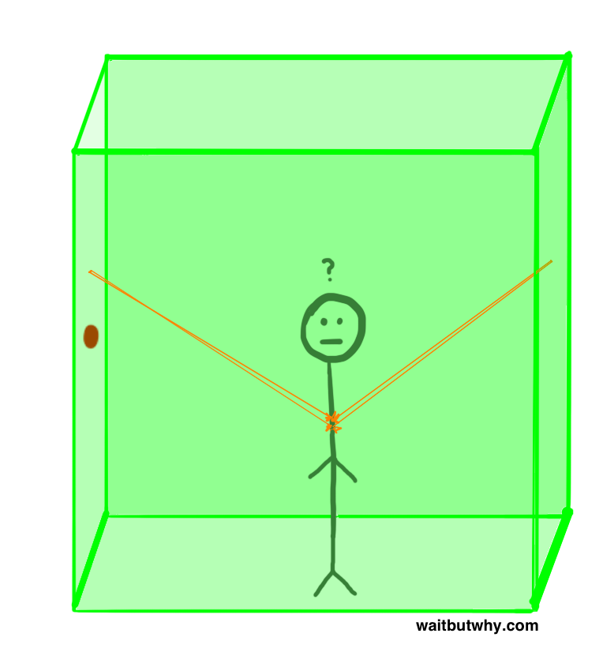
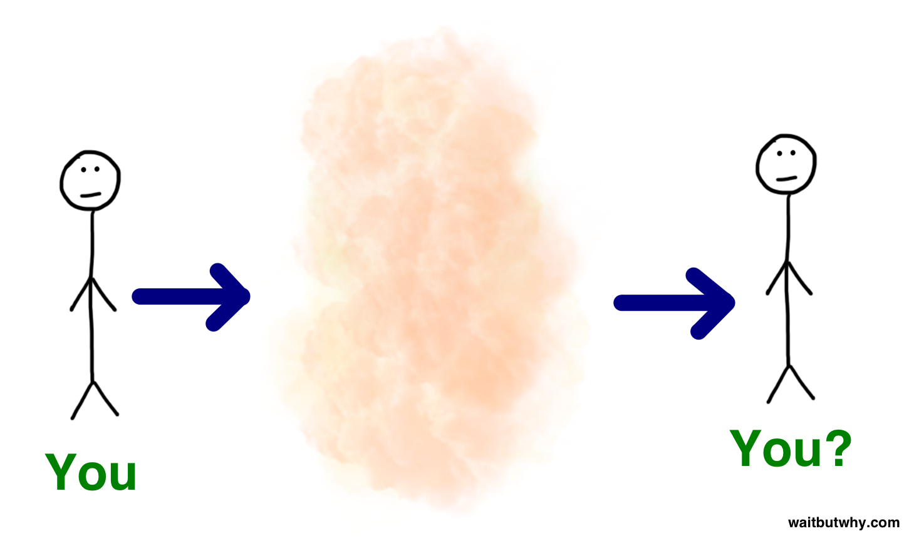

What Makes You You? - Wait But Why

# What Makes You You?

*Note: If you want to print this post or read it offline, the PDF is probably the way to go. You can [buy it here](https://gum.co/wbw-you).*

When you say the word “me,” you probably feel pretty clear about what that means. It’s one of the things you’re cleareston in the whole world—something you’ve understood since you were a year old. You might be working on the question, “Who amI?” but what you’re figuring out is the *who am *part of the question—the *I *part is obvious. It’s just you. Easy.

But when you stop and actually think about it for a minute—about what “me” really boils down to at its core—things start to get pretty weird. Let’s give it a try.

**The Body Theory**

We’ll start with the first thing most people equate with what a person is—the physical body itself. The Body Theory says that that’s what makes you you. And that would make sense. It doesn’t matter what’s happening in your life—if your body stops working, you die. If Mark goes through something traumatic and his family says, [(L)](https://28oa9i1t08037ue3m1l0i861-wpengine.netdna-ssl.com/wp-content/uploads/2014/12/CH1.png)

“It really changed him—he’s just not the same person anymore,” they don’t literally mean Mark isn’t the same person—he’s changed, but he’s still Mark, because Mark’s body *is *Mark, no matter what he’s acting like. Humans believe they’re so much more than a hunk of flesh and bone, but in the end, a physical ant *is *the ant, a squirrel’s body *is* the squirrel, and a human is its body. This is the Body Theory—let’s test it:

So what happens when you cut your fingernails? You’re changing your body, severing some of its atoms from the whole. Does that mean you’re not you anymore? Definitely not—you’re still you.

How about if you get a liver transplant? Bigger deal, but definitely still you, right?

What if you get a terrible disease and need to replace your liver, kidney, heart, lungs, blood, and facial tissue with synthetic parts, but after all the surgery, you’re fine and can live your life normally. Would your family say that you had died because most of your physical body was gone? No, they wouldn’t. You’d still be you. None of that is needed for you to be you.

Well maybe it’s your DNA? Maybe *that’s *the core thing that makes you you, and none of these organ transplants matter because your remaining cells all still contain your DNA, and they’re what maintains “you.” One major problem—identical twins have identical DNA, and they’re not the same person. You are you, and your identical twin is most certainly *not *you. DNA isn’t the answer.

So far, the Body Theory isn’t looking too good. We keep changing major parts of the body, and you keep being you.

But how about your brain?
**The Brain Theory**

Let’s say a mad scientist captures both you and Bill Clinton and locks the two of you up in a room.

[(L)](https://28oa9i1t08037ue3m1l0i861-wpengine.netdna-ssl.com/wp-content/uploads/2014/12/CH.png)

The scientist then performs an operation on both of you, whereby he safely removes each of your brains and switches them into the other’s head. Then he seals up your skulls and wakes you both up. You look down and you’re in a totally different body—Bill Clinton’s body. And across the room, you see your body—with Bill Clinton’s personality.

[(L)](https://28oa9i1t08037ue3m1l0i861-wpengine.netdna-ssl.com/wp-content/uploads/2014/12/CFO.png)

Now, are you still you? Well, my intuition says that you’re you—you still have your exact personality and all your memories—you’re just in Bill Clinton’s body now. You’d go find your family to explain what happened:

[(L)](https://28oa9i1t08037ue3m1l0i861-wpengine.netdna-ssl.com/wp-content/uploads/2014/12/CF11.png)

[(L)](https://28oa9i1t08037ue3m1l0i861-wpengine.netdna-ssl.com/wp-content/uploads/2014/12/CF2.png)

So unlike your other organs, which could be transplanted without changing your identity, when you swapped brains, it wasn’t a brain transplant—*it was a body transplant*. You’d still feel like you, just with a different body. Meanwhile, your old body would *not *be you—it would be Bill Clinton. So what makes you you must be your *brain. *The Brain Theory says that wherever the brain goes, you go—even if it goes into someone else’s skull.

**The Data Theory**
Consider this—

What if the mad scientist, after capturing you and Bill Clinton, instead of swapping your physical *brains*, just hooks up a computer to each of your brains, copies every single bit of data in each one, then wipes both of your brains completely clean, and then copies each of your brain data onto the *other person’s physical brain*? So you both wake up, both with your own physical brains in your head, but *you’re* not in your body—you’re in Bill Clinton’s body. After all, Bill Clinton’s brain now has all of your thoughts, memories, fears, hopes, dreams, emotions, and personality. The body and brain of Bill Clinton would still run out and go freak out about this to your family. And again, after a significant amount of convincing, they would indeed accept that you were alive, just in Bill Clinton’s body.

Philosopher John Locke’s [memory theory](http://www.ncbi.nlm.nih.gov/pmc/articles/PMC3115296/) of personal identity suggests that what makes you you is your memory of your experiences. Under Locke’s definition of you, the new Bill Clinton in this latest example *is *you, despite not containing any part of your physical body,* not even your brain. *

This suggests a new theory we’ll call The Data Theory, which says that you’re not your physical body at all. Maybe what makes you you is your brain’s *data*—your memories and your personality.

We seem to be honing in on something, but the best way to get to concrete answers is by testing these theories in hypothetical scenarios. Here’s an interesting one, [conceived by](http://www.uvm.edu/~lderosse/courses/metaph/Williams(1970).pdf) British philosopher Bernard Williams:

**The Torture Test**

Situation 1:The mad scientist kidnaps you and Clinton, switches your brain data with Clinton’s, as in the latest example, wakes you both up, and then walks over to the body of Clinton, where you supposedly reside, and says, “I’m now going to horribly torture one of you—which one should I torture?”

What’s your instinct? Mine is to point at my old body, where I no longer reside, and say, “*Him*.” And if I believe in theData Theory, then I’ve made a good choice. My brain data is in Clinton’s body, so *I’m* now in Clinton’s body, so who cares about my body anymore? Sure, it sucks for anyone to be tortured, but if it’s between me and Bill Clinton, I’m choosing him.

Situation 2:The mad scientist captures you and Clinton, except he doesn’t do anything to your brains yet. He comes over to you—normal you with your normal brain and body—and asks you a series of questions. Here’s how I think it would play out:

**Mad Scientist: **Okay so here’s what’s happening. I’m gonna torture one of you. Who should I torture?

**You: **[pointing at Clinton] *Him*.

**MS: **Okay but there’s something else—before I torture whoever I torture, I’m going to wipe both of your brains of all memories, so when the torture is happening, neither of you will remember who you were before this. Does that change your choice?

**You: **Nope. Torture him.

**MS: **One more thing—before the torture happens, not only am I going to wipe your brains clean, I’m going to build new circuitry into your brain that will convince you that you’re Bill Clinton. By the time I’m done, you’ll think you’re Bill Clinton and you’ll have all of his memories and his full personality and anything else that he thinks or feels or knows. I’ll do the same thing to him, convincing him he’s you. Does that change your choice?

**You: **Um, no. Regardless of any delusion I’m going through and no matter who I *think* I am, I don’t want to go through the horrible pain of being tortured. Insane people still feel pain. Torture him.

So in the first situation, I think you’d choose to have your *own* body tortured. But in the second, I think you’d choose Bill Clinton’s body—at least I would. But the thing is—*they’re the exact same example. *In both cases, before any torture happens, Clinton’s brain ends up with all of your data and your brain has his—the difference is just at which point in the process you were asked to decide. In both cases, your goal is for *you* to not be tortured, but in the first situation, you felt that after the brain data swap, *you *were in Clinton’s body, with all of your personality and memories there with you—while in the second situation, if you’re like me, you didn’t care what was going to happen with the two brains’ data, you believed that *you* would remain with your physical brain, and body, either way.

Choosing your body to be the one tortured in the first situation is an argument for the Data Theory—you believe that where your *data *goes,* you *go. Choosing Clinton’s body to be tortured in the second situation is an argument for the Brain Theory, because you believe that regardless of what he does with your brain’s data, you will continue to be in your own body, because that’s where your physical brain is. Some might even take it a step further, and if the mad scientist told you he was even going to switch your *physical* brains, you’d *still *choose Clinton’s body, with your brain in it, to be tortured. Those that would torture a body with their own brain in it over torturing their own body believe in the Body Theory.

Not sure about you, but I’m finishing this experiment still divided. Let’s try another. Here’s my version of modern philosopher Derek Parfit’s *teletransporter *thought experiment, which he first described in his book [Reasons and Persons](https://aax-us-east.amazon-adsystem.com/x/c/Qk_equR6IT_MwBOPkTzvx18AAAFhqhexjQEAAAFKAdilceQ/https://assoc-redirect.amazon.com/g/r/http://www.amazon.com/Reasons-Persons-Derek-Parfit/dp/019824908X/ref=as_at?creativeASIN=019824908X&linkCode=w61&imprToken=ZNYDVCmPvgEPV.fBrAnb5w&slotNum=0)—

**The Teletransporter Thought Experiment**

It’s the year 2700. The human race has invented all kinds of technology unimaginable in today’s world. One of these technologies is teleportation—the ability to transport yourself to distant places at the speed of light. Here’s how it works—

You go into a Departure Chamber—a little room the size of a small cubicle.

[(L)](https://28oa9i1t08037ue3m1l0i861-wpengine.netdna-ssl.com/wp-content/uploads/2014/12/cube-stand.png)

You set your location—let’s say you’re in Boston and your destination is London—and when you’re ready to go, you press the button on the wall. The chamber walls then scan your entire body, uploading the exact molecular makeup of your body—every atom that makes up every part of you and its precise location—and as it scans, it destroys, so every cell in your body is destroyed by the scanner as it goes.

[(L)](https://28oa9i1t08037ue3m1l0i861-wpengine.netdna-ssl.com/wp-content/uploads/2014/12/cube-beam.png)

When it’s finished (the Departure Chamber is now empty after destroying all of your cells), it beams your body’s information to an Arrival Chamber in London, which has all the necessary atoms waiting there ready to go. The Arrival Chamber uses the data to re-form your entire body with its storage of atoms, and when it’s finished you walk out of the chamber in London looking and feeling exactly how you did back in Boston—you’re in the same mood, you’re hungry just like you were before, you even have the same paper cut on your thumb you got that morning.

The whole process, from the time you hit the button in the Departure Chamber to when you walk out of the Arrival Chamber in London, takes five minutes—but to you it feels instantaneous. You hit the button, things go black for a blink, and now you’re standing in London. Cool, right?

In 2700, this is common technology. Everyone you know travels by teleportation. In addition to the convenience of speed, it’s incredibly safe—no one has ever gotten hurt doing it.

But then one day, you head into the Departure Chamber in Boston for your normal morning commute to your job in London, you press the big button on the wall, and you hear the scanner turn on, but it doesn’t work.

[(L)](https://28oa9i1t08037ue3m1l0i861-wpengine.netdna-ssl.com/wp-content/uploads/2014/12/cubicle-broken.png)

The normal split-second blackout never happens, and when you walk out of the chamber, sure enough, you’re still in Boston. You head to the check-in counter and tell the woman working there that the Departure Chamber is broken, and you ask her if there’s another one you can use, since you have an early meeting and don’t want to be late.

She looks down at her records and says, “Hm—it looks like the scanner worked and collected its data just fine, but the cell destroyer that usually works in conjunction with the scanner has malfunctioned.”

“No,” you explain, “it couldn’t have worked, because I’m still here. And I’m late for this meeting—can you please set me up with a new Departure Chamber?”

She pulls up a video screen and says, “No, it did work—see? There you are in London—it looks like you’re gonna be right on time for your meeting.” She shows you the screen, and you see yourself walking on the street in London.

“But that *can’t *be me,” you say, “because I’m still *here*.”

At that point, her supervisor comes into the room and explains that she’s correct—the scanner worked as normal and you’re in London as planned. The only thing that didn’t work was the cell destroyer in the Departure Chamber here in Boston. “It’s not a problem, though,” he tells you, “we can just set you up in another chamber and activate its cell destroyer and finish the job.”

And even though this isn’t anything that wasn’t going to happen before—in fact, you have your cells destroyed twice every day—suddenly, you’re *horrified *at the prospect.

“Wait—no—I don’t want to do that—I’ll *die*.”

The supervisor explains, “You won’t die sir. You just saw yourself in London—you’re alive and well.”

“But that’s not *me*. That’s a *replica *of me—an *imposter*. *I’m *the real me—you *can’t *destroy my cells!”

The supervisor and the woman glance awkwardly at each other. “I’m really sorry sir—but we’re obligated by law to destroy your cells. We’re not allowed to form the body of a person in an Arrival Chamber without destroying the body’s cells in a Departure Chamber.”

You stare at them in disbelief and then run for the door. Two security guards come out and grab you. They drag you toward a chamber that will destroy your cells, as you kick and scream…

__________

If you’re like me, in the first part of that story, you were pretty into the idea of teletransportation, and by the end, you were *not*.

The question the story poses is, “Is teletransportation, as described in this experiment, a form of traveling? Or a form of *dying*?

This question might have been ambiguous when I first described it—it might have even felt like a perfectly safe way of traveling—but by the end, it felt much more like a form of dying. Which means that every day when you commute to work from Boston to London, you’re killed by the cell destroyer, and a *replica* of you is created.[1](https://waitbutwhy.com/2014/12/what-makes-you-you.html#) To the people who know you, you survive teletransportation just fine, the same way your wife seems just fine when she arrives home to you after her own teletransportation, talking about her day and discussing plans for next week. But is it possible that your wife was actually *killed *that day, and the person you’re kissing now was just created a few minutes ago?

Well again, it depends on what *you *are. Someone who believes in the Data Theory would posit that London you is you as much as Boston you, and that teletransportation is perfectly survivable. But we all related to Boston you’s terror at the end there—could anyone really believe that he should be fine with being obliterated just because his data is safe and alive over in London? Further, if the teletransporter could beam your data to London for reassembly, couldn’t it also beam it to 50 other cities and create 50 new versions of you? You’d be hard-pressed to argue that those were all *you*. To me, the teletransporter experiment is a big strike against the Data Theory.

Similarly, if there were an Ego Theory that suggests that you are simply your ego, the teletransporter does away nicely with that. Thinking about London Tim, I realize that “Tim Urban” surviving means nothing to me. The fact that my replica in London will stay friends with my friends, keep Wait But Why going with his Tuesday-ish posts, and live out the whole life I was planning for myself—the fact that no one will miss me or even realize that I’m dead, the same way in the story you never felt like you lost your wife—does almost *nothing *for me. I don’t *care *about Tim Urban surviving. I care about *me *surviving.

All of this seems like very good news for Body Theory and Brain Theory. But let’s not judge things yet. Here’s another experiment:

**The Split Brain Experiment**

A cool fact about the human brain is that the left and right hemispheres function as their own little worlds, each with their own things to worry about, but if you remove one half of someone’s brain, they can sometimes not only survive, but their remaining brain half can learn to do many of the other half’s previous jobs, [allowing the person](http://www.today.com/id/36032653/ns/today-today_health/t/meet-girl-half-brain/#.VIqitpPF_hA) to live a normal life. That’s right—you could lose half of your brain and potentially function normally.

So say you have an identical twin sibling named Bob who develops a fatal brain defect. You decide to save him by giving him half of your brain. Doctors operate on both of you, discarding his brain and replacing it with half of yours. When you wake up, you feel normal and like yourself. Your twin (who already has your identical DNA because you’re twins) wakes up with your exact personality and memories.

[(L)](https://28oa9i1t08037ue3m1l0i861-wpengine.netdna-ssl.com/wp-content/uploads/2014/12/twins.png)

When you realize this, you panic for a minute that your twin now knows all of your innermost thoughts and feelings on absolutely everything, and you’re about to make him promise not to tell anyone, when it hits you that you of course don’t have to tell him. He’s not your twin—he’s *you*. He’s just as intent on your privacy as you are, because it’s his privacy too.

As you look over at the guy who used to be Bob and watch him freak out that he’s in Bob’s body now instead of his own, you wonder, “Why did I stay in my body and not wake up in Bob’s? Both brain halves are me, so why am I distinctly in my body and not seeing and thinking in dual split-screen right now, from both of our points of view? And whatever part of me is in Bob’s head, why did I lose touch with it? Who is the me in Bob’s head, and how did he end up over there while I stayed here?”

Brain Theory is shitting his pants right now—it makes no sense. If people are supposed to go wherever their brains go, *what happens when a brain is in two places at once?* Data Theory, who was badly embarrassed by the teletransporter experiment, is doing no better in this one.

But Body Theory—who was shot down at the very beginning of the post—is suddenly all smug and thrilled with himself. Body Theory says “Of *course *you woke up in your own body—your body is what makes you *you.* Your brain is just the tool your body uses to think. Bob isn’t you—he’s Bob. He’s just now a Bob who has your thoughts and personality. There’s nothing Bob’s body can ever do to not be Bob.” This would help explain why you stayed in your body.

So a nice boost for Body Theory, but let’s take a look at a couple more things—

What we learned in the teletransporter experiment is that if your brain data is transferred to someone else’s brain, even if that person is molecularly identical to you, all it does is create a *replica *of you—a total stranger who happens to be just like you. There’s something distinct about Boston you that was *important*. When you were recreated out of different atoms in London, *something critical was lost—*something that made you you.

Body Theory (and Brain Theory) would point out that the only difference between Boston you and London you was that London you was made out of different atoms. London you’s body was *like *your body, but it was still made of different material. So is that it? Could Body Theory explain this too?

Let’s put it through two tests:
**The Cell Replacement Test**

Imagine I replace a cell in your arm with an identical, but foreign, replica cell. Are you not you anymore? Of course you are. But how about if, one at a time, I replace 1% of your cells with replicas? How about 10%? 30%? 60%? The London you was composed of 100% replacement cells, and we decided that that was *not *you—so when does the “crossover” happen? How many of your cells do we need to swap out for replicas before you “die” and what’s remaining becomes your replica?

Something feels off with this, right? Considering that the cells we’re replacing are molecularly identical to those we’re removing, and someone watching this all happen wouldn’t even notice anything change about you, it seems implausible that you’d ever die during this process, even if we eventually replaced 100% of your cells with replicas. But if your cells are eventually all replicas, how are you any different from London you?

**The Body Scattering Test **

Imagine going into an Atom Scattering Chamber that completely disassembles your body’s atoms so that all that’s left in the room is a light gas of floating atoms—and then a few minutes later, it perfectly reassembles the atoms into you, and you walk out feeling totally normal.

[(L)](https://28oa9i1t08037ue3m1l0i861-wpengine.netdna-ssl.com/wp-content/uploads/2014/12/disassemble.png)

Is that still you? Or did you die when you were disassembled and what has been reassembled is a replica of you? It doesn’t really make sense that this reassembled you would be the real you and London you would be a replica, when the only difference between the two cases is that the scattering room preserves your exact atoms and the London chamber assembles you out of different atoms. At their most basic level, atoms are identical—a hydrogen atom from your body is identical in every way to a hydrogen atom in London. Given that, I’d say that if we’re deciding London you is not you, then reassembled you is probably not you either.

The first thing these two tests illustrate is that the key distinction between Boston you and London you isn’t about the presence or absence of your actual, physical cells. The Cell Replacement Test suggests that you can gradually replace much or all of your body with replica material and still be you, and the Body Scattering Test suggests that you can go through a scatter and a reassembly, even with all of your original physical material, and be no more you than the you in London. Not looking great for Body Theory anymore.

The second thing these tests reveal is that the difference between Boston and London you might not be the nature of the particular atoms or cells involved, but about *continuity. *The Cell Replacement Test might have left you intact because it changed you *gradually*, one cell at a time. And if the Body Scattering Test were the end of you, maybe it’s because it happened all at the same time, breaking the *continuity* of you. This could also explain why the teletransporter might be a murder machine—London you has no continuity with your previous life.

So could it be that we’ve been off the whole time pitting the brain, the body, and the personality and memories against each other? Could it be that anytime you relocate your brain, or disassemble your atoms all at once, transfer your brain data onto a new brain, etc., you lose *you* because maybe, you’re not defined by any of these things on their own, but rather by a long and unbroken string of *continuous *existence?

**Continuity **

A few years ago, my late grandfather, in his 90s and suffering from dementia, pointed at a picture on the wall of himself as a six-year-old. “That’s me!” he explained.

He was right. But *come on*. It seems ridiculous that the six-year-old in the picture and the extremely old man standing next to me could be the same person. Those two people had *nothing *in common. Physically, they were vastly different—almost every cell in the six-year-old’s body died decades ago. As far as their personalities—we can agree that they wouldn’t have been friends. And they shared almost no common brain data at all. Any 90-year-old man on the street is much more similar to my grandfather than that six-year-old.

But remember—maybe it’s not about similarity, but about *continuity*. If similarity were enough to define you, Boston you and London you, who are *identical*, would be the same person. The thing that my grandfather shared with the six-year-old in the picture is something he shared with no one else on Earth—they were connected to each other by a long, unbroken string of continuous existence. As an old man, he may not know anything about that six-year-old boy, but he knows something about himself as an 89-year-old, and that 89-year-old might know a bunch about himself as an 85-year-old. As a 50-year-old, he knew a ton about him as a 43-year-old, and when he was seven, he was a *pro *on himself as a 6-year-old. It’s a long chain of overlapping memories, personality traits, and physical characteristics.

It’s like having an old wooden boat. You may have repaired it hundreds of times over the years, replacing wood chip after wood chip, until one day, you realize that not one piece of material from the original boat is still part of it. So is that still your boat? If you named your boat Polly the day you bought it, would you change the name now? It would still be Polly, right?

In this way, what *you *are is not really a *thing *as much as a *story, *or a *progression*, or one particular *theme *of person. You’re a bit like a roomwith a bunch of things in it—some old, some new, some you’re aware of, some you aren’t—but the room is always changing, never exactly the same from week to week.

Likewise, you’re not a set of brain data, you’re a particular data*base* whose contents are constantly changing, growing, and being updated. And you’re not a physical body of atoms, you’re a set of instructions on how to deal with and organize the atoms that bump into you.

People always say the word *soul *and I never really know what they’re talking about. To me, the word soul has always seemed like a poetic euphemism for a part of the brain that feels very inner to us; or an attempt to give humans more dignity than just being primal biological organisms; or a way to declare that we’re eternal. But maybe when people say the word soul what they’re talking about is whatever it is that connects my 90-year-old grandfather to the boy in the picture. As his cells and memories come and go, as every wood chip in his canoe changes again and again, maybe the single common thread that ties it all together is his soul. After examining a human from every physical and mental angle throughout the post, maybe the answer this whole time has been the much less tangible Soul Theory.

______

It would have been pleasant to end the post there, but I just can’t do it, because I can’t quite believe in souls.

The way I actually feel right now is completely off-balance. Spending a week thinking about clones of yourself, imagining sharing your brain or merging yours with someone else’s, and wondering whether you secretly die every time you sleep and wake up as a replica will do that to you. If you’re looking for a satisfying conclusion, I’ll direct you to the sources below since I don’t even know who I am right now.

The only thing I’ll say is that I told someone about the topic I was posting on for this week, and their question was, “That’s cool, but what’s the point of trying to figure this out?” While researching, I came across this quote by Parfit: “The early Buddhist view is that much or most of the misery of human life resulted from the false view of self.” I think that’s probably very true, and that’s the point of thinking about this topic.

___________

If you’re into Wait But Why, sign up for the **[Wait But Why email list](https://waitbutwhy.com/2014/12/what-makes-you-you.html#)** and we’ll send you the new posts right when they come out. That’s the only thing we use the list for—and since my posting schedule isn’t exactly…regular…this is the best way to stay up-to-date with WBW posts.

If you’d like to support Wait But Why, **[here’s our Patreon](https://www.patreon.com/waitbutwhy)**.

You can buy this post as a PDF for printing and offline reading [**here**](https://gum.co/wbw-you).

___________
**Related Wait But Why Posts**

– [Here’s](https://waitbutwhy.com/2014/10/religion-for-the-nonreligious.html) how I’m working on this false view of self thing.

– And things could get even more confusing soon when we have to figure out if [Artificial Superintelligence](https://waitbutwhy.com/2015/01/artificial-intelligence-revolution-1.html) is conscious or not.

**Sources

**Very few of the ideas or thought experiments in this post are my original thinking. I read and listened to a bunch of personal identity philosophy this week and gathered my favorite parts together for the post. The two sources I drew from the most were philosopher Derek Parfit’s book [Reasons and Persons](https://aax-us-east.amazon-adsystem.com/x/c/Qk_equR6IT_MwBOPkTzvx18AAAFhqhexjQEAAAFKAdilceQ/https://assoc-redirect.amazon.com/g/r/http://www.amazon.com/Reasons-Persons-Derek-Parfit/dp/019824908X/ref=as_at?creativeASIN=019824908X&linkCode=w61&imprToken=ZNYDVCmPvgEPV.fBrAnb5w&slotNum=1) and Yale professor Shelly Kagan’s fascinating philosophy course on death—the lectures are all [watchable](http://oyc.yale.edu/philosophy/phil-176#sessions) online for free.

Other Sources:

David Hume: [Hume on Identity Over Time and Persons](http://www3.nd.edu/~jspeaks/courses/2006-7/20208/hume-personal-identity.pdf)Derek Parfit: [We Are Not Human Beings](http://andrewmbailey.com/papers/Parfit%202012.pdf)Peter Van Inwagen: [Materialism and the Psychological-Continuity Account of Personal Identity](http://onlinelibrary.wiley.com/doi/10.1111/0029-4624.31.s11.14/abstract)Bernard Williams: [The Self and the Future](http://mind.ucsd.edu/syllabi/07-08/Phil-87/williams.pdf)John Locke: [An Essay Concerning Human Understanding](http://www.blackwellpublishing.com/content/BPL_Images/Content_store/Sample_chapter/9780631234418/001.pdf) (Chapter: [Of Identity and Diversity](http://enlightenment.supersaturated.com/johnlocke/BOOKIIChapterXXVII.html))

Douglas Hofstadter: [Gödel, Escher, Bach](https://aax-us-east.amazon-adsystem.com/x/c/Qk_equR6IT_MwBOPkTzvx18AAAFhqhexjQEAAAFKAdilceQ/https://assoc-redirect.amazon.com/g/r/http://www.amazon.com/G%C3%B6del-Escher-Bach-Eternal-Golden/dp/0465026567/ref=as_at?creativeASIN=0465026567&linkCode=w61&imprToken=ZNYDVCmPvgEPV.fBrAnb5w&slotNum=2)Patrick Bailey: [Concerning Theories of Personal Identity](http://scholarcommons.usf.edu/cgi/viewcontent.cgi?article=1944&context=etd)

**And a fascinating and related video

**For a while now, my favorite YouTube channel has been [Kurzgesagt](https://www.youtube.com/user/Kurzgesagt). They make one amazing five-minute animated video a month on the exact kinds of topics I love to write about. I highly recommend subscribing. Anyway, I’ve spoken to them and we liked the idea of tag-teaming a similar topic at the same time, and since this one was on both of our lists, we did that this week. I focused on what the self is, they explored what life itself is. Check it out: