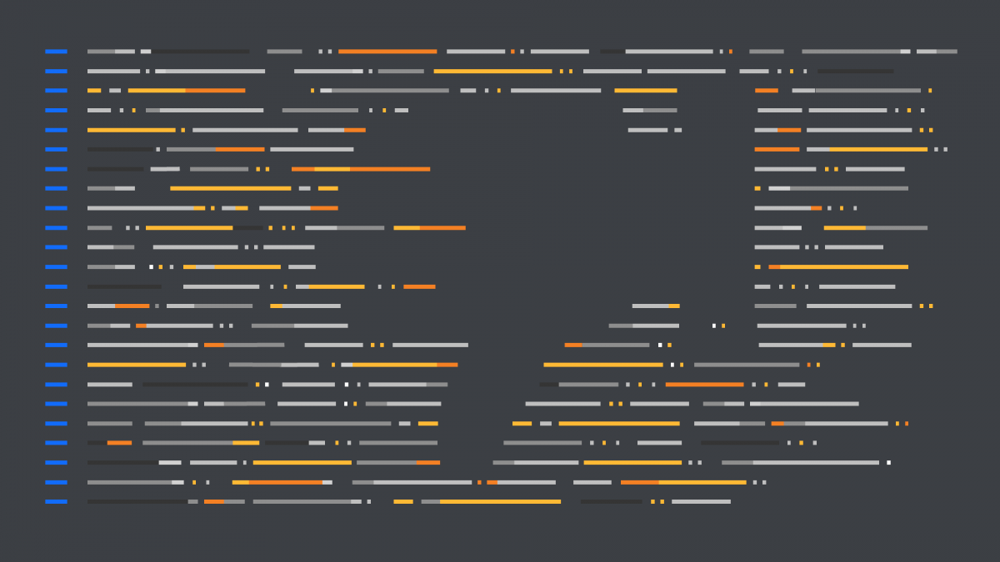
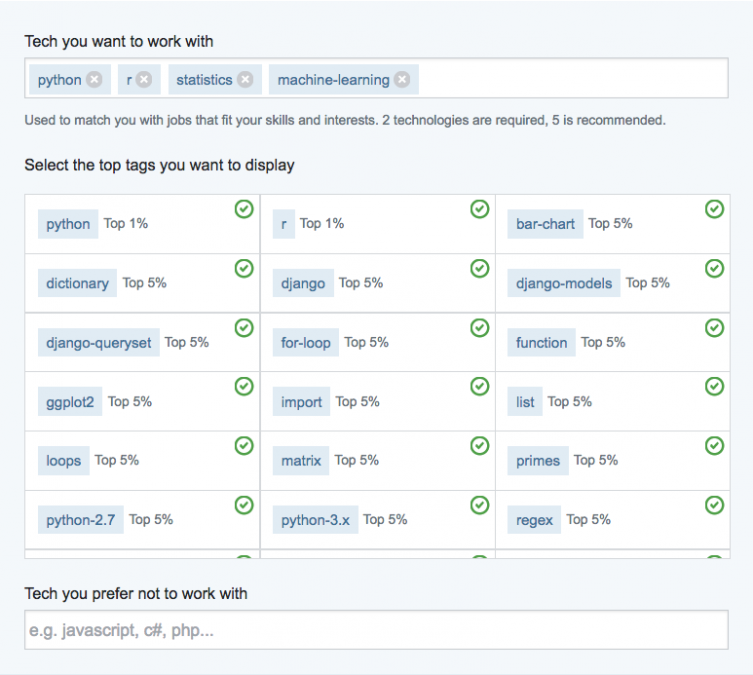
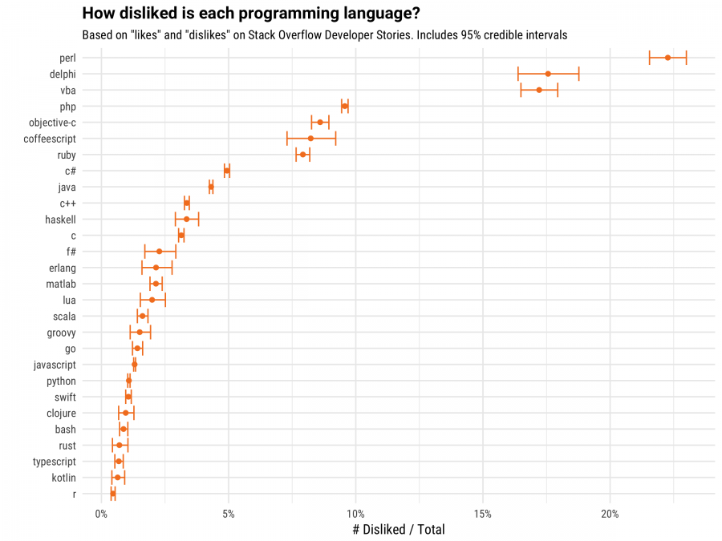
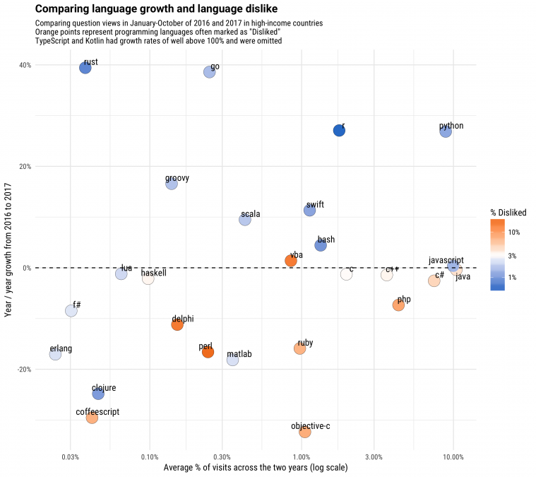
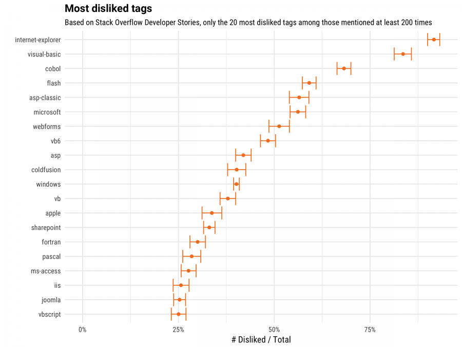
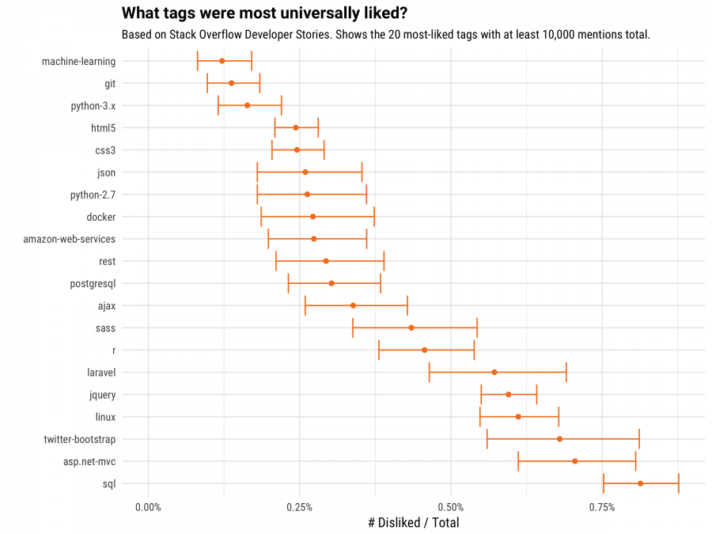
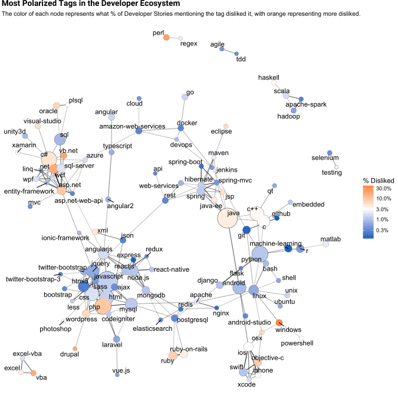
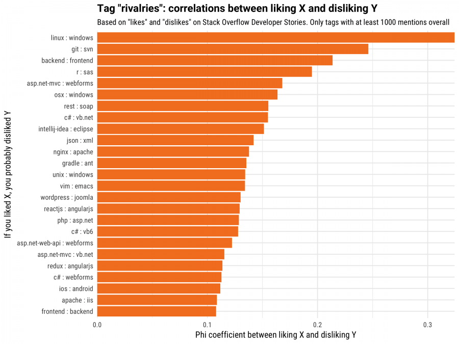

What are the Most Disliked Programming Languages? - Stack Overflow Blog

# What are the Most Disliked Programming Languages?

[(L)](https://stackoverflow.blog/authors/drobinson/)by [David Robinson](https://stackoverflow.blog/authors/drobinson/) on October 31, 2017

 AddThis Sharing Buttons
[Share to Twitter]()[Share to LinkedIn250]()[Share to Facebook220]()

On [Stack Overflow Jobs](https://stackoverflow.com/jobs?utm_source=so-owned&utm_medium=blog&utm_campaign=gen-blog&utm_content=blog-link&utm_term=polarizing-languages), you can create your own [Developer Story](https://stackoverflow.blog/2016/10/11/bye-bye-bullets-the-stack-overflow-developer-story-is-the-new-technical-resume/?utm_source=so-owned&utm_medium=blog&utm_campaign=gen-blog&utm_content=blog-link&utm_term=polarizing-languages) to showcase your achievements and advance your career. One option you have when creating a Developer Story is to add tags you would like to work with or would *not* like to work with:

This offers us an opportunity to examine the opinions of hundreds of thousands of developers. There are many ways to measure the popularity of a language; for example, we’ve often used [Stack Overflow visits or question views](https://stackoverflow.blog/2017/09/06/incredible-growth-python/?utm_source=so-owned&utm_medium=blog&utm_campaign=gen-blog&utm_content=blog-link&utm_term=polarizing-languages) to measure such trends. But this dataset is a rare way to find out what technologies people tend to *dislike*, when given the opportunity to say so on their CV.

(I posted some of this analysis on [my personal blog two years ago](http://varianceexplained.org/r/polarizing-technologies/), but this post is updated with both a more recent dataset and more visualizations and explorations).

### Programming languages

As a measure of how polarizing each tag is, we’ll look at what fraction of the time it appears in someone’s Disliked tags compared to how often it appears in either someone’s Liked or Disliked tags. Thus, 50% would mean a tag was disliked exactly as often as it was liked, while 1% means there were 99 people who liked it for each one who disliked it. (We used the empirical Bayes method I describe in [this post](http://varianceexplained.org/r/empirical_bayes_baseball/) to estimate these averages, and [this method](http://varianceexplained.org/r/credible_intervals_baseball/) to calculate 95% credible intervals).

Let’s start by looking at a selected list of programming *languages* (as opposed to platforms like Android or libraries like JQuery), all of which have at least 2,000 mentions on Developer Stories.

The most disliked languages, by a fairly large margin, are Perl, Delphi, and VBA. They’re followed by PHP, Objective-C, Coffeescript, and Ruby. On our team we’re certainly happy to see that R is the least disliked programming language, relative to the number of people who liked it.

If you’ve read some of our other posts about the growing and shrinking programming languages, you might notice that the least disliked tags tend to be *fast-growing ones*. R, Python, Typescript, Go, and Rust are all fast-growing in terms of Stack Overflow activity (we’ve specifically explored [Python](https://stackoverflow.blog/2017/09/06/incredible-growth-python/?utm_source=so-owned&utm_medium=blog&utm_campaign=gen-blog&utm_content=blog-link&utm_term=polarizing-languages) and [R](https://stackoverflow.blog/2017/10/10/impressive-growth-r/?utm_source=so-owned&utm_medium=blog&utm_campaign=gen-blog&utm_content=blog-link&utm_term=polarizing-languages) before) and all are among the least polarizing languages. Similarly, many of the shrinking tags, such as Perl, Objective-C, and Ruby, are ones we’ve [previously observed](https://stackoverflow.blog/2017/08/01/flash-dead-technologies-might-next/?utm_source=so-owned&utm_medium=blog&utm_campaign=gen-blog&utm_content=blog-link&utm_term=polarizing-languages) to be among the fastest-shrinking tags on the site.

We can examine this by comparing the size and growth of each language to the % of people disliking it, with orange points representing the most disliked languages. To keep our analysis consistent with the last few posts, we’ll limit the statistics to high-income countries (such as the US, UK, Germany, and Canada).

Generally there is a relationship between a tag’s growth and how often it’s disliked. Almost everything disliked by more than 3% of stories mentioning it is shrinking in Stack Overflow traffic (except for the quite polarizing VBA, which is steady or slightly growing). And the least-disliked tags— R, Rust, Typescript and Kotlin— are all among the fast-growing tags (Typescript and Kotlin growing so quickly they had to be truncated in the plot).

One tag that stands out is the functional language Clojure; almost nobody expresses dislike for it, but it’s still among the most rapidly shrinking (based on [question visits](https://insights.stackoverflow.com/trends?tags=clojure&utm_source=so-owned&utm_medium=blog&utm_campaign=gen-blog&utm_content=blog-link&utm_term=polarizing-languages), it only started shrinking in the last year or so). Another exception is MATLAB, which is shrinking despite not many people expressing dislike of it. This may indicate a limitation of the data for measuring sentiment: while any web developers might have an opinion on PHP, C# or Ruby, people who don’t work in data analysis have little reason to express an opinion on MATLAB. (This is probably part of the reason R is so rarely mentioned in “Dislikes” as well.)

We’re not necessarily suggesting a causal relationship, where tags being disliked by a component of programmers leads to them being abandoned. Another possibility is that people feel comfortable expressing their dislike publicly if they sense that the language is already shrinking in popularity. It’s also conceivable that developers often use this field to note technologies they *used* to work with, but no longer do. This would lead to a natural progression of “replaced” technologies ending up in the Disliked field.

### Most disliked and liked tags

The above analysis considers only programming languages, not operating systems, platforms, or libraries. What are the most disliked technologies overall? To focus on large technologies for which we have enough data, we limited them to technologies mentioned at least 1,000 times.

Several are Microsoft technologies, particularly Internet Explorer and Visual Basic, as well as the “Microsoft” tag (“Apple” also makes the list, though it’s not as dramatically disliked). [We have good news](https://stackoverflow.blog/2017/08/01/flash-dead-technologies-might-next/?utm_source=so-owned&utm_medium=blog&utm_campaign=gen-blog&utm_content=blog-link&utm_term=polarizing-languages) for the majority of people who dislike Flash. Older languages such as COBOL, Fortran, and Pascal also make appearances.

It’s worth emphasizing again that this is no indictment of the technologies, their quality, or their popularity. It is simply a measurement of what technologies stir up strong negative feelings in at least a subset of developers who feel comfortable sharing this publicly.

We could also zoom in on the most uniformly popular technologies, those that are almost never disliked. (This time, since highly-liked tags are more common, we’re focusing only on technologies mentioned at least 10,000 times.)

Git might be a source of frustration to many developers (it certainly is for me!), but it’s rare that people admit it on their resume, as it’s the most lopsidedly-liked tag in our Developer Stories. R makes this list, but it’s not the only data-science-related tag that’s uncontroversial; the machine learning tag was liked by 23 thousand people and was quite rarely disliked. Tags such as Python-3.X, CSS3 and HTML5 could indicate that developers rarely specify that they dislike a specific *version* of a technology (even if they specify). And of course, [jQuery is as popular as ever on Stack Overflow](http://i.stack.imgur.com/ssRUr.gif).

### Network of polarizing tags

We can combine all these tags into one story by organizing them into a network. In a recent post, [Julia Silge showed how we can construct a network of technologies](https://stackoverflow.blog/2017/10/03/mapping-ecosystems-software-development/) to represent the overall software ecosystem. If we color the nodes according to how disliked each tag is, we can understand what parts of the ecosystem are more controversial than others.

By laying out Developer Story tags into sub-ecosystems, this network tells a story about what types of tags tend to be polarizing. There are clusters of polarizing tags within the sub-ecosystems for Microsoft (centered around C# and .NET), PHP (along with WordPress and Drupal), and mobile development (particularly Objective-C). Within the cluster of operating systems (lower right), we can see that systems such as OSX and especially Windows have their detractors, but tags like Linux, Ubuntu and Unix don’t.

### Rivalries

If someone likes a particular tag, are there any tags they’re unusually likely to dislike?

We can measure this using a [phi coefficient](https://en.wikipedia.org/wiki/Phi_coefficient) between the appearance of a particular liked tag. (When computing these correlations, we considered only people who had disliked at least one tag.)

This highlights some of the “rivalries” underlying the software ecosystem: Linux and OSX vs Windows, Git vs SVN, vim vs emacs and (unsurprisingly to me) R vs SAS. Most of these pairs don’t represent “opposite” technologies, but instead reflect two approaches to similar problems. Many of them suggest a progression from a formerly popular technology to a more modern one (SVN replaced by Git, XML replaced by JSON, VB replaced by C#). This makes sense in terms of what people would list on a resume; it’s common for developers to specify that they’d rather not work with something they consider outdated.

### Conclusion

I don’t have any interest in “language wars,” and I don’t have any judgment of users who share technologies they’d rather not work with. Thinking about how polarizing Microsoft technologies often are does encourage me to share my personal experience. I’ve been a lifelong Mac and UNIX user, and nearly all of my programming in college and graduate school was centered around Python and R. Despite that, I was happy to join a company with a .NET stack, and I’m glad I did— because I loved the team, the product, and the data. I can’t speak for anyone else, but I’m glad I defined myself in terms of what work I wanted to do, and not something I wanted to avoid.

If you’re interested in sharing what technologies you like and dislike, and perhaps find the next step in your career, you can [create your own Developer Story](http://stackoverflow.com/users/story/join?utm_source=so-owned&utm_medium=blog&utm_campaign=gen-blog&utm_content=blog-link&utm_term=polarizing-languages).

Want to work with the technologies you love? Find your next move on [Stack Overflow Jobs](https://stackoverflow.com/jobs?utm_source=so-owned&utm_medium=blog&utm_campaign=gen-blog&utm_content=blog-link&utm_term=polarizing-languages), where you can search by tech you *like* working with.

## Author

David Robinson
Data Scientist

[Author Archives](https://stackoverflow.blog/authors/drobinson/)[Website](http://varianceexplained.org/)[Twitter](https://twitter.com/drob)[Github](https://github.com/dgrtwo)

## Tags

- [Announcements](https://stackoverflow.blog/tags/announcements/)
- [Engineering](https://stackoverflow.blog/engineering/)
- [Insights](https://stackoverflow.blog/insights/)

## Related Articles

## [Podcast #120 – Halloween Spooktacular with Anil Slash](https://stackoverflow.blog/2017/10/30/podcast-120-halloween-spooktacular-anil-slash/)

[(L)](https://stackoverflow.blog/authors/jpardue/)by [Jess Pardue](https://stackoverflow.blog/authors/jpardue/) on October 30, 2017

Welcome to The Stack Overflow Podcast episode #120 recorded Thursday, October 26, 2017 at our Stack Overflow HQ in NYC. As a special treat (or is it a trick?) your...

[Continue reading](https://stackoverflow.blog/2017/10/30/podcast-120-halloween-spooktacular-anil-slash/)

## [From Power Calculations to P-Values: A/B Testing at Stack Overflow](https://stackoverflow.blog/2017/10/17/power-calculations-p-values-ab-testing-stack-overflow/)

[(L)](https://stackoverflow.blog/authors/juliasilge/)by [Julia Silge](https://stackoverflow.blog/authors/juliasilge/) on October 17, 2017

If you hang out on Meta Stack Overflow, you may have noticed news from time to time about A/B tests of various features here at Stack Overflow. We use A/B...

[Continue reading](https://stackoverflow.blog/2017/10/17/power-calculations-p-values-ab-testing-stack-overflow/)

## [Podcast #119 – This Podcast is Definitely a Simulation](https://stackoverflow.blog/2017/10/16/podcast-119-podcast-definitely-simulation/)

[(L)](https://stackoverflow.blog/authors/jpardue/)by [Jess Pardue](https://stackoverflow.blog/authors/jpardue/) on October 16, 2017

Welcome to The Stack Overflow Podcast episode #119 recorded Thursday, October 12, 2017 at the Stack Overflow HQ in NYC. Today’s motley crew includes VP and GM of Stack Overflow...

[Continue reading](https://stackoverflow.blog/2017/10/16/podcast-119-podcast-definitely-simulation/)