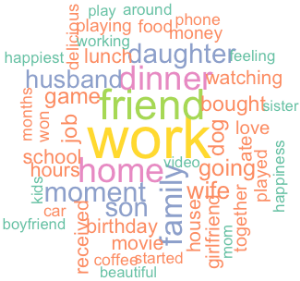

What is HappyDB?

## What is HappyDB?

HappyDB is a corpus of 100,000 crowd-sourced happy moments. The goal of the corpus is to advance the state of the art of understanding the causes of happiness that can be gleaned from text.

* * *

## Using the dataset?

For details on how HappyDB was created, check out our [paper](https://arxiv.org/abs/1801.07746). If you use HappyDB in your work, please cite the paper as:

	@inproceedings{asai2018happydb,
	  title = {HappyDB: A Corpus of 100,000 Crowdsourced Happy Moments},
	  author = {Asai, Akari and Evensen, Sara and Golshan, Behzad and Halevy, Alon
	  and Li, Vivian and Lopatenko, Andrei and Stepanov, Daniela and Suhara, Yoshihiko
	  and Tan, Wang-Chiew and Xu, Yinzhan},
	  booktitle = {Proceedings of LREC 2018},
	  month = {May},   year={2018},
	  address = {Miyazaki, Japan},
	  publisher = {European Language Resources Association (ELRA)}
	}

* * *

## Dataset description

Simply stated, HappyDB is a collection of happy moments described by individuals experiencing those moments. The following are some examples:

	1. When I won a lottery ticket.
	2. My girlfriend wore a a traditional dress just to make me happy.
	3. The lawn looks great now that it's completely mowed.
	4. Today I finished all the work I was tasked to do.
	5. I was able to spend a little extra time with my son today.

#### Collecting happy moments

The happy moments are crowd-sourced via Amazon’s Mechanical Turk. We presented each worker with the following task:

	What made you happy today? Reflect on the past 24 hours, and recall
	three actual events that happened to you that made you happy. Write
	down your happy moment in a complete sentence.
	(Write three such moments.)

In this task, the “past 24 hours” is what we call the *reflection period*. HappyDB also contains happy moments with reflection periods “past week” and “past month”.

Along with each happy moment, we have collected the demographic information of the worker who provided the moment.

#### Lab in the wild

To further provide resources for researchers interested in the science of happiness, we have partnered with **Lab In The Wild** to collect more happy moments. We encourage you to take a look at our task on Lab In The Wild.

[Lab In The Wild](http://happiness.labinthewild.org/)

#### Cleaning the corpus

The HappyDB corpus, like any other human-generated data, has errors and requires cleaning. Many workers did not write down complete sentences or had spelling errors. To make using the corpus more convenient, we have created a clean version of the corpus that deals with the issues mentioned earlier. More specifically, we have:

1. removed any happy moment that consists of a single word,

2. corrected the misspelled words (if we could infer the correct spelling from the context).