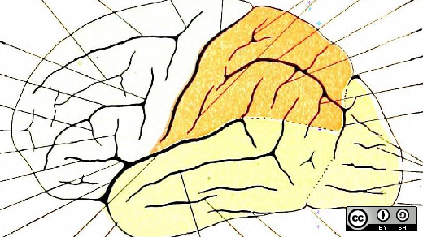
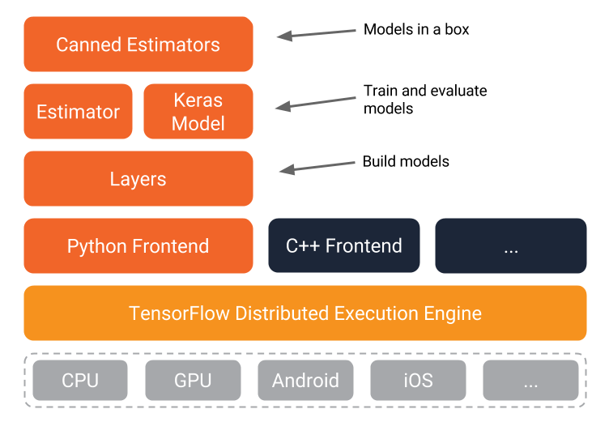
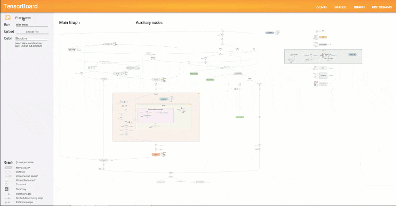

What is the TensorFlow machine intelligence platform?

# What is the TensorFlow machine intelligence platform?

## Learn about the Google-developed open source library for machine learning and deep neural networks research.

| 09 Nov 2017 | [Amy Unruh](https://opensource.com/users/amyu) [Feed](https://opensource.com/user/188496/feed) |

541

[up](https://opensource.com/article/17/11/intro-tensorflow?rate=_95XtCvkfFT9wcr0LQXlCwbKFtEbo-TfpibkoUw-lAU)

| [2 comments](https://opensource.com/article/17/11/intro-tensorflow#comments) |

Image by :
Opensource.com
.

[TensorFlow](https://www.tensorflow.org/) is an open source software library for numerical computation using data-flow graphs. It was originally developed by the Google Brain Team within Google's Machine Intelligence research organization for machine learning and deep neural networks research, but the system is general enough to be applicable in a wide variety of other domains as well. It [reached version 1.0](https://research.googleblog.com/2017/02/announcing-tensorflow-10.html) in February 2017, and has continued rapid development, with 21,000+ commits thus far, many from outside contributors. This article introduces TensorFlow, its open source community and ecosystem, and highlights some interesting TensorFlow open sourced models.

TensorFlow is cross-platform. It runs on nearly everything: GPUs and CPUs—including mobile and embedded platforms—and even tensor processing units ([TPUs](https://www.blog.google/topics/google-cloud/google-cloud-offer-tpus-machine-learning/)*)*, which are specialized hardware to do tensor math on. They aren't widely available yet, but we have recently launched an [alpha program](https://www.tensorflow.org/tfrc/).

## [1tensorflow.png](https://opensource.com/file/373346)

 
Image by Google.com

The TensorFlow distributed execution engine abstracts away the many supported devices and provides a high performance-core implemented in C++ for the TensorFlow platform.

More Python Resources

- [What is Python?](https://opensource.com/resources/python?intcmp=7016000000127cYAAQ)
- [Top Python IDEs](https://opensource.com/resources/python/ides?intcmp=7016000000127cYAAQ)
- [Top Python GUI frameworks](https://opensource.com/resources/python/gui-frameworks?intcmp=7016000000127cYAAQ)
- [Latest Python content](https://opensource.com/tags/python?intcmp=7016000000127cYAAQ)
- [More developer resources](https://developers.redhat.com/?intcmp=7016000000127cYAAQ)

On top of that sit the Python and C++ frontends (with more to come). The [Layers API](https://www.tensorflow.org/tutorials/layers/) provides a simpler interface for commonly used layers in deep learning models. On top of that sit higher-level APIs, including [Keras](https://www.tensorflow.org/versions/master/api_docs/python/tf/contrib/keras) (more on the [Keras.io site](https://keras.io/)) and the [Estimator API](https://www.tensorflow.org/get_started/estimator), which makes training and evaluating distributed models easier.

And finally, a number of commonly used models are ready to use out of the box, with more to come.

## TensorFlow execution model

### Graphs

Machine learning can get complex quickly, and deep learning models can become large. For many model graphs, you need distributed training to be able to iterate within a reasonable time frame. And, you'll typically want the models you develop to deploy to multiple platforms.

With the current version of TensorFlow, you write code to build a computation graph, then execute it. The graph is a data structure that fully describes the computation you want to perform. This has lots of advantages:

- It's portable, as the graph can be executed immediately or saved to use later, and it can run on multiple platforms: CPUs, GPUs, TPUs, mobile, embedded. Also, it can be deployed to production without having to depend on any of the code that built the graph, only the runtime necessary to execute it.
- It's transformable and optimizable, as the graph can be transformed to produce a more optimal version for a given platform. Also, memory or compute optimizations can be performed and trade-offs made between them. This is useful, for example, in supporting faster mobile inference after training on larger machines.
- Support for distributed execution

TensorFlow's high-level APIs, in conjunction with computation graphs, enable a rich and flexible development environment and powerful production capabilities in the same framework.

### Eager execution

An upcoming addition to TensorFlow is **[eager execution](https://developers.googleblog.com/2017/10/eager-execution-imperative-define-by.html)**, an imperative style for writing TensorFlow. When you enable eager execution, you will be executing TensorFlow kernels immediately, rather than constructing graphs that will be executed later.

Why is this important? Four major reasons:

- You can inspect and debug intermediate values in your graph easily.
- You can use Python control flow within TensorFlow APIs—loops, conditionals, functions, closures, etc.
- Eager execution should make debugging more straightforward.
- Eager's "define-by-run" semantics will make building and training dynamic graphs easy.

Once you are satisfied with your TensorFlow code running eagerly, you can convert it to a graph automatically. This will make it easier to save, port, and distribute your graphs.

This interface is in its early (pre-alpha) stages. Follow along on [GitHub](https://github.com/tensorflow/tensorflow/tree/master/tensorflow/contrib/eager).

## TensorFlow and the open source software community

TensorFlow was open sourced in large part to allow the community to improve it with contributions. The TensorFlow team has set up [processes](https://www.oreilly.com/ideas/how-the-tensorflow-team-handles-open-source-support) to manage pull requests, review and route issues filed, and answer [Stack Overflow](https://stackoverflow.com/questions/tagged/tensorflow) and [mailing list](https://groups.google.com/a/tensorflow.org/forum/#!forum/discuss) questions.

So far, we've had more than 890 external contributors add to the code, with everything from small documentation fixes to large additions like [OS X GPU support](https://github.com/tensorflow/tensorflow/pull/664) or the [OpenCL implementation](https://github.com/tensorflow/tensorflow/pull/9117). (The broader TensorFlow GitHub organization has had nearly 1,000 unique non-Googler contributors.)

Tensorflow has more than 76,000 stars on GitHub, and the number of other repos that use it is growing every month—as of this writing, there are more than 20,000.

Many of these are community-created tutorials, models, translations, and projects. They can be a great source of examples if you're getting started on a machine learning task.

Stack Overflow is monitored by the TensorFlow team, and it's a [good way to get questions answered](https://stackoverflow.com/questions/tagged/tensorflow) (with 8,000+ answered so far).

The external version of TensorFlow internally is no different than internal, beyond some minor differences.  These include the interface to Google's internal infrastructure (it would be no help to anyone), some paths, and parts that aren't ready yet.  The core of TensorFlow, however, is identical.  Pull requests to internal will appear externally within around a day and a half and vice-versa.

In the [TensorFlow GitHub org](https://github.com/tensorflow), you can find not only [TensorFlow](https://github.com/tensorflow/tensorflow) itself, but a useful ecosystem of other repos, including [models](https://github.com/tensorflow/models), [serving](https://github.com/tensorflow/serving), [TensorBoard](https://github.com/tensorflow/tensorboard), [Project Magenta](https://github.com/tensorflow/magenta), and many more. (A few of these are described below). You can also find TensorFlow APIs in [multiple languages](https://www.tensorflow.org/api_docs/) (Python, C++, Java, and Go); and the community has developed [other bindings](https://www.tensorflow.org/api_docs/), including C#, Haskell, Julia, Ruby, Rust, and Scala.

## Performance and benchmarking

TensorFlow has high standards around measurement and transparency. The team has developed a set of detailed [benchmarks](https://www.tensorflow.org/performance/benchmarks) and has been very careful to include all necessary details to reproduce. We've not yet run comparative benchmarks, but would welcome for others to publish comprehensive and reproducible benchmarks.

There's a [section](https://www.tensorflow.org/performance/performance_models) of the TensorFlow site with information specifically for performance-minded developers. Optimization can often be model-specific, but there are some general guidelines that can often make a big difference.

## TensorFlow's open source models

The TensorFlow team has open sourced a large number of models. You can find them in the [tensorflow/models](https://github.com/tensorflow/models) repo. For many of these, the released code includes not only the model graph, but also trained model weights. This means that you can try such models out of the box, and you can tune many of them further using a process called [transfer learning](https://www.tensorflow.org/tutorials/image_retraining).

Here are just a few of the recently released models (there are many more):

- [The Object Detection API](http://research.googleblog.com/2017/06/supercharge-your-computer-vision-models.html): It's still a core machine learning challenge to create accurate machine learning models capable of localizing and identifying multiple objects in a single image. The recently open sourced [TensorFlow Object Detection API](https://github.com/tensorflow/models/tree/master/research/object_detection) has produced state-of-the-art results (and placed first in the [COCO detection challenge](http://mscoco.org/dataset/#detections-leaderboard)).

## [2tensorflow.png](https://opensource.com/file/373351)

 

The out-of-the-box Object Detection model, derived from [raneko via Flickr](https://goo.gl/images/xf45oH), CC BY-2.0.

- [tf-seq2seq](https://research.googleblog.com/2017/04/introducing-tf-seq2seq-open-source.html): Google previously announced [Google Neural Machine Translation](https://research.googleblog.com/2016/09/a-neural-network-for-machine.html) (GNMT), a sequence-to-sequence (seq2seq) model that is now used in Google Translate production systems. [tf-seq2seq](https://google.github.io/seq2seq/) is an open source seq2seq framework in TensorFlow that makes it easy to experiment with seq2seq models and achieve state-of-the-art results.
- [ParseySaurus](https://research.googleblog.com/2017/03/an-upgrade-to-syntaxnet-new-models-and.html) is a set of pretrained models that reflect an upgrade to [SyntaxNet](https://research.googleblog.com/2016/05/announcing-syntaxnet-worlds-most.html). The new models use a character-based input representation and are much better at predicting the meaning of new words based both on their spelling and how they are used in context. They are much more accurate than their predecessors, particularly for languages where there can be dozens of forms for each word and many of these forms might never be observed during training, even in a very large corpus.

## [3tensorflow.png](https://opensource.com/file/373356)

 
Asking ParseySaurus to parse a line from Jabberwocky

- [Multistyle Pastiche Generator](https://magenta.tensorflow.org/2016/11/01/multistyle-pastiche-generator/) from the [Magenta Project](https://magenta.tensorflow.org/): "Style transfer" is what's happening under the hood with those fun apps that apply the style of a painting to one of your photos. This Magenta model extends image style transfer by [creating a single network](https://github.com/tensorflow/magenta/tree/master/magenta/models/image_stylization) that can perform more than one stylization of an image, optionally at the same time. (Try playing with the sliders for the dog images in this [blog post](https://magenta.tensorflow.org/2016/11/01/multistyle-pastiche-generator/).)

## [4tensorflow.png](https://opensource.com/file/373361)

 

Style transfer example, derived from [Anthony Quintano via Flickr](https://flic.kr/p/q3iESK), CC BY 2.0.

## Transfer learning

Many of the [TensorFlow models](https://github.com/tensorflow/models) include trained weights and examples that show how you can use them for [transfer learning](https://en.wikipedia.org/wiki/Transfer_learning), e.g. to learn your own classifications. You typically do this by deriving information about your input data from the penultimate layer of a trained model—which encodes useful abstractions—then use that as input to train your own much smaller neural net to predict your own classes. Because of the power of the learned abstractions, the additional training typically does not require large data sets.

For example, you can use transfer learning with the [Inception](https://www.tensorflow.org/tutorials/image_retraining) image classification model to train an image classifier that uses your specialized image data.

For examples of using transfer learning for medical diagnosis by training a neural net to detect specialized classes of images, see the following articles:

- [Deep learning for detection of diabetic eye disease](https://research.googleblog.com/2016/11/deep-learning-for-detection-of-diabetic.html)
- [Deep learning algorithm does as well as dermatologists in identifying skin cancer](http://news.stanford.edu/2017/01/25/artificial-intelligence-used-identify-skin-cancer)
- [Assisting pathologists in detecting cancer with deep learning](https://research.googleblog.com/2017/03/assisting-pathologists-in-detecting.html)

And, you can do the same [to learn your own](https://www.tensorflow.org/tutorials/image_retraining) ([potentially goofy](http://amygdala.github.io/ml/2017/02/03/transfer_learning.html)) image classifications too.

[The Object Detection API](http://research.googleblog.com/2017/06/supercharge-your-computer-vision-models.html) code is designed to support transfer learning as well. In the [tensorflow/models](https://github.com/tensorflow/models) repo, there is an [example](https://github.com/tensorflow/models/blob/master/research/object_detection/g3doc/running_pets.md) of how you can use transfer learning to bootstrap this trained model to [build a pet detector](https://cloud.google.com/blog/big-data/2017/06/training-an-object-detector-using-cloud-machine-learning-engine), using a (somewhat limited) data set of dog and cat breed examples. And, in case you like raccoons more than dogs and cats, see [this tutorial](https://medium.com/towards-data-science/how-to-train-your-own-object-detector-with-tensorflows-object-detector-api-bec72ecfe1d9) too.

## [5tensorflow.png](https://opensource.com/file/373366)

 

The "pet detector" model, trained via transfer learning, derived from [raneko via Flickr](https://goo.gl/images/xf45oH), CC BY-2.0.

## Using TensorFlow on mobile devices

Mobile is a great use case for TensorFlow—mobile makes sense when there is a poor or missing network connection or where sending continuous data to a server would be too expensive. But, once you've trained your model and you're [ready to start using it](https://petewarden.com/2016/09/27/tensorflow-for-mobile-poets/), you don't want the on-device model footprint to be too big.

TensorFlow is working to help developers [make lean mobile apps](https://github.com/tensorflow/tensorflow/tree/master/tensorflow/examples/android/), both by continuing to reduce the code footprint and by supporting [quantization](https://www.tensorflow.org/performance/quantization).

(And although it's early days, see also Accelerated Linear Algebra [[XLA](https://www.tensorflow.org/performance/xla/)], a domain-specific compiler for linear algebra that optimizes TensorFlow computations.)

One of the TensorFlow projects, [MobileNet](https://research.googleblog.com/2017/06/mobilenets-open-source-models-for.html), is developing a set of computer vision models that are particularly [designed to](https://arxiv.org/abs/1611.10012) address the speed/accuracy trade-offs that need to be considered on mobile devices or in embedded applications. The MobileNet models can be found in the TensorFlow [models repo](https://github.com/tensorflow/models/blob/master/research/slim/nets/mobilenet_v1.md) as well.

One of the newer Android demos, [TF Detect](https://github.com/tensorflow/tensorflow/blob/master/tensorflow/examples/android/src/org/tensorflow/demo/DetectorActivity.java), uses a MobileNet model trained using the Tensorflow Object Detection API.

## [6tensorflow.jpg](https://opensource.com/file/373371)

 
Image by Google.com

And of course we'd be remiss in not mentioning "[How HBO's 'Silicon Valley' built 'Not Hotdog' with mobile TensorFlow, Keras, and React Native](https://medium.com/@timanglade/how-hbos-silicon-valley-built-not-hotdog-with-mobile-tensorflow-keras-react-native-ef03260747f3)."

## The TensorFlow ecosystem

The TensorFlow ecosystem includes many tools and libraries to help you work more effectively. Here are a few.

### TensorBoard

[TensorBoard](https://github.com/tensorflow/tensorboard/blob/master/README.md) is a suite of web applications for inspecting, visualizing, and understanding your TensorFlow runs and graphs. You can use TensorBoard to view your TensorFlow model graphs and zoom in on the details of graph subsections.

You can plot metrics like loss and accuracy during a training run; show histogram visualizations of how a tensor is changing over time; show additional data, like images; collect runtime metadata for a run, such as total memory usage and tensor shapes for nodes; and more.

## [7tensorflow2.gif](https://opensource.com/file/373376)

 
Image by Google.com

TensorBoard works by reading TensorFlow files that contain [summary information](https://www.tensorflow.org/get_started/summaries_and_tensorboard) about the training process. You can generate these files when running TensorFlow jobs.

You can use TensorBoard to compare training runs, collect runtime stats, and generate [histograms](https://www.tensorflow.org/get_started/tensorboard_histograms).

## [8tensorflow.png](https://opensource.com/file/373381)

 
Image by Google.com

A particularly mesmerizing feature of TensorBoard is its [embeddings visualizer](https://www.tensorflow.org/get_started/embedding_viz). [Embeddings](http://colah.github.io/posts/2014-10-Visualizing-MNIST/) are [ubiquitous](https://www.tensorflow.org/tutorials/word2vec) in machine learning, and in the context of TensorFlow, it's often natural to view tensors as points in space, so almost any TensorFlow model will give rise to various embeddings.

### Datalab

[Jupyter](https://jupyter.org/) notebooks are an easy way to interactively explore your data, define TensorFlow models, and kick off training runs. If you're using Google Cloud Platform tools and products as part of your workflow—maybe using [Google Cloud Storage](https://cloud.google.com/storage/) or [BigQuery](https://cloud.google.com/bigquery/) for your datasets, or [Apache Beam](https://beam.apache.org/) for [data preprocessing](https://github.com/GoogleCloudPlatform/cloudml-samples/blob/master/flowers/pipeline.py#L201)—then [Google Cloud Datalab](https://cloud.google.com/datalab/) provides a Jupyter-based environment with all of these tools (and others like NumPy, pandas, scikit-learn, and Matplotlib), along with TensorFlow, preinstalled and bundled together. [Datalab is open source](https://github.com/googledatalab/datalab), so if you want to further modify its notebook environment, it's easy to do.

### Facets

Machine learning's power comes from its ability to learn patterns from large amounts of data, so understanding your data can be critical to building a powerful machine learning system.

[Facets](https://research.googleblog.com/2017/07/facets-open-source-visualization-tool.html) is a recently released [open source data visualization tool](https://pair-code.github.io/facets/) that helps you understand your machine learning datasets and get a sense of the shape and characteristics of each feature and see at a glance how the features interact with each other. For example, you can view your training and test datasets (as is done here with some [Census](http://archive.ics.uci.edu/ml/datasets/Census+Income) data), compare the characteristics of each feature, and sort the features by "distribution distance."

## [9tensorflow.png](https://opensource.com/file/373386)

 
Inspecting Census data with Facets. Image by Google.com

Cloud Datalab includes Facets integration. [This GitHub link](https://github.com/amygdala/code-snippets/blob/master/datalab/facets/facets_snippets.ipynb) has a small example of loading a [NHTSA Traffic Fatality](https://cloud.google.com/bigquery/public-data/nhtsa)  [BigQuery](https://cloud.google.com/bigquery/)  [public dataset](https://cloud.google.com/bigquery/public-data/) and viewing it with Facets.

## [10tensorflow.png](https://opensource.com/file/373391)

 
Image by Google.com

In Facets' Dive view we can quickly see which states have the most traffic fatalities and that the distribution of collusion type appears to change as the number of fatalities per accident increases.

## And more…

Another useful diagnostic tool is the [TensorFlow debugger](https://www.tensorflow.org/programmers_guide/debugger), **tfdbg**, which lets you view the internal structure and states of running TensorFlow graphs during training and inference.

Once you've trained a model that you're happy with, the next step is to figure out how you'll serve it in order to scalably support predictions on the model. [TensorFlow Serving](https://www.tensorflow.org/serving) is a high-performance serving system for machine-learned models, designed for production environments. It has [recently](https://developers.googleblog.com/2017/07/tensorflow-serving-10.html) moved to version 1.0.

There are many other tools and libraries that we don't have room to cover here, but see the [TensorFlow GitHub org](https://github.com/tensorflow) repos to learn about them.

The [TensorFlow site](https://www.tensorflow.org/) has many [getting started](https://www.tensorflow.org/get_started/) guides, examples, and [tutorials](https://www.tensorflow.org/tutorials/). (A fun new tutorial is [this](https://www.tensorflow.org/versions/master/tutorials/audio_recognition) audio recognition example.)

##  Topics :

[AI and machine learning](https://opensource.com/tags/ai-and-machine-learning)
[Yearbook](https://opensource.com/tags/yearbook)
[2017 Open Source Yearbook](https://opensource.com/yearbook/2017)

## About the author

 Amy Unruh - Amy is a developer relations engineer for the Google Cloud Platform, where she focuses on machine learning and data analytics as well as other Cloud Platform technologies. Amy has an academic background in CS/AI and has also worked at several startups, done industrial R&D, and published a book on App Engine.

[• More about me](https://opensource.com/users/amyu)

- [Learn how you can contribute](https://opensource.com/participate)

.

##  Recommended reading

 [ 100 ways to learn Python and R for data science](https://opensource.com/article/19/5/learn-python-r-data-science?utm_campaign=intrel)

 [ Introduction to generative adversarial network](https://opensource.com/article/19/4/introduction-generative-adversarial-networks?utm_campaign=intrel)

 [ Detecting malaria with deep learning](https://opensource.com/article/19/4/detecting-malaria-deep-learning?utm_campaign=intrel)

 [ 6 steps to stop ethical debt in AI product development](https://opensource.com/article/19/3/ethical-debt-ai-product-development?utm_campaign=intrel)

 [ 9 resources for data science projects](https://opensource.com/article/19/2/learn-data-science-ai?utm_campaign=intrel)

 [ Announcing the 2018 Open Source Yearbook: Download now](https://opensource.com/article/19/2/announcing-2018-open-source-yearbook-download-now?utm_campaign=intrel)

##  2 Comments

 

 [Zvonko Kosic](https://opensource.com/users/zvonkok) on 14 Nov 2017

Regarding OpenCL, are there any benchmarks that show how an OpenCL implementation compares to a CUDA implementation (performance)?

Vote up!
 0

.

 

 [Gagan](https://opensource.com/users/gagandeep007) on 09 Dec 2017

Thanks, it helps me a lot to understand TensorFlow and how it works

Vote up!
 0

.

 .