What makes a good conversation? | Abigail See

# What makes a good conversation?

### How controllable attributes affect human judgments

August 13, 2019

*This blog post is about the [NAACL 2019](https://naacl2019.org/) paper **What makes a good conversation? How controllable attributes affect human judgments** by Abigail See, Stephen Roller, Douwe Kiela and Jason Weston.*[[paper](https://www.aclweb.org/anthology/N19-1170)] [[code/demo](https://parl.ai/projects/controllable_dialogue)] [[slides](https://cs.stanford.edu/people/abisee/naacl2019slides.pdf)]

* * *

### The Natural Language Generation task spectrum

I think of Natural Language Generation (NLG) tasks as existing on the following spectrum:[1](http://www.abigailsee.com/2019/08/13/what-makes-a-good-conversation.html#fn:sasha)

 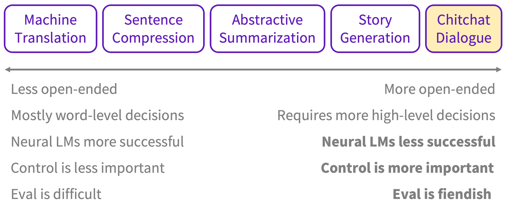

On the left are tasks like Machine Translation (MT), which are **less open-ended** (i.e. there is a relatively narrow range of correct outputs given the input). Given the close correspondence between input and output, these tasks can be accomplished mostly (but not entirely) by decisions at the word/phrase level. On the right are tasks like Story Generation and Chitchat Dialogue, which are **more open-ended** (i.e. there is a huge range of appropriate outputs given the input). For these tasks, the ability to make high-level decisions (e.g. ‘what should happen next in the story?’ or ‘should we change the subject of discussion?’) is central to the task.

While **neural Language Model (LM)** based approaches have been successful for tasks on the left, they have well-documented difficulties with tasks on the right, such as repetitious and generic output (under certain decoding algorithms, such as beam search[2](http://www.abigailsee.com/2019/08/13/what-makes-a-good-conversation.html#fn:beam)). More broadly, neural LMs seem to struggle to make the high-level decisions that are necessary to sustain a long story or dialogue.

One way to address these open-ended NLG issues is to add **control** – that is, the ability to specify desired attributes of the generated text at test time. For example, if we can control the repetitiveness or genericness of the text, we can fix those related problems. Furthermore, if we can control certain high-level attributes of the text (e.g. whether to change the subject, or whether to ask a question), then perhaps we can make some high-level decisions *for* the neural LM.

The last part of our NLG task spectrum is **evaluation**. For the tasks on the left, evaluation is difficult. Useful automatic metrics exist, though they are imperfect – the MT and summarization communities continue to get value from BLEU and ROUGE, despite their well-documented problems. For *open-ended* NLG however, evaluation is even more difficult. In the absence of useful automatic metrics to capture overall quality, we rely on human evaluation. Even that is complex – when evaluating dialogue, should we evaluate single turns or multiple turns? Should evaluators take part in conversations interactively or not? What questions should be asked, and how should they be phrased?

### Three research questions

In this work, we use chitchat dialogue as a setting to better understand the issues raised above. In particular, we **control multiple attributes of generated text** and **human-evaluate multiple aspects of conversational quality**, in order to answer **three main research questions**:

**[Research Question 1](http://www.abigailsee.com/2019/08/13/what-makes-a-good-conversation.html#research-question-1-how-effectively-can-we-control-the-attributes): How effectively can we control the attributes?**

**Quick answer**: Pretty well! But some control methods only work for some attributes.

**[Research Question 2](http://www.abigailsee.com/2019/08/13/what-makes-a-good-conversation.html#research-question-2-how-do-the-controllable-attributes-affect-conversational-quality-aspects): How do the controllable attributes affect aspects of conversational quality?**

**Quick answer**: Strongly – we improve several conversational aspects (such as interestingness and listening) by controlling repetition, question-asking, and specificity vs genericness.

**[Research Question 3](http://www.abigailsee.com/2019/08/13/what-makes-a-good-conversation.html#research-question-3-can-we-use-control-to-make-a-better-chatbot-overall): Can we use control to make a better chatbot overall?**

**Quick answer**: Yes! Though the answer can depend on the definition of ‘better overall’.

### The PersonaChat task

We use [PersonaChat](https://arxiv.org/pdf/1801.07243.pdf), a chitchat dataset containing conversations between two participants who each have a ‘persona’. Our task is to build a chatbot that can converse with a human in this setting.

 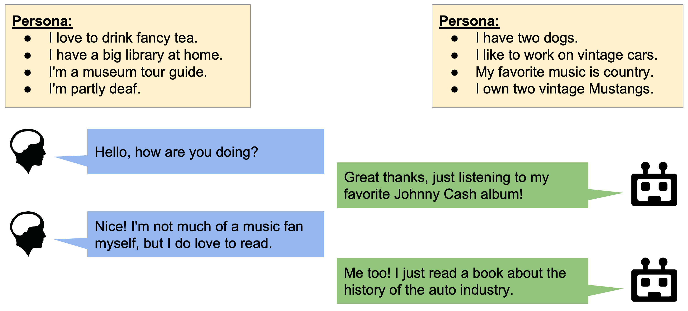

In the PersonaChat task, both participants are supplied with a persona and instructed to get to know each other.

The PersonaChat task was the focus of the [NeurIPS 2018 ConvAI2 Competition](http://convai.io/). Most of the top-scoring teams built neural sequence generation systems without control mechanisms (see the [competition report](https://arxiv.org/pdf/1902.00098.pdf)). In particular, the winning team *Lost in Conversation* used a finetuned version of OpenAI’s [GPT](https://openai.com/blog/language-unsupervised/) language model, which is pretrained on a very large amount of text (985 million words).

We use a simple baseline – a standard LSTM-based sequence-to-sequence architecture with attention. On each turn, the bot’s persona is concatenated with the dialogue history to form the input sequence, and the output is generated using beam search.[2](http://www.abigailsee.com/2019/08/13/what-makes-a-good-conversation.html#fn:beam)We pretrain this model on 2.5 million Twitter message/response pairs, then finetune it on PersonaChat.

### Four controllable attributes of text

 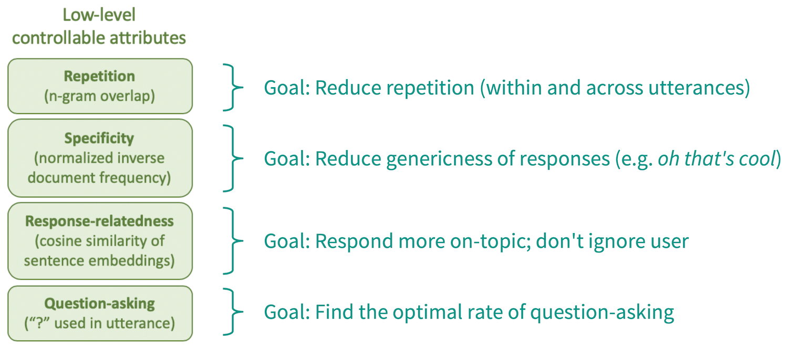
We control four attributes of the output text.

Neural LMs often produce repetitive, generic or irrelevant text, especially when decoding using beam search.[2](http://www.abigailsee.com/2019/08/13/what-makes-a-good-conversation.html#fn:beam)Motivated by this, we control the **repetitiveness**, **specificity** and **response-relatedness** of the output text. We measure these attributes as follows: repetitiveness as n-gram overlap, specificity as word rareness, and response-relatedness as the embedding similarity of the bot’s response to the human’s last utterance.

Lastly, we also control the rate at which the bot asks **questions** (here we regard an utterance to contain a question if and only if it contains ‘?’). Question-asking is an essential component of chitchat, but one that must be balanced carefully. By controlling question-asking, we can find and understand the right balance.

### Aspects of conversational quality

To evaluate our chatbots, we ask crowdworkers to chat with our bots for six turns before asking them to rate several different aspects of the conversation (most are on a scale from 1 to 4).

 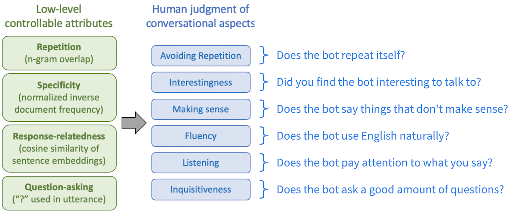

We collect human evaluations for six lower-level aspects of conversational quality.

Some of the aspects – such as **avoiding repetition**, **making sense**, and **fluency** – are designed to capture certain basic error classes (like repeating oneself, saying nonsensical things, or disjointed language). The others – **interestingness**, **listening**, and **inquisitiveness** – encompass other important elements of conversation, each of which must be balanced.

 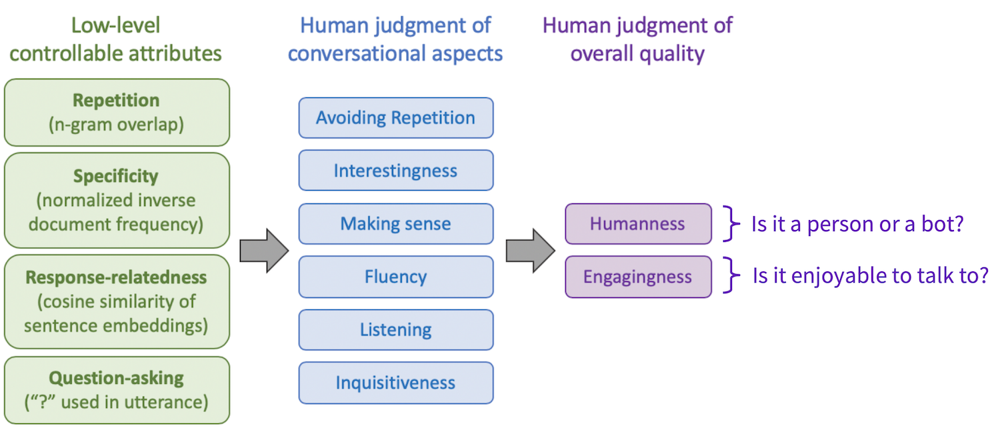

We also collect human evaluations for two definitions of overall quality - humanness and engagingness.

Lastly, we ask the crowdworker to rate the bot with respect to two different notions of overall quality. To measure **humanness**, we ask the crowdworker whether they think they spoke to a bot or a human (i.e. a Turing test question). To measure **engagingness**, we ask the crowdworker how much they enjoyed the conversation.

Many dialogue studies use either engagingness or humanness as a single stand-alone quality metric. In particular, in the ConvAI2 competition, only engagingness was used for human evaluation. Given that we use the exact same wording of the engagingness question, our evaluation is a *superset* of ConvAI2’s.

### Control methods

In this work, we use two simple existing methods to produce text with some desired attribute, and use them both to control all four of our text attributes. Aside from helping us build a better chatbot, this also allows us to understand and directly compare the relative effectiveness of the control methods themselves.

#### Control method 1: Conditional Training (CT)

A standard sequence-to-sequence model learns P(y \vert x)*P*(*y*∣*x*), the conditional probability of the output text y*y* given the input text x*x*.

A Conditional Training model ([Kikuchi et al 2016](https://aclweb.org/anthology/D16-1140), [Peng et al 2018](https://aclweb.org/anthology/W18-1505), [Fan et al 2018](https://aclweb.org/anthology/W18-2706)) learns P(y\vert x,z)*P*(*y*∣*x*,*z*), the conditional probability of the output text y*y* given the input text x*x*  *and* a control variable z*z*, which specifies the desired output attribute. For example, to control specificity, we might set z*z* to HIGH or LOW to get a very specific or a very generic response to *What’s your favorite hobby?*

 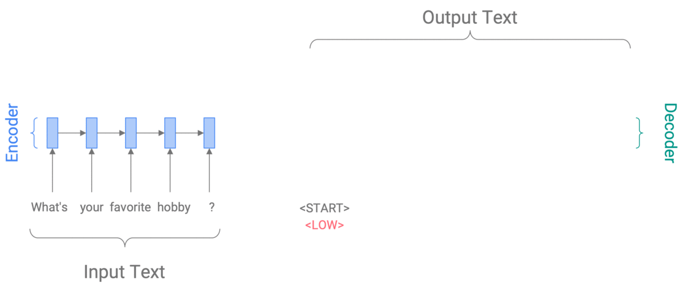
Controlling specificity with Conditional Training

The CT model is trained to predict y*y* given x*x* and z*z* (where z*z* is provided via automatic annotation). Then at test time, z*z* can be chosen by us.

Several researchers have proposed versions of this method ([Kikuchi et al 2016](https://aclweb.org/anthology/D16-1140), [Peng et al 2018](https://aclweb.org/anthology/W18-1505), [Fan et al 2018](https://aclweb.org/anthology/W18-2706)), using various methods to incorporate z*z* into the model. We represent z*z* with a learned embedding, and find that concatenating z*z* to each decoder input is most effective. We can even concatenate *multiple* control embeddings z_1, z_2, ..., z_n*z*​1​​,*z*​2​​,...,*z*​*n*​​ and learn P(y \vert x, z_1, z_2, ... z_n )*P*(*y*∣*x*,*z*​1​​,*z*​2​​,...*z*​*n*​​) if we wish to simultaneously control several attributes.

#### Control method 2: Weighted Decoding (WD)

Weighted Decoding ([Ghazvininejad et al 2017](https://aclweb.org/anthology/P17-4008), [Baheti et al 2018](https://aclweb.org/anthology/D18-1431)) is a technique applied during decoding to increase or decrease the probability of words with certain *features*.

For example, to control specificity with Weighted Decoding, we use the rareness of a word as a feature. On each step of the decoder, we update the probability of each word in the vocabulary, in proportion to its rareness. The size of the update is controlled by a weight parameter, which we choose – allowing us to encourage more specific or more generic output. In the example below, we increase the probability of rarer words, thus choosing *I like watching sunrises* rather than *I like watching movies*.

 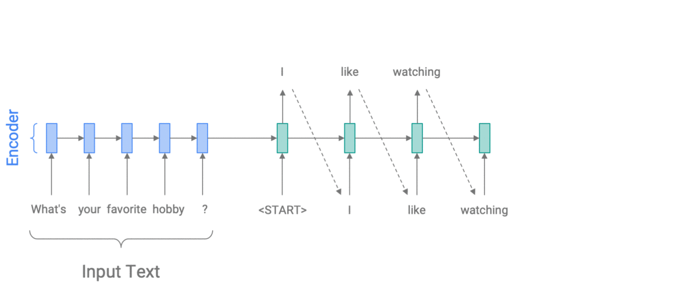
Controlling specificity with Weighted Decoding

This method requires no special training and can be applied to modify any decoding algorithm (beam search, greedy search, top-*k* sampling, etc). Weighted Decoding can be used to control multiple attributes at once, and it can be applied alongside Conditional Training.

### Research Question 1: How effectively can we control the attributes?

We find that **Weighted Decoding** is effective to control attributes that can be easily defined at the word-level, like repetition, specificity, and response-relatedness (shown below). However, the method yields degenerate output when the feature weight is too high – for example, devolving into a long list of related words (*drinks, espresso, latte, tea*).

 

Controlling response-relatedness with Weighted Decoding (WD). By increasing response-relatedness, we obtain a more on-topic response (*I do, usually at starbucks*).

Because Weighted Decoding controls attributes using word-level features, it cannot control attributes such as question-asking, which are more naturally defined at the sentence-level.

We find that **Conditional Training** is effective to control simple attributes of the output text, such as specificity and question-asking. In particular, it usually produces output that is well-formed and has the desired attribute – this makes it less risky than Weighted Decoding (see below for example).

 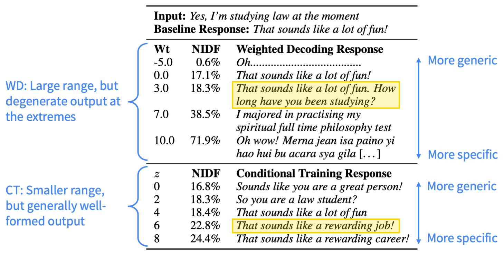

Controlling specificity with Weighted Decoding (WD) and Conditional Training (CT). By increasing specificity, we obtain more interesting, personalized responses.

However, we find Conditional Training is less effective at learning to control *relationships* between the input and output, such as response-relatedness. In addition, Conditional Training can’t control attributes without sufficient training data – meaning it is ineffective to control repetition, because our training data does not contain the kind of severely repetitive output we wish to prevent.

Overall, though the control methods didn’t work for every attribute, we find that each of our four attributes can be satisfactorily controlled by at least one of the two methods.

### Research Question 2: How do the controllable attributes affect conversational quality aspects?

We find that **reducing repetition** gives large boosts to all human evaluation scores. This is not surprising, as our beam search baseline model repeats itself a lot (especially across utterances), creating a very frustrating user experience. However, this does demonstrate the importance of multi-turn evaluation (as opposed to single response evaluation), as it is necessary to detect across-utterance repetition.

 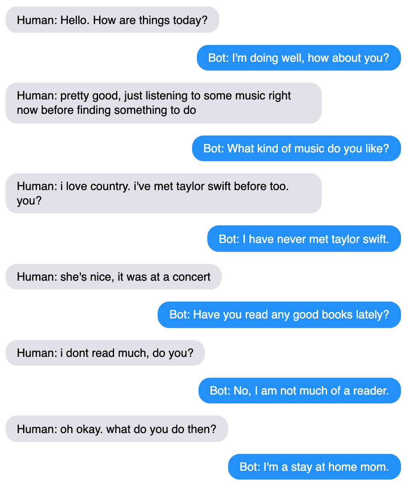
After reducing repetition, our bot has mostly safe but generic conversations.

After reducing repetition, we find that by **increasing question-asking** rate to 65.7%, we achieve better inquisitiveness, interestingness and engagingness. Interestingly, this rate is higher than both the baseline (50%) and humans (28.8%) – implying that, in chitchat settings such as these, more question-asking is often received well.

 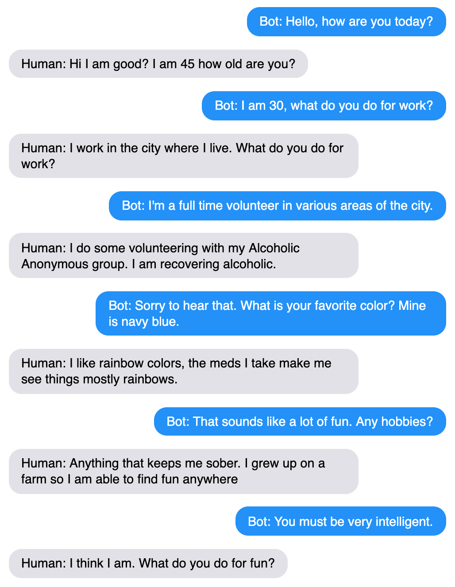

Our increased question-asking bot is more engaging, often commenting and asking a question in the same turn.

By **increasing specificity** to around human levels, we obtain improvements to interestingness, listening and engagingness. However, finding the right balance is difficult – increasing specificity too much leads to lower making sense and fluency scores.

 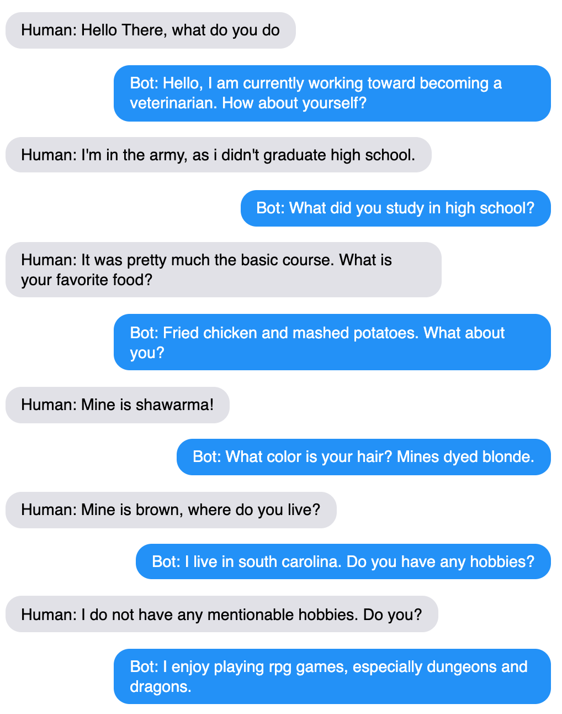

Our increased specificity bot typically offers more interesting details about itself.

Lastly, we were unable to obtain an improvement in any of our evaluation categories by controlling **response-relatedness**. Though we hoped that increasing response-relatedness would create a chatbot that appears more attentive, friendly and interested in the user, crowdworkers did not rate the ‘more responsive’ bots better overall. In particular, these bots received lower average scores for fluency and making sense, and consequently lower overall scores for humanness and engagingness too. As with specificity, attempting higher response-relatedness is a risky strategy, as it increases the chance of the bot saying something that sounds unnatural or nonsensical.

 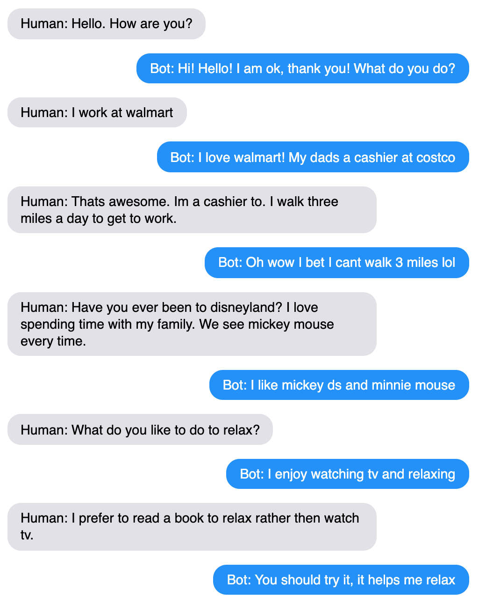

Our increased-responsiveness bot can give good relevant responses (e.g. *costco*), but tends to mirror the user too much (*relax*) and makes false connections (*mickey d's* is slang for McDonalds, which is unrelated to Mickey Mouse).

You can browse more example conversations by following the instructions [here](https://parl.ai/projects/controllable_dialogue).

### Research Question 3: Can we use control to make a better chatbot overall?

The first answer is **yes**! By controlling repetition, specificity and question-asking, we achieve**near-human engagingness** (i.e. enjoyability) ratings.

 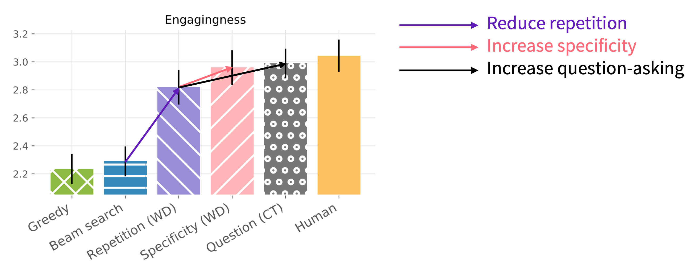
Engagingness (i.e. enjoyability) ratings for humans and selected models.

In particular, our raw engagingness score matches that of the ConvAI2 competition winner’s GPT-based model.[3](http://www.abigailsee.com/2019/08/13/what-makes-a-good-conversation.html#fn:convai2)This is especially notable because our model is much less deep (a 2-layer LSTM-based model vs a 12-layer Transformer-based model), and is trained on 12 times less data.

However, on the **humanness** (i.e. Turing test) metric, all our models are **nowhere near human-level**!

 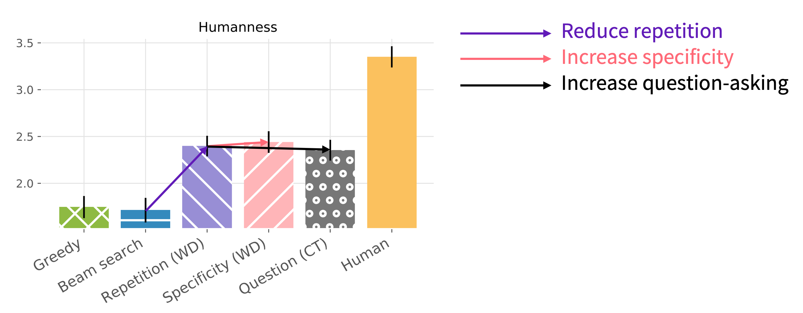
Humanness (i.e. Turing test) ratings for humans and selected models.

These results show that **our bots are (almost) as engaging as humans, but they’re clearly non-human**. How is this possible? There are many ways a bot can reveal itself as non-human – for example, through logical errors, unnatural style, or poor social skills – but despite these flaws, the bot can still be enjoyable. As a concrete example, the last chat in the previous section was rated enjoyable (3/4) but obviously non-human (1/4).

Clearly, our results demonstrate that **engagingness is not the same as humanness**. While both metrics are frequently used alone for evaluation, our results show the importance of measuring both (or at least, thinking carefully about which you want to use).

Another possible explanation for our finding, is that the **human ‘engagingness’ performance may be artificially low**. We observe that crowdworkers chatting for money (using artificial personas) seem to be less engaging conversationalists than people who are genuinely chatting for fun. Though we did not formally test this hypothesis, it may explain why the human-level engagingness scores are easy to match.

### Conclusions

- If you’re building an end-to-end neural sequence generation dialogue system, then **control is probably a good idea**. Using simple control mechanisms, we matched the performance of a GPT-based contest winner. We expect these techniques would yield even better results when applied to a highly pretrained language model like GPT.

- If you want to control a fairly **simple attribute** of the output text, and you have sufficient **training examples** of the attribute, then Conditional Training is probably a good idea.

- If you **don’t have the training data**, or the attribute is **harder to learn**, then Weighted Decoding may be more effective – though you need to be careful as the method can produce degenerate output.

- **Multi-turn phenomena** (such as repetition across utterances, and question-asking frequency) are important to conversations – so we need **multi-turn eval** to detect them.

- **Engagingness is not the same as humanness**, so think carefully about which to use as an overall quality metric.

- We suspect that **paid crowdworkers are not very engaging conversationalists**, and perhaps aren’t even good judges of whether a conversation is engaging. Humans chatting for fun may be a better source of genuine judgments.

- Whether you’re a human or a bot: **Don’t repeat yourself. Don’t be boring. Ask more questions.**

### Outlook

This project involved a lot of manual tuning of control parameters, as we attempted to find the best combination of settings for the four attributes. This was a long and laborious process, requiring not only many hours of crowdworker evaluation time, but also many hours of our own evaluation time as we chatted to the bots.

I’m reminded of [QWOP](http://www.foddy.net/Athletics.html) – a simple game in which you press four buttons (Q, W, O and P) to control the individual muscles in a runner’s legs. Though the aim of the game is to run as far as possible, the entertainment comes from the absurd difficulty of the task.

 

QWOP is a game in which you attempt to run by pressing four buttons that each control a different part of the runner's legs.

Manually controlling four low-level text attributes is *not* the most principled, nor the most scalable way to build a good conversational dialogue system – just as manually controlling the four parts of the runner’s legs is not the most principled way to run a marathon. However, for the neural sequence generation systems we are using today, this kind of control can be useful and effective – getting us a little further down the track, if not all the way to the finish line.

* * *

*For further details on this work, check out the [paper](https://www.aclweb.org/anthology/N19-1170).*

*To chat to the bots yourself, follow the instructions [here](https://parl.ai/projects/controllable_dialogue) – it only takes a few minutes to set up!*

* * *

Footnotes

1.   Sasha Rush showed a similar diagram during his talk at the NeuralGen 2019 workshop. See “Open Questions” slide [here](http://nlp.seas.harvard.edu/slides/Pre-training%20for%20Generation.pdf). [↩](http://www.abigailsee.com/2019/08/13/what-makes-a-good-conversation.html#fnref:sasha)

2.   Since we carried out this research in 2018, it has become clearer that likelihood-maximizing decoding algorithms (such as greedy decoding and beam search) are a key cause of repetitive and generic text ([Holtzman et al, 2019](https://arxiv.org/pdf/1904.09751.pdf)), and that sampling-based methods such as top-*k* sampling ([Fan et al 2018](https://arxiv.org/abs/1805.04833), [Radford et al 2019](https://d4mucfpksywv.cloudfront.net/better-language-models/language_models_are_unsupervised_multitask_learners.pdf)) may fare better for open-ended NLG tasks. In retrospect, beam search is perhaps *not* the best choice of decoding algorithm for our chitchat setting. Though we didn’t experiment with sampling-based decoding algorithms, it would be interesting to see whether the control methods described here are as reliable under sampling-based decoding. [↩](http://www.abigailsee.com/2019/08/13/what-makes-a-good-conversation.html#fnref:beam) [↩2](http://www.abigailsee.com/2019/08/13/what-makes-a-good-conversation.html#fnref:beam:1) [↩3](http://www.abigailsee.com/2019/08/13/what-makes-a-good-conversation.html#fnref:beam:2)

3.   Though we used the exact same wording as ConvAI2 for our Engagingness question, the comparison of raw scores should be considered as a rough indication of a similar overall quality, *not* an exact comparison. [↩](http://www.abigailsee.com/2019/08/13/what-makes-a-good-conversation.html#fnref:convai2)