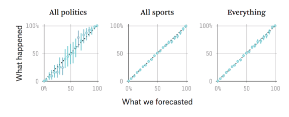
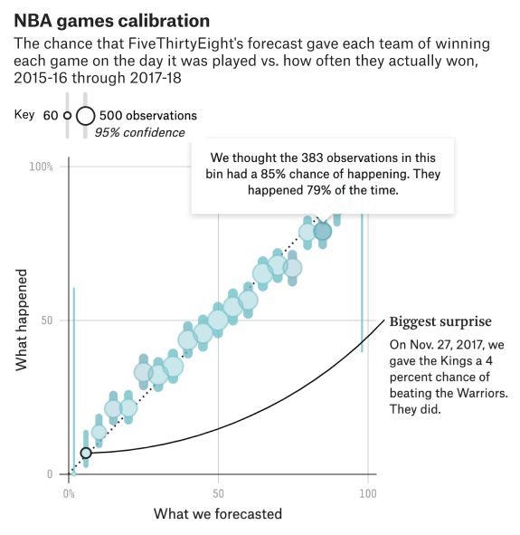

When We Say 70 Percent, It Really Means 70 Percent

Apr. 4, 2019, at5:16 PM

# When We Say 70 Percent, It Really Means 70 Percent

By [Nate Silver](https://fivethirtyeight.com/contributors/nate-silver/)
Filed under [Housekeeping](https://fivethirtyeight.com/tag/housekeeping/)

- [](https://fivethirtyeight.com/features/when-we-say-70-percent-it-really-means-70-percent/?share=facebook&nb=1)
- [](https://fivethirtyeight.com/features/when-we-say-70-percent-it-really-means-70-percent/?share=twitter&nb=1)

One of FiveThirtyEight’s goals has always been to [get people to think more carefully about probability](https://fivethirtyeight.com/features/the-media-has-a-probability-problem/). When we’re forecasting an upcoming election or sporting event, we’ll go to great lengths to analyze and explain the sources of real-world uncertainty and the extent to which events — say, a Senate race in Texas and another one in Florida — are correlated with one another. We’ll spend a lot of time working on how to build robust models that don’t suffer from [p-hacking](https://fivethirtyeight.com/features/science-isnt-broken/) or [overfitting](http://people.duke.edu/~mababyak/papers/babyakregression.pdf) and which will perform roughly as well when we’re making *new* predictions as when we’re [backtesting them](https://en.wikipedia.org/wiki/Backtesting). There’s a lot of science in this, as well as a lot of art. We really care about the difference between a 60 percent chance and a 70 percent chance.

That’s not always how we’re judged, though. Both our fans and our critics sometimes look at our probabilistic forecasts as *binary*  *predictions*. Not only might they not care about the difference between a 60 percent chance and a 70 percent chance, they sometimes treat a 55 percent chance the same way as a 95 percent one.

There are also frustrating moments related to the sheer number of forecasts that we put out — for instance, forecasts of [hundreds of U.S. House races](https://projects.fivethirtyeight.com/2018-midterm-election-forecast/house/), or [dozens of presidential primaries](https://projects.fivethirtyeight.com/election-2016/primary-forecast/california-democratic/), or the [thousands of NBA games](https://projects.fivethirtyeight.com/2019-nba-predictions/) in a typical season. If you want to make us look bad, you’ll have a lot of opportunities to do so because some — many, actually — of these forecasts will inevitably be “wrong.”

Sometimes, there are more sophisticated-seeming criticisms. “*Sure*, your forecasts are *probabilistic,*” people who think they’re very clever will say. “But all that means is that you can n*ever be wrong*. Even a 1 percent chance happens sometimes, after all. So what’s the point of it all?”

I don’t want to make it sound like we’ve had a rough go of things overall.[1](https://fivethirtyeight.com/features/when-we-say-70-percent-it-really-means-70-percent/#fn-1) But we do think it’s important that our forecasts are successful on their own terms — that is, in the way that we [have always said they should be judged](https://fivethirtyeight.com/?s=calibration+forecast). That’s what our latest project — “[How Good Are FiveThirtyEight Forecasts?](https://projects.fivethirtyeight.com/checking-our-work/)” — is all about.

That way is principally via [*calibration*](https://www.edge.org/conversation/philip_tetlock-edge-master-class-2015-a-short-course-in-superforecasting-class-ii). Calibration measures whether, over the long run, events occur about as often as you say they’re going to occur. For instance, of all the events that you forecast as having an 80 percent chance of happening, they should indeed occur about 80 out of 100 times; that’s good calibration. If these events happen only 60 out of 100 times, you have problems — your forecasts aren’t well-calibrated and are *overconfident*. But it’s just as bad if they occur 98 out of 100 times, in which case your forecasts are *underconfident*.

Calibration isn’t the only thing that matters when judging a forecast. Skilled forecasting also requires *discrimination* — that is, distinguishing relatively more likely events from relatively less likely ones. (If at the start of the [68-team NCAA men’s basketball tournament](https://projects.fivethirtyeight.com/2019-march-madness-predictions/), you assigned each team a 1 in 68 chance of winning, your forecast would be well-calibrated, but it wouldn’t be a skillful forecast.) Personally, I also think it’s important how a forecast lines up relative to reasonable alternatives, e.g., how it compares with other models or the market price or the “conventional wisdom.” If you say there’s a [29 percent chance](https://projects.fivethirtyeight.com/2016-election-forecast/) of event X occurring when everyone else says [10 percent](https://markets.predictwise.com/politics/2016-president-winner) or [2 percent](https://elections.huffingtonpost.com/2016/forecast/president) or simply [never really entertains X as a possibility](https://fivethirtyeight.com/features/there-really-was-a-liberal-media-bubble/), your forecast should probably get credit rather than blame if the event actually happens. But let’s leave that aside for now. (I’m not [bitter or anything](https://fivethirtyeight.com/features/why-fivethirtyeight-gave-trump-a-better-chance-than-almost-anyone-else/). OK, maybe I am.)

The catch about calibration is that it takes a fairly large sample size to measure it properly. If you have just 10 events that you say have an 80 percent chance of happening, you could pretty easily have them occur five out of 10 times or 10 out of 10 times as the result of chance alone. Once you get up to dozens or hundreds or thousands of events, these anomalies become much less likely.

But the thing is, FiveThirtyEight *has* made thousands of forecasts. We’ve been issuing forecasts of elections and sporting events for a long time — for more than 11 years, since [the first version of the site](https://web.archive.org/web/20080512090419/http://www.fivethirtyeight.com/) was launched in March 2008. The interactive lists almost all of the probabilistic sports and election forecasts that we’ve designed and published since then. You can see how all our [U.S. House forecasts](https://projects.fivethirtyeight.com/checking-our-work/us-house-elections/) have done, for example, or our [men’s](https://projects.fivethirtyeight.com/checking-our-work/march-madness-men/) and [women’s](https://projects.fivethirtyeight.com/checking-our-work/march-madness-women/) March Madness predictions. There are [NFL games](https://projects.fivethirtyeight.com/checking-our-work/nfl-games/) and of course [presidential elections](https://projects.fivethirtyeight.com/checking-our-work/presidential-elections/). There are a few important notes about the scope of what’s included in the footnotes,[2](https://fivethirtyeight.com/features/when-we-say-70-percent-it-really-means-70-percent/#fn-2) and for years before FiveThirtyEight was acquired by ESPN/Disney/ABC News (in 2013) — when our record-keeping wasn’t as good — we’ve sometimes had to rely on [archived versions of the site](https://web.archive.org/web/*/www.fivethirtyeight.com) if we couldn’t otherwise verify exactly what forecast was published at what time.

What you’ll find, though, is that our calibration has generally been very, *very* good. For instance, out of the 5,589 events (between sports and politics combined) that we said had a 70 chance of happening (rounded to the nearest 5 percent), they in fact occurred 71 percent of the time. Or of the 55,853 events[3](https://fivethirtyeight.com/features/when-we-say-70-percent-it-really-means-70-percent/#fn-3) that we said had about a 5 percent chance of occurring, they happened 4 percent of the time.

We did discover a handful of cases where we weren’t entirely satisfied with a model’s performance. For instance, our NBA game forecasts have [historically been a bit overconfident](https://projects.fivethirtyeight.com/checking-our-work/nba-games/) in lopsided matchups — e.g., teams that were supposed to win 85 percent of the time in fact won only 79 percent of the time. These aren’t huge discrepancies, but given a large enough sample, some of them are on the threshold of being statistically significant. In the particular case of the NBA, we [substantially redesigned our model before this season](https://fivethirtyeight.com/methodology/how-our-nba-predictions-work/), so we’ll see how the new version does.[4](https://fivethirtyeight.com/features/when-we-say-70-percent-it-really-means-70-percent/#fn-4)

Our forecasts of elections have actually been a little bit *underconfident*, historically. For instance, candidates who we said were supposed to win 75 percent of the time have won 83 percent of the time. These differences are generally not statistically significant, given that [election outcomes are highly correlated](https://fivethirtyeight.com/features/election-update-why-our-model-is-more-bullish-than-others-on-trump/) and that we issue dozens of forecasts (one every day, and sometimes using several different versions of a model) for any given race. But we [do think underconfidence can be a problem](https://fivethirtyeight.com/features/how-fivethirtyeights-2018-midterm-forecasts-did/) if replicated over a large enough sample, so it’s something we’ll keep an eye out for.

It’s just not true, though, that there have been an especially large number of upsets in politics relative to polls or forecasts (or at least not relative to FiveThirtyEight’s forecasts). In fact, there have been fewer upsets than our forecasts expected.

There’s a lot more to explore in the interactive, including [Brier skill scores](https://en.wikipedia.org/wiki/Forecast_skill) for each of our forecasts, which do account for discrimination as well as calibration. We’ll continue to update the interactive as elections or sporting events are completed.

None of this ought to mean that FiveThirtyEight or our forecasts — which are a relatively small part of what we do — are immune from criticism or that our models can’t be improved. We’re studying ways to improve all the time.

But we’ve been publishing forecasts for more than a decade now, and although we’ve sometimes tried to do an [after-action report](https://fivethirtyeight.com/features/how-fivethirtyeights-2018-midterm-forecasts-did/) following a big election or sporting event, this is the first time we’ve studied *all* of our forecast models in a comprehensive way. So we were relieved to discover that our forecasts really do what they’re supposed to do. When we say something has a 70 percent chance of occurring, it *doesn’t* mean that it will always happen, and it isn’t supposed to. But empirically, 70 percent in a FiveThirtyEight forecast really does mean about 70 percent, 30 percent really does mean about 30 percent, 5 percent really does mean about 5 percent, and so forth. Our forecasts haven’t always been right, but they’ve been right just about as often as they’re supposed to be right.

* * *

Nate Silver reviews the FiveThirtyEight Midterm forecasts

00:00/02:25



* * *