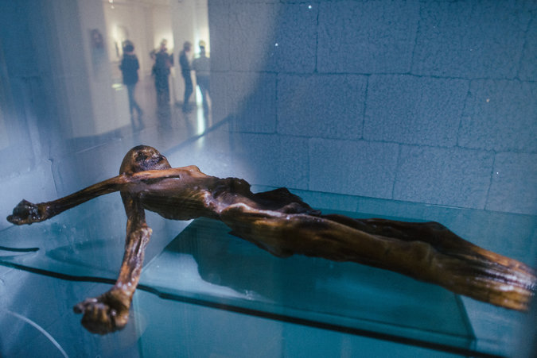
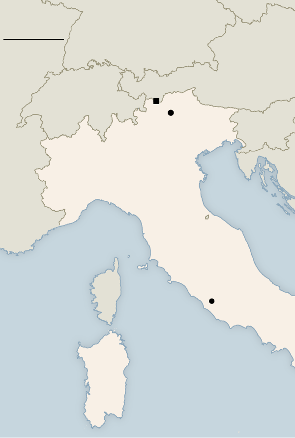
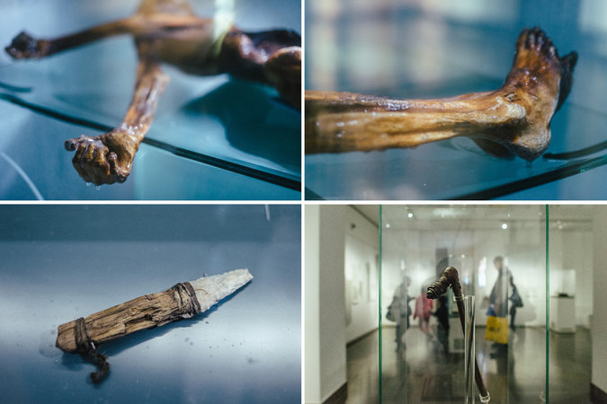

Who Killed the Iceman? Clues Emerge in a Very Cold Case

“When I was first contacted with the idea, I thought it was too difficult, too much time has passed,” said Inspector Horn, [a noted profiler](http://www.spiegel.de/international/a-serial-killer-stalks-turkish-shopkeepers-german-police-step-up-hunt-for-doener-kebab-killer-a-430710.html). “But actually he’s in better condition than recent homicide victims I’ve worked on who have been found out in the open.”

 Photo
 
**

 The mummy on display at the museum. There are a few mummies in the world as old, but none so well preserved.    Credit Dmitry Kostyukov for The New York Times

There are a few mummies in the world as old as Ötzi, but none so well preserved. Most were ritually prepared, which usually meant removal of internal organs, preservation with chemicals or exposure to destructive desert conditions.

The glacier not only froze Ötzi where he had died, but the high humidity of the ice also kept his organs and skin largely intact. “Imagine, we know the stomach contents of a person 5,000 years ago,” Inspector Horn said. “In a lot of cases we are not able to do that even now.”

Those contents, as it turned out, were critical in determining with surprising precision what happened to Ötzi and even helped shed light on the possible motive of his killer.

The more [scientists learn](http://www.eurac.edu/en/research/health/iceman/conferences/Pages/3rd-Bolzano-Mummy-Congress-oetzi-25-years-of-research.aspx), the more recognizable the Iceman becomes. He was 5 feet 5 inches tall (about average height for his time), weighed 110 pounds, had brown eyes and shoulder-length, dark brown hair, and a size 7½ foot. He was about 45, give or take six years, respectably old for the late Neolithic age — but still in his prime.

Ötzi had the physique of a man who did a lot of strenuous walking but little upper-body work; there was hardly any fat on his body. He had all of his teeth, and between his two upper front teeth was a 3-millimeter gap, an inherited condition known as [diastema](https://en.oxforddictionaries.com/definition/diastema), which Madonna and [Elton John](https://www.pinterest.com/pin/535858055641074968/) also have.

100 Miles
GERMANY
AUSTRIA
Ötzi discovery site
SWITZ.
SLOVENIA
Bolzano
FRANCE
Adriatic
Sea
ITALY
Rome
Corsica
Tyrrhenian Sea
Sardinia
ITALY
Mediterranean Sea

By The New York Times

When viewed through the window of the museum’s freezer, where he is kept now, his hands not only appear unusually small, but they also show little sign of hard use, suggesting that Ötzi was no manual laborer.

Every modern murder investigation relies heavily on forensic science, but in Ötzi’s case, the techniques have been particularly high tech, involving exotic specialties like archaeobotany and paleometallurgy.

From examining traces of pollen in his digestive tract, scientists were able to place the date of Ötzi’s death at sometime in late spring or early summer. In his last two days, they found, he consumed three distinct meals and walked from an elevation of about 6,500 feet, down to the valley floor and then up into the mountains again, where he was found at the crime site, 10,500 feet up.

On his body was one prominent wound, other than the one from the arrowhead: a deep cut in his right hand between the thumb and forefinger, down to the bone and potentially disabling. By the degree of healing seen on the wound, it was one to two days old.

From this, Inspector Horn surmises that Ötzi may have come down to his village and become embroiled in a violent altercation. “It was a very active defensive wound, and interesting in the context that no other injuries are found on the body, no major bruises or stab wounds, so probably he was the winner of that fight, even possibly he killed the person who tried to attack him,” he said.

 Photo
 
**

 The area where the Iceman was from. The crime scene was in the mountains, 10,500 feet up.    Credit Dmitry Kostyukov for The New York Times

Then he left, fully provisioned with food, the embers of a fire preserved in maple leaf wrappings inside a birch-bark cylinder, and quite a lot of other equipment, most of it probably carried in a backpack with a wooden frame. For weapons he had only a flint dagger so small it seemed to be the Copper Age equivalent of a derringer, a six-foot-long stave for a bow that had not yet been completed; and a beautifully crafted deerskin quiver with a dozen arrows, only two of them with arrowheads attached.

Inspector Horn reckons Ötzi was in no hurry. At 10,500 feet, he made what appeared to be a camp in a protected gully on the mountain saddle, spreading his belongings around and sitting down to his last meal.

“Roughly half an hour before his death he was having a proper meal, even a heavy meal,” Inspector Horn said. The Copper Age menu was well balanced, consisting of ibex meat, smoked or raw; einkorn wheat (an early domesticated variety), possibly in the form of bread; some sort of fat, which might have been from bacon or cheese; and [bracken](https://www.rhs.org.uk/advice/profile?pid=445), a common fern.

There is even evidence that some of his food was recently cooked. “If you’re in a rush and the first thing is to get away from someone trying to kill you, that’s not what you do,” he said. Ötzi’s longbow was only half a day’s work from completion, he added, but there was no sign that he was working on it at the time.

Half an hour after Ötzi dined, the killer came along and shot him in the back from a distance of almost 100 feet. The arrow went under his left armpit and ripped through a roughly half-inch section of his subclavian artery, a wound that would have been quickly fatal and probably not treatable even in modern times, especially where it happened. By the angle of the wound, he was either shot from below and behind, or he had been bent forward when he was hit from above and behind.

 Photo
 
**

 Clockwise from top left: the Iceman’s hand, lower leg, ax and dagger.    Credit Dmitry Kostyukov for The New York Times

“The aim of the offender was to kill him, and he decides to take a long-distance shot — could be a learning effect from what happened one or two days before,” Inspector Horn said. “Which is pretty much what you see all the time nowadays. Most homicides are personal, and follow violence and an escalation of violence. I want to follow him, find him and kill him. All the emotions we have in homicide, these things have not died out in all these years.”

Robbery can certainly be ruled out, he said. Ötzi had a copper ax, a valuable artifact only rarely seen in burials of the period. His [clothing and kit](https://www.nytimes.com/2016/08/23/science/otzi-the-icemans-patchwork-ensemble.html) were a match for the harsh alpine climate, and probably valuable, made from the leather and fur of at least 10 animals of six species.

“This was not a robbery gone bad or something,” Inspector Horn said; clearly, the killer was trying to cover up his act. “You go back to your village with this unusual ax, it would be pretty obvious what had happened.”

Ötzi’s cold case continues to yield surprises to scientists in many disciplines who still are studying his remains. Last year, for example, they discovered that he was infected with an unusual strain of [H](https://www.nytimes.com/2016/01/08/science/otzi-the-iceman-stomach-bacteria-europe-migration.html)[. pylori](https://www.nytimes.com/2016/01/08/science/otzi-the-iceman-stomach-bacteria-europe-migration.html), the bacteria believed responsible for ulcers today.

There is one thing they are unlikely to discover, as Inspector Horn noted with a chuckle. “I’m not optimistic we’ll find the offender in Ötzi’s case.”

Both in life and in death, the Iceman seems uncannily familiar to his modern descendants, said the museum’s deputy director, Katharina Hersel.

“He is so close to us. He uses the same equipment as we do when he goes to the mountain, just the materials are different,” she said. “And we are still killing each other, so maybe there hasn’t been so much evolution after all.”

A version of this article appears in print on March 27, 2017, on Page A1 of the New York edition with the headline: Who Killed the Iceman? New Clues Emerge in a Very Cold Case.   [Order Reprints](http://www.nytreprints.com/)|  [Today's Paper](http://www.nytimes.com/pages/todayspaper/index.html)|[Subscribe](http://www.nytimes.com/subscriptions/Multiproduct/lp839RF.html?campaignId=48JQY)

 [Continue reading the main story](https://www.nytimes.com/2017/03/26/world/europe/bolzano-italy-iceman-south-tyrol-museum-of-archaeology.html?_r=0#whats-next)