Why Procrastinators Procrastinate - Wait But Why

# Why Procrastinators Procrastinate

***PDF: **We made a fancy PDF of this post for printing and offline viewing. [Buy it here.](https://gum.co/wbw-proc1) (Or see a [preview](https://28oa9i1t08037ue3m1l0i861-wpengine.netdna-ssl.com/wp-content/uploads/2016/02/why-procrastinators-procrastinate-preview.pdf).)*

___________
**pro-cras-ti-na-tion** |prəˌkrastəˈnāSHən, prō-|
noun

the action of delaying or postponing something:* your first tip is to avoid procrastination*.

Who would have thought that after decades of struggle with procrastination, the dictionary, of all places, would hold the solution.

*Avoid procrastination. *So elegant in its simplicity.

While we’re here, let’s make sure obese people avoid overeating, depressed people avoid apathy, and someone please tell beached whales that they should avoid being out of the ocean.

No, “avoid procrastination” is only good advice for fake procrastinators—those people that are like, “I totally go on Facebook a few times every day at work—I’m such a procrastinator!” The same people that will say to a real procrastinator something like, “Just don’t procrastinate and you’ll be fine.”

The thing that neither the dictionary nor fake procrastinators understand is that for a real procrastinator, procrastination isn’t optional—it’s something they don’t know how to not do.

In college, the sudden unbridled personal freedom was a disaster for me—I did nothing, ever, for any reason. The one exception was that I had to hand in papers from time to time. I would do those the night before, until I realized I could just do them through the night, and I did that until I realized I could actually start them in the early morning on the day they were due. This behavior reached caricature levels when I was unable to start writing my 90-page senior thesis until 72 hours before it was due, an experience that ended with me in the campus doctor’s office learning that lack of blood sugar was the reason my hands had gone numb and curled up against my will. (I did get the thesis in—no, it was not good.)

Even this post took much longer than it should have, because I spent a bunch of hours doing things like seeing [this picture](http://upload.wikimedia.org/wikipedia/commons/d/d5/Jock,_the_Gorilla_(2).jpg) sitting on my desktop from [a previous post](https://www.waitbutwhy.com/2013/10/the-primate-awards.html), opening it, looking at it for a long time thinking about how easily he could beat me in a fight, then wondering if he could beat a tiger in a fight, then wondering who would win between a lion and a tiger, and then googling that and reading about it for a while (the tiger would win). I have problems.

To understand why procrastinators procrastinate so much, let’s start by understanding a *non*-procrastinator’s brain:

[(L)](https://4.bp.blogspot.com/-dID9_Fb3jsQ/Upvh1rjLxYI/AAAAAAAAGb8/fVhfjlj3Pks/s1600/NP+brain.png)

[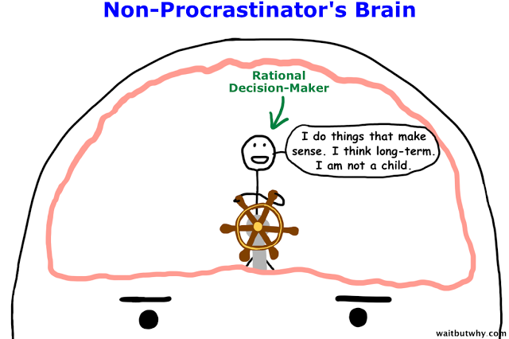](https://4.bp.blogspot.com/-dID9_Fb3jsQ/Upvh1rjLxYI/AAAAAAAAGb8/fVhfjlj3Pks/s1600/NP+brain.png)

Pretty normal, right? Now, let’s look at a procrastinator’s brain:

[(L)](https://1.bp.blogspot.com/-S6ryaE6HuZg/Upvh2oS7q9I/AAAAAAAAGcI/R2-QDRd6A7o/s1600/P+brain.png)

[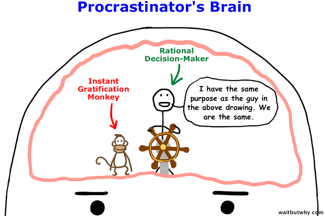](https://1.bp.blogspot.com/-S6ryaE6HuZg/Upvh2oS7q9I/AAAAAAAAGcI/R2-QDRd6A7o/s1600/P+brain.png)

Notice anything different?

It seems the Rational Decision-Maker in the procrastinator’s brain is coexisting with a pet—the Instant Gratification Monkey.

This would be fine—cute, even—if the Rational Decision-Maker knew the first thing about how to own a monkey. But unfortunately, it wasn’t a part of his training and he’s left completely helpless as the monkey makes it impossible for him to do his job.

[(L)](https://2.bp.blogspot.com/-Itw_OLDmScQ/Upvh0zdThcI/AAAAAAAAGbc/oTJBvQsSgaA/s1600/IGM+RDM+interacting+1.png)

[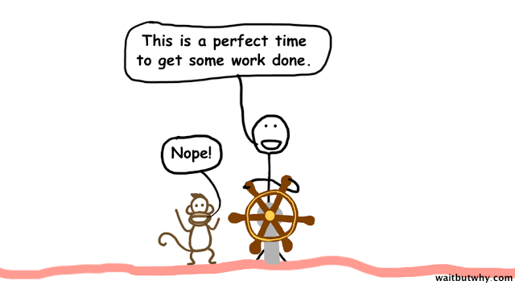](https://2.bp.blogspot.com/-Itw_OLDmScQ/Upvh0zdThcI/AAAAAAAAGbc/oTJBvQsSgaA/s1600/IGM+RDM+interacting+1.png)

[(L)](https://1.bp.blogspot.com/-TUld_HzbZP8/Upvh1CFYvBI/AAAAAAAAGbo/i3VQRZ3zPjU/s1600/IGM+RDM+interacting+2.png)

[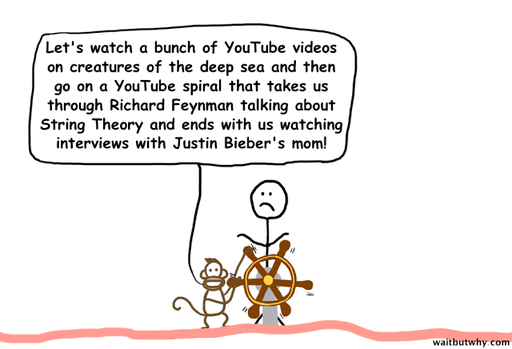](https://1.bp.blogspot.com/-TUld_HzbZP8/Upvh1CFYvBI/AAAAAAAAGbo/i3VQRZ3zPjU/s1600/IGM+RDM+interacting+2.png)

[(L)](https://3.bp.blogspot.com/-VG-qHIJJeM4/Upvh1QrCVkI/AAAAAAAAGcE/XwQWbOsUIok/s1600/IGM+RDM+interacting+3.png)

[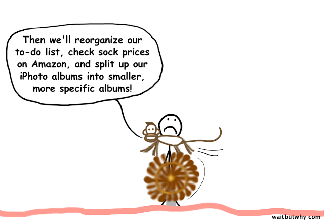](https://3.bp.blogspot.com/-VG-qHIJJeM4/Upvh1QrCVkI/AAAAAAAAGcE/XwQWbOsUIok/s1600/IGM+RDM+interacting+3.png)

[(L)](https://2.bp.blogspot.com/-CLsCpHveOY0/Upvh1oFtMNI/AAAAAAAAGcA/Bu92QWsX0dQ/s1600/IGM+RDM+interacting+4.png)

[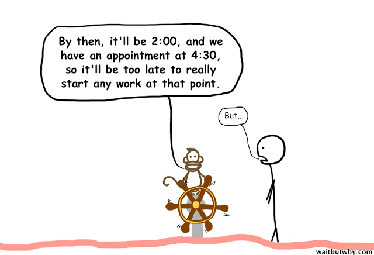](https://2.bp.blogspot.com/-CLsCpHveOY0/Upvh1oFtMNI/AAAAAAAAGcA/Bu92QWsX0dQ/s1600/IGM+RDM+interacting+4.png)

The fact is, the Instant Gratification Monkey is the last creature who should be in charge of decisions—he thinks *only *about the present, ignoring lessons from the past and disregarding the future altogether, and he concerns himself entirely with maximizing the ease and pleasure of the current moment. He doesn’t understand the Rational Decision-Maker any better than the Rational Decision-Maker understands him—why would we continue doing this jog, he thinks, when we could stop, which would feel better. Why would we practice that instrument when it’s not fun? Why would we ever use a computer for work when the internet is sitting right there waiting to be played with? He thinks humans are insane.

In the monkey world, he’s got it all figured out—if you eat when you’re hungry, sleep when you’re tired, and don’t do anything difficult, you’re a pretty successful monkey. The problem for the procrastinator is that he happens to live in the human world, making the Instant Gratification Monkey a highly unqualified navigator. Meanwhile, the Rational Decision-Maker, who was trained to make rational decisions, not to deal with competition over the controls, doesn’t know how to put up an effective fight—he just feels worse and worse about himself the more he fails and the more the suffering procrastinator whose head he’s in berates him.

It’s a mess. And with the monkey in charge, the procrastinator finds himself spending a lot of time in a place called the Dark Playground.[1](https://waitbutwhy.com/2013/10/why-procrastinators-procrastinate.html#)

The Dark Playground is a place every procrastinator knows well. It’s a place where leisure activities happen at times when leisure activities are not supposed to be happening. The fun you have in the Dark Playground isn’t actually fun because it’s completely unearned and the air is filled with guilt, anxiety, self-hatred, and dread. Sometimes the Rational Decision-Maker puts his foot down and refuses to let you waste time doing normal leisure things, and since the Instant Gratification Monkey sure as hell isn’t gonna let you work, you find yourself in a bizarre purgatory of weird activities where everyone loses.[2](https://waitbutwhy.com/2013/10/why-procrastinators-procrastinate.html#)

[(L)](https://store.waitbutwhy.com/collections/posters/products/dark-playground-poster-18x24)

[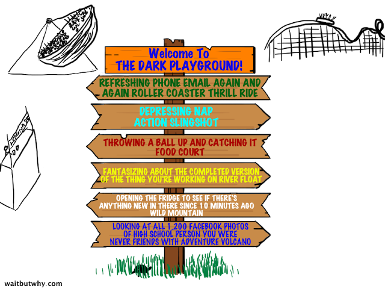](https://store.waitbutwhy.com/collections/posters/products/dark-playground-poster-18x24)

And the poor Rational Decision-Maker just mopes, trying to figure out how he let the human he’s supposed to be in charge of end up here *again*.

[(L)](https://store.waitbutwhy.com/collections/posters/products/dark-playground-poster-18x24)

[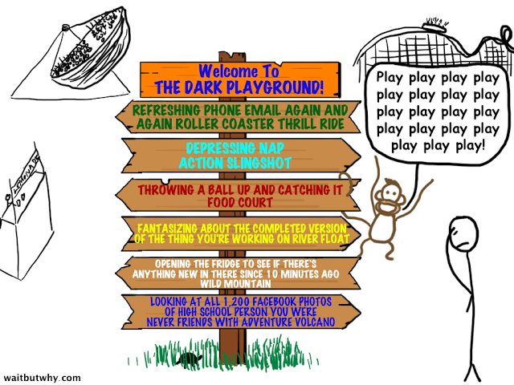](https://store.waitbutwhy.com/collections/posters/products/dark-playground-poster-18x24)

Given this predicament, how does the procrastinator ever manage to accomplish anything?

As it turns out, there’s one thing that scares the shit out of the Instant Gratification Monkey:

[(L)](https://4.bp.blogspot.com/-MlSCOooBXFE/Upvh3lkFkhI/AAAAAAAAGck/ItaOXl_J2rU/s1600/PM.png)

[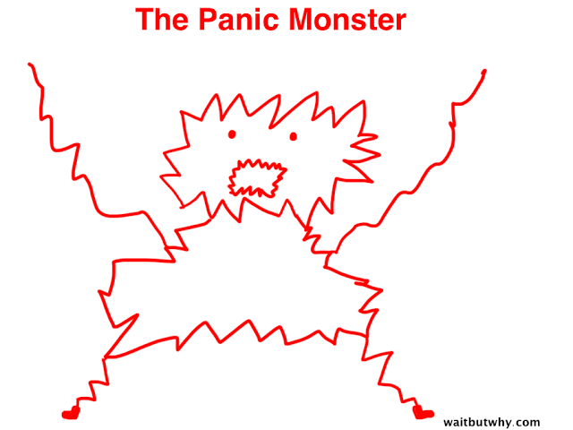](https://4.bp.blogspot.com/-MlSCOooBXFE/Upvh3lkFkhI/AAAAAAAAGck/ItaOXl_J2rU/s1600/PM.png)

The Panic Monster is dormant most of the time, but he suddenly wakes up when a deadline gets too close or when there’s danger of public embarrassment, a career disaster, or some other scary consequence.

[(L)](https://1.bp.blogspot.com/-bRsO0-Gbt5I/Upvh2hIjDJI/AAAAAAAAGcs/Bs_y-0os0aY/s1600/PM+Scare+1.png)

[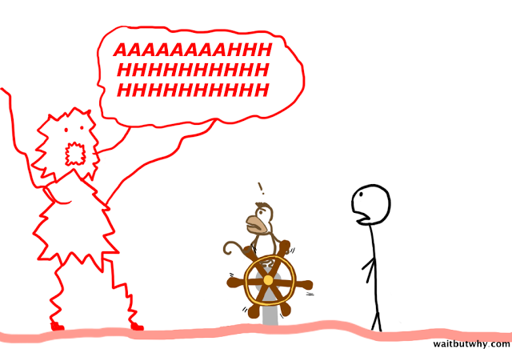](https://1.bp.blogspot.com/-bRsO0-Gbt5I/Upvh2hIjDJI/AAAAAAAAGcs/Bs_y-0os0aY/s1600/PM+Scare+1.png)

[(L)](https://2.bp.blogspot.com/-m06IHIKx56Q/Upvh284PRiI/AAAAAAAAGcg/Dki558dQ1O4/s1600/PM+Scare+2.png)

[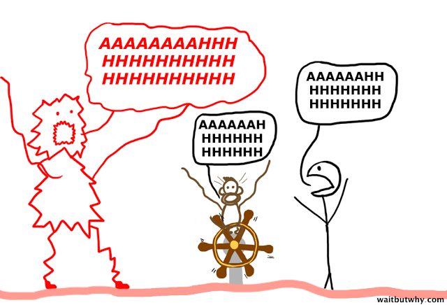](https://2.bp.blogspot.com/-m06IHIKx56Q/Upvh284PRiI/AAAAAAAAGcg/Dki558dQ1O4/s1600/PM+Scare+2.png)

[(L)](https://4.bp.blogspot.com/-Jjn22OLAd2E/Upvh3ICJbGI/AAAAAAAAGcY/fe37M2hsFiU/s1600/PM+Scare+3.png)

[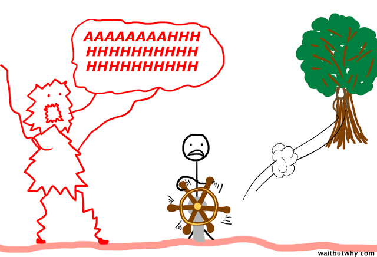](https://4.bp.blogspot.com/-Jjn22OLAd2E/Upvh3ICJbGI/AAAAAAAAGcY/fe37M2hsFiU/s1600/PM+Scare+3.png)

The Instant Gratification Monkey, normally unshakable, is terrified of the Panic Monster. How else could you explain the same person who can’t write a paper’s introductory sentence over a two-week span suddenly having the ability to stay up all night, fighting exhaustion, and write eight pages? Why else would an extraordinarily lazy person begin a rigorous workout routine other than a Panic Monster freakout about becoming less attractive?

And these are the lucky procrastinators—there are some who don’t even respond to the Panic Monster, and in the most desperate moments they end up running up the tree with the monkey, entering a state of self-annihilating shutdown.

Quite a crowd we are.

Of course, this is no way to live. Even for the procrastinator who does manage to eventually get things done and remain a competent member of society, something has to change. Here are the main reasons why:

**1) It’s unpleasant.** Far too much of the procrastinator’s precious time is spent toiling in the Dark Playground, time that could have been spent enjoying satisfying, well-earned leisure if things had been done on a more logical schedule. And panic isn’t fun for anyone.

**2) The procrastinator ultimately sells himself short.** He ends up underachieving and fails to reach his potential, which eats away at him over time and fills him with regret and self-loathing.

**3) The Have-To-Dos may happen, but not the Want-To-Dos. **Even if the procrastinator is in the type of career where the Panic Monster is regularly present and he’s able to be fulfilled at work, the other things in life that are important to him—getting in shape, cooking elaborate meals, learning to play the guitar, writing a book, reading, or even making a bold career switch—never happen because the Panic Monster doesn’t usually get involved with those things. Undertakings like those expand our experiences, make our lives richer, and bring us a lot of happiness—and for most procrastinators, they get left in the dust.

So how can a procrastinator improve and become happier? **See Part 2, [How To Beat Procrastination](https://www.waitbutwhy.com/2013/11/how-to-beat-procrastination.html). **

___________

**[My TED Talk on procrastination](https://www.ted.com/talks/tim_urban_inside_the_mind_of_a_master_procrastinator)**

If you’re into Wait But Why, sign up for the **[Wait But Why email list](https://waitbutwhy.com/2013/10/why-procrastinators-procrastinate.html#)** and we’ll send you the new posts right when they come out.

If you’d like to support Wait But Why, **[here’s our Patreon](https://www.patreon.com/waitbutwhy)**.

___________
**Two related WBW posts:**

**[Why you shouldn’t care what other people think](https://waitbutwhy.com/2014/06/taming-mammoth-let-peoples-opinions-run-life.html).** A different struggle going on in another part of your brain. Meet the mammoth.

**[A religion for the nonreligious](https://waitbutwhy.com/2014/10/religion-for-the-nonreligious.html).** An even deeper look at the deal with the monkey and the other animals in your brain.

**
While they’re ruining your life, you might as well cuddle with them:**
[(L)](https://store.waitbutwhy.com/collections/plush-toys)

