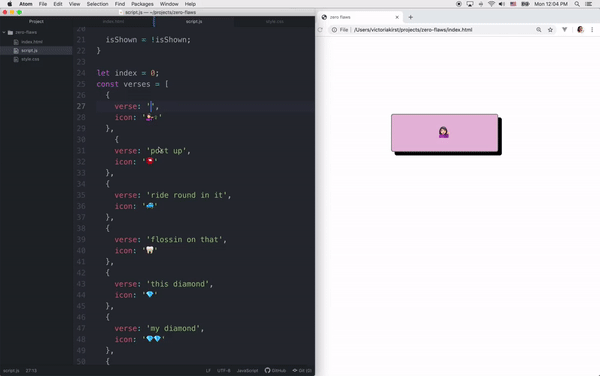
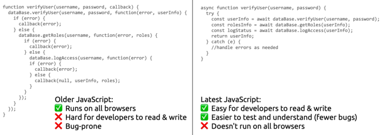
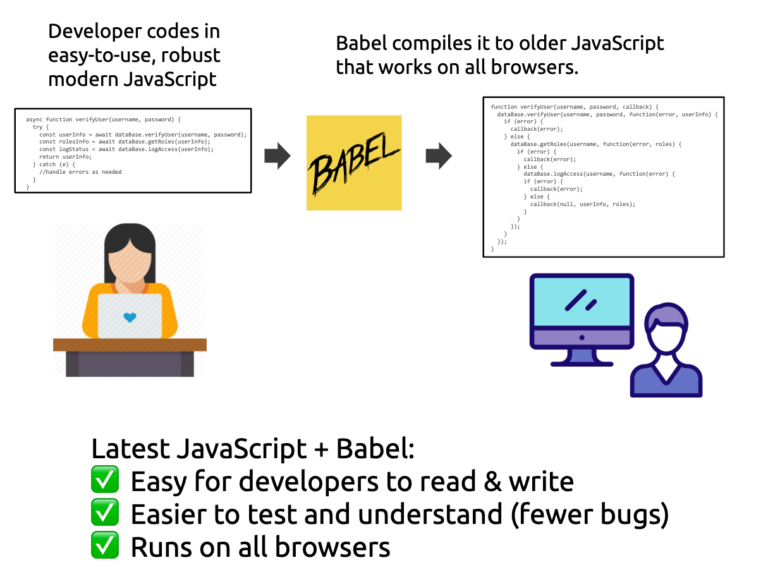
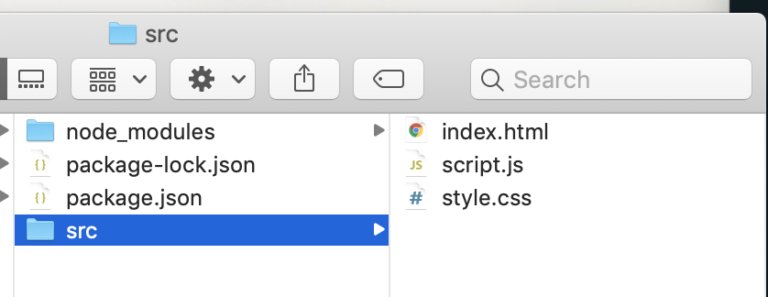
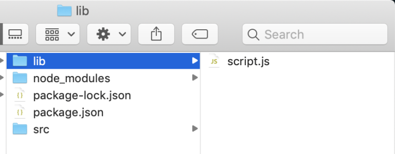
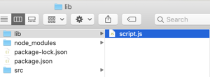
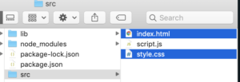
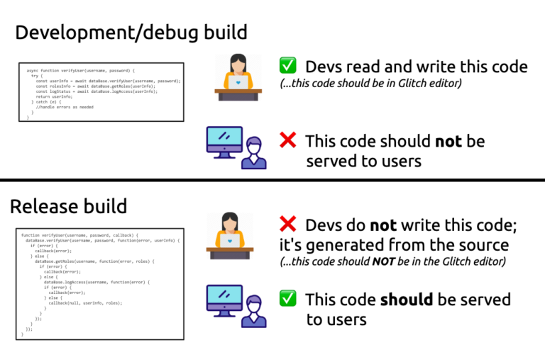

Why is modern web development so complicated? A long yet hasty explanation: Part 1! - vrk.dev

# Why is modern web development so complicated? A long yet hasty explanation: Part 1!

July 11, 2019 ·[Coding](https://www.vrk.dev/category/coding/)

Modern frontend web development is a polarizing experience: many love it, others despise it.

I am a huge fan of modern web development, though I would describe it as “magical” — and magic has its upsides and downsides:

- When you understand how to use the magical tools of web development (babel! bundlers! watchers! etc!), your development workflow is speedy, powerful, and delightful
- If you **don’t** understand the magical tools of web development, it’s terribly confusing
- … and trying to learn how the magic works is all-too-often miserable, unless you have someone to help guide you through the tangle of jargon, hot takes, and outdated information on the web

Recently I’ve been needing to explain “modern web development workflows” to folks who only have a cursory of vanilla web development workflows and……

It is a LOT to explain!
Even a hasty explanation ends up being pretty long.

So in the effort of writing more of my explanations down, here is the beginning of a long yet hasty explanation of the evolution of web development:

**Part 1: How we got from static websites to babel**
– – – – – – – – – – –

## Simplest website: Static website

Let’s start from “classic” frontend web development, which I’m going to assume you-the-reader already understand.

In classic frontend web development, we are directly modifying HTML/CSS/JavaScript files. To preview changes, we open the HTML file locally in the browser, and as we develop, we refresh the page for updates.

### Development workflow

The development workflow looks like this:

1. Edit your HTML/CSS/JavaScript files in a text editor like [Atom](https://atom.io/).

2. Save the file in your text editor.
3. Open and reload file in the browser.

Edit JavaScript, save file, refresh the page to see updates

### Deployment

Then when you want to publish your website to the internet, you simply upload the HTML/CSS/JavaScript files to the internet somewhere.

With a service like [Netlify](https://www.netlify.com/), you can just drag-and-drop the folder containing your files to publish the page to the web.

Here’s an example of the published page: https://sleepy-lichterman-6811cc.netlify.com/

## That’s so simple! Why did we make things complicated?!

So if you understand how the “classic” web development workflow works, you might ask: Gee, that’s really simple and convenient. Why did we ever deviate from that?! Why are modern web development flows so complicated?

The short answer: …Ok maybe I have two short answers.
Two short answers:

- **You don’t *have* to make it more complicated.** The “classic” web development workflow is great! And is perfectly sufficient for plenty of needs! You should never add superfluous tooling, or tools whose purpose you don’t understand.
- **But for certain projects you’ll *****benefit***** from a more sophisticated workflow.** Every tool that you add to your workflow is meant to solve a problem.

In order to understand the tooling for modern web development, we have to **understand the problems** of web development.

In this long-but-hasty journey, we’ll address each problem individually, starting with an old web dev problem that has existed for decades:.

## An old problem: Limitations in JavaScript

Up until fairly recently, JavaScript and the Web APIs had a lot of limitations (for a myriad of reasons that will not be covered in this long ‘n’ hasty post).

To name a few of these limitations:

- No modules
- No constants
- No Promises / async
- No Array.includes() (!!)
- Clunky syntax / missing for a lot of common primitives (no for-of, template literals, arrow function syntax, template unpacking…)
- (Web APIs) Countless DOM operations were needlessly complex (like adding/removing class names, hiding elements, selecting elements, removing elements…)

Browsers are only capable of executing JavaScript, so when there are limitations in the JavaScript language, it’s not like you can just use a different language; you have to work with what you have.

### Aside: Difference between JavaScript and Web APIs?

You may have noticed I said “JavaScript and the Web APIs” above. These are two different things!

When you write JavaScript for a web page, any API call that interacts with the web page itself is a [Web API](https://developer.mozilla.org/en-US/docs/Web/API) (which happens to be written in JavaScript), and not part of JavaScript the language.

Some examples:

- **Web APIs**: `document` and every method on `document`; `window` and every method on `window`; `Event`, `XMLHttpRequest`, `fetch`, etc.
- **JavaScript**: functions, `const`/`let`/`var`, arrays, `Promise`, etc

So for instance, if you’re writing a Node.js server, you’ll be writing in JavaScript, so that means you can use e.g. `Promise`s but you can’t use `document.querySelector` (nor would it make sense to do that).

## An old solution: jQuery & friends

Back in 2006, [jQuery](https://en.wikipedia.org/wiki/JQuery) was released: It’s a library that helped workaround lot of the shortcomings of JavaScript and the Web APIs.

jQuery includes APIs that help dramatically with common web tasks, like DOM manipulations, async processing, cross-browser discrepancies and resource-fetching.

So basically: All these things were technically possible using old-JavaScript/old-Web-APIS, but they were super annoying, tedious, and often tricky to code – so instead of having every web developer write the same tedious code to e.g. download and process and JSON file, you could instead download the jQuery library and use jQuery’s nice APIs instead.

## A new solution: Let’s improve JavaScript itself

A lot of time has passed since 2006, though!

Since 2006, JavaScript and the Web APIs have improved **tremendously**. (With a lot of help from jQuery and others in paving the way!)

JavaScript is an ever-evolving language. Similar to how software is updated, the JavaScript language itself is updated to different versions.

You may have heard the term “ES6.” ES6 stands for “ECMAScript 6,” and refers to the 6th iteration of ECMAScript. ECMAScript is just another word for JavaScript — the only difference is a colloquial one, in that people usually use “ECMAScript” to refer to the specification itself, and “JavaScript” to refer to the language people code in.

(Btw, that’s another confusing aside and pet peeve of mine: JavaScript is **not** an implementation/flavor/dialect of ECMAScript; that’s like calling “HTML” an implementation/flavor/dialect of the “HTML,” or, if you’re generous, the “HTML spec.” Either way, it’s wrong! [Wikipedia, you’re wrong](https://en.wikipedia.org/wiki/ECMAScript)! JavaScript and ECMAScript are one and the same.)

Anyway! [ES6 (released in 2015)](https://en.wikipedia.org/wiki/ECMAScript#6th_Edition_-_ECMAScript_2015) is notable because it adds a lot of really language nice features to JavaScript, like `const`, modules, and `Promise`s. (And [ES8](https://en.wikipedia.org/wiki/ECMAScript#8th_Edition_-_ECMAScript_2017) introduced maybe my [favorite language feature](https://twitter.com/bictolia/status/1136441515104985089) ever, `async`.)

In parallel, the Web APIs have also improved tremendously since 2006, like with the addition of `[document.querySelector](https://developer.mozilla.org/en-US/docs/Web/API/Document/querySelector)`, `[fetch](https://developer.mozilla.org/en-US/docs/Web/API/Fetch_API)`, and little things like `[classList](https://developer.mozilla.org/en-US/docs/Web/API/Element/classList)` and `[hidden](https://developer.mozilla.org/en-US/docs/Web/API/HTMLElement/hidden)`.

So instead of using jQuery or other similar libraries, in 2019 we can, for the most part, just use JavaScript and the Web APIs directly.

… sort of!

## A new-old problem: Cross-browser support

When there’s an update to the JavaScript language, browsers will also need to be updated to support the new language features. (Same is true for the Web APIs, but we’ll stick to just JavaScript for simplicity for now.)

However, there’s a delay between:
1. When the language feature is defined in JavaScript
2. When the browsers have all implemented and shipped support for that feature

3. When users have all upgraded to the latest version of their browser, usually via auto-updating/restarting your browser (and this sometimes doesn’t happen!).

The dilemma: Do we write using older JavaScript or the latest JavaScript? Both have pros and cons. (This particular code example lifted [from here](https://blog.hellojs.org/asynchronous-javascript-from-callback-hell-to-async-and-await-9b9ceb63c8e8)!)

This causes a dilemma for JavaScript developers: We want to use modern JavaScript language features, because these improvements often make it much easier to code certain things. But we also want our websites to work for all users, regardless of when’s the last time they’ve restarted their browser to get the latest updates.

This specific dilemma is commonly solved by [Babel](https://babeljs.io/).

Babel is a JavaScript compiler that transforms JavaScript code into … different JavaScript code! Specifically, it transforms JavaScript code written using the latest version of JavaScript into the equivalent code written using an older version JavaScript that’s supported on far more browser.

With Babel, we can enjoy the benefits of writing in the latest JavaScript without having to worry about browser compatibility.

Web developers incorporate Babel into their workflow so that they can write the code using the latest JavaScript features without having to worry about browser compatibility.

### Aside: Babel doesn’t include Web APIs

For example if you use `fetch` in your JavaScript, babel will not provide fallback support (this is called “**polyfill**“-ing) because `fetch` is a Web API and not part of JavaScript proper. ([This decision is being reconsidered](https://github.com/babel/babel/issues/10008).)

So you’ll need a separate solution for polyfilling Web APIs! But we’ll get to that in a later post.

* * *

## Back to workflows: Static website + babel

OK, so we’ve now motivated why one might want to use babel. What does a web development workflow with babel look like?

The following is the **simplest** babel workflow, which people **don’t usually use**. (That’s because a bundler like Parcel or webpack is more convenient, but we’ll get there another next time!)

### Setup

1. Install* babel

*(*You can follow the [CLI instructions here](https://babeljs.io/setup#installation), though it assumes you understand how npm works. And they recommends that you install babel locally as an npm dev dependency for each project, vs globally on your machine.)*

### Development workflow

1. Develop your site like a [normal static web page](https://www.notion.so/glitch/Proposal-Debug-Release-without-branching-a7a080fd59644e90a4f22f0a6f31b5ed#1227ca2fe74346a89bcc78e94de166d4).

Example: The src directory is where your vanilla JavaScript lives

### Deployment

When you’re ready to publish your website to the internet, you do **NOT** want to upload your vanilla JavaScript files to the web, because you’ve been using JavaScript features that are not supported by all browsers.

Instead, you want to:
1. Compile your JavaScript using babel, to get browser-compatible code:

This will create the new, compiled JavaScript file in a separate folder:

Example: Babel will generate a second “script.js”, and this one has cross-browser-compatible code

2. Upload the **compiled** JavaScript to the internet, along with your HTML and CSS:

Compiled JS

…plus your CSS and HTL

Your website will* look and behave the same as in development mode, but users will be served the compiled, babel-fied JavaScript.

- This is the project without babel: [site](https://sleepy-lichterman-6811cc.netlify.com/) / [script.js](https://sleepy-lichterman-6811cc.netlify.com/script.js)
- This is the project with babel: [site](https://zen-lamarr-b74cd8.netlify.com/) / [script.js](https://zen-lamarr-b74cd8.netlify.com/script.js)

*(*hopefully! Sometimes there are differences in Debug vs Release builds, but those are bugs!)*

## Pause to point out: Development vs Release code!

Notice that we now have a separation between “development” code and “release” code:

- Development code: The code that you write **while developing** your web app.
- Release code: The code that you want to run **when users visit** your web app.

We purposely want to keep these things separate, because:

- The development code is good for developers, but bad for users
- The release code is good for users, but bad for developers

In frontend web development, not everyone will uses or needs to use babel.
However! The general pattern of:

- Writing **development code** that does not get shown to users
- and is instead compiled into different **release code**, that *should* be shown to users

…is not just common, but is often expected in modern frontend web development.

(Note that having a separate “Debug” vs “Release” build is a general pattern in software engineering, not something new with web development. But it’s especially pertinent to frontend web development, both because of how commonplace it is, and because of how big the difference can be between Debug/Release for frontend web development in particular.)

A short list of frontend technologies that expect this separation between debug and release:

- npm modules
- Any CSS preprocessor
- React/Vue/Angular/any web framework

This is going to be a recurring pattern, so make note of it now!

## Next time: npm and bundling

In the next part of our journey, we’ll explore npm modules (what are they and why) and bundling (what is it and why), and how that complicates the workflow.

…coming soon?! Sure, let’s say coming soon!