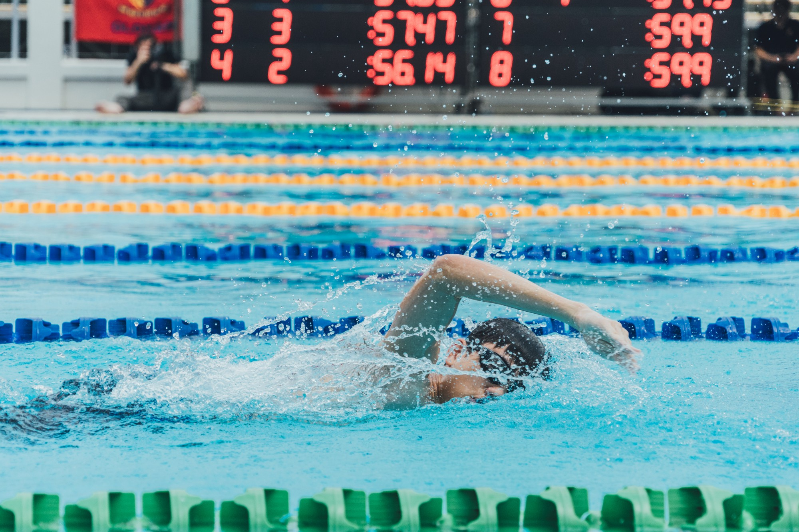

Working Out Is Powerful Brain Training – Elemental

# **Working Out Is Powerful Brain Training**

## *Life is hard, and you’ll be better off if you practice doing hard things — like making your body purposefully uncomfortable*

[Anna Held](https://elemental.medium.com/@ajshults_57909)

Apr 16·4 min read

Photo by [Goh Rhy Yan](https://unsplash.com/@gohrhyyan?utm_source=medium&utm_medium=referral) on [Unsplash](https://unsplash.com/?utm_source=medium&utm_medium=referral)

Last year, I fell on my face more times than I had in all the previous years of my life combined. Over time, my body became peppered with tiny bruises as I crashed to the floor again and again.

To be fair, the wounds were all self-inflicted. I was working on my crow, a yoga pose that involves balancing on your hands while perching your knees on your triceps, nose inches from the mat. It took me months of regular practice to conquer my fear of tipping over enough to get both feet off the ground.

Finally pulling it off felt like an accomplishment in more ways than one. Perseverance has never come naturally to me, but over the past couple years, as I’ve gotten more into both yoga and running, I’ve noticed that’s changing — in my workouts and in other areas of my life. I also get frustrated less easily and approach difficult projects with more energy and less trepidation than I used to. Maybe it’s just a consequence of getting older and wiser, but I suspect that my increase in regular exercise has also played a role.

It’s not exactly a secret that exercise can have a positive effect on both mental and physical health. Research has highlighted its potential in alleviating symptoms of [depression and anxiety](https://www.ncbi.nlm.nih.gov/pmc/articles/PMC474733/), raising [mood](https://www.ncbi.nlm.nih.gov/pmc/articles/PMC474733/), and improving [sleep](https://www.hopkinsmedicine.org/health/healthy-sleep/sleep-better/exercising-for-better-sleep). Perhaps less well known — but no less real — is the role exercise can play in making us more patient, more resilient, and better at solving problems.

> Exercise can be a tool for self-improvement, if you choose to treat it as such.

Jacob Ballon, MD, a clinical associate professor of psychiatry and behavioral sciences at Stanford University, relates exercise to the work done in therapy. “We think about it as being a microcosm for the rest of [a patient’s] life,” he says. “That which happens in therapy tends to repeat itself outside of therapy.” In the same way, purposefully pushing your body to the point of discomfort is the implementation of a simple but powerful idea: Life is hard, and you’ll be better off if you practice doing hard things. Research on physical activity and the brain bears this out in a few different ways. Investigators at Harvard University’s [Lazar Lab](https://scholar.harvard.edu/sara_lazar/home), which studies how yoga and meditation affect the brain, have found that regular practice of these activities can increase gray matter in both the hippocampus (the area responsible for learning and emotional regulation) and the temporo-parietal junction (responsible for compassion and perspective-taking). Aerobic exercise has been [linked](https://elifesciences.org/articles/15092) to increased levels of brain-derived neurotrophic factor (BDNF), a protein that helps build neural connections and has been shown to have a protective effect against [stress](https://www.nature.com/articles/4001211).

Paul Crockett, a running coach with the Marathon Coalition in Boston and co-founder of an education technology company, describes marathon training as “getting comfortable with being uncomfortable.” He says training for marathons has helped him stay steady through the ups and downs of managing a startup: “Pushing through some of the hardest training that I’ve done has carried over to working through challenges in the rest of my life.”

Exercise can also enhance the neurological processes that make it easier to learn new skills. Douglas Noordsy, MD, director of sports psychiatry at Stanford University, notes that exercise can increase synaptic plasticity, or the brain’s ability to adapt to new uses over time, which is important for learning and memory.

One caveat: To reap the brain-training effects of a workout, it helps to think of that workout as a positive experience, says Jeffery Christle, PhD, a clinical exercise physiologist at Stanford. Enjoyment creates a positive feedback loop: When you get pleasure or satisfaction from exercising and building new capacities, you’ll continue to strengthen those skills. If you’re pushing through a tough sprint on a bike and feel a rush of pride at the end, for example, your mind will create another link between resilience and feelings of reward, and that link will intensify with each new instance.

This is why repetition and time are key for seeing these positive changes, according to Christle. “Once you start looking at the machinery behind the curtain,” he says, “a lot of things seem to be programmable in us.”

I personally find that encouraging—that exercise can be a tool for self-improvement, if you choose to treat it as such. The research isn’t definitive enough to establish a clear link between exercise and behavior — I can’t say, for example, that practicing handstands is what has made me brave enough to ask for more money at work — but the idea echoes what coaches, spin instructors, and drill sergeants have been saying for years: How you do one thing is how you do everything. A meticulously made bed is preparation for higher-stakes responsibilities; it’s not about clean corners but practicing attention to detail.

You can also use your workouts to figure out the mental skills you need to work on. What do you do when things get hard? Do challenges inspire you or make you angry? Do you shy away from things you don’t know how to do? By paying attention to your hardwired patterns during exercise, you can learn to multitask, fine-tuning the behaviors that help you grow while keeping yourself physically healthy.