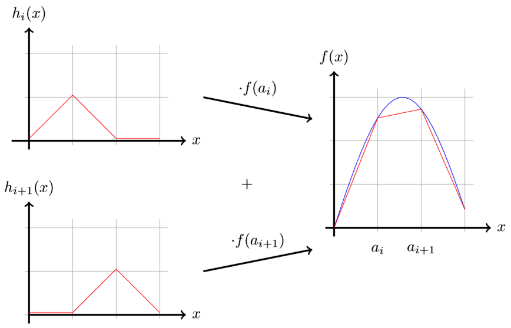
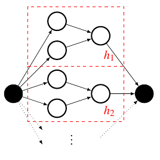
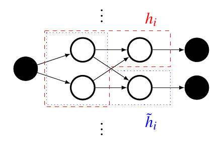
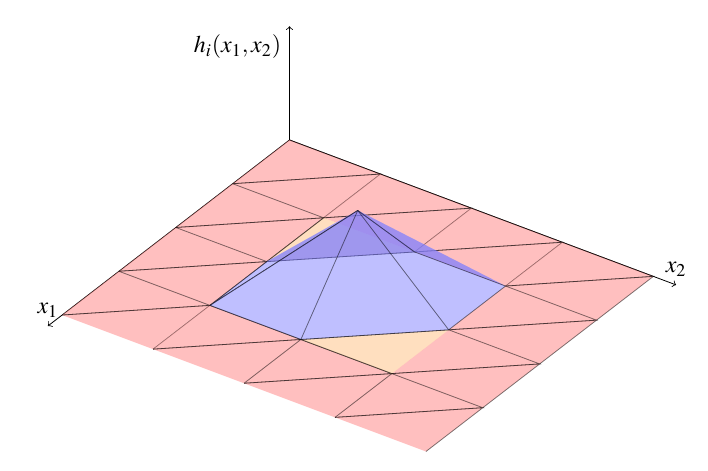

Writing down the weights and biases of a universal Neural Network without training it

# Writing down the weights and biases of a universal Neural Network without training it

[Michael Kissner](https://medium.com/@kayzaks)
Feb 20·4 min read

Recently, well a day ago, Lee et al. uploaded [a paper](https://arxiv.org/abs/1902.06720) that talks about the learning dynamics of wide Neural Networks (NN), which sparked a lively discussion on Reddit and among some of my friends. The paper itself is very interesting and I do suggest taking a look at it, our discussion however drifted off into the Universal Approximation Theorem (UAT) and its meaning. What I want to present here is a very simple way to actually construct a wide NN that is a universal approximator. I’ll even show you how to write down all the weights and all the biases using simple formulas, without ever doing backpropagation. Of course this isn’t practical, just think of this as an alternative example to the typical XOR-Problem.

Let’s review the UAT. The UAT basically states that a NN of finite width with one or more hidden layers (depending on the activation function) can approximate any function on a compact domain. Cool.

Say we have some 1-dimensional function*  ****f(x)*** that we wish to approximate. Classically we would choose appropriate basis functions and simply interpolate. So let’s try that by using many little hat functions ***h(x)***. We can approximate ***f(x)*** using

or if you are like me and like visualizations

An arbitrary function (blue) approximated by a linear combination of hat functions (red)

Nothing too fancy and standard knowledge from numerical analysis. This is just a linear interpolation of some function, where the support points are directly under the peak of each hat. The more hat functions you have, the more accurate your approximation.

Notice that I forgot to show you what the equation for such a weird hat function looks like. Well, here it is

Cool, a bit of linear stuff, a few max functions here and … Wait a minute, doesn’t ReLU use ***max ***as an activation function? Indeed it does. So, could we possibly replace each hat function by 3 neurons? Indeed we can:

Hat functions replaced by Neurons

Note that we apply the function value to each hat function in the output Neuron, which of course must have linear activation instead of ReLU or otherwise we lose all negative values. Now we can simply read off the weights and biases from the formula for hat functions. Done.

At least for 1-dimensional inputs and 1-dimensional outputs we are indeed done. What about the n-dimensional case?

Let’s take a look at how to do n-dimensional outputs. Here**  *f(x)*** describes a vector. We use the previous analysis to output the first component. But we can also reuse those hat functions and just apply the second component for the second output! The network would now look something like this:

The original hat function (red) reused for the second output (blue)
Repeat this for all other n outputs and we are done.

What about n-dimensional input? Easy, we just define n-dimensional hat functions! As an example, here is the 2-dimensional case:

A 2-dimensional hat function

Where in the 1-dimensional case we had to choose how far apart each peak of the hat functions were, here we have to do the same by selecting a good 2-dimensional triangulation. Now, what does the function for the above look like?

Again, we see a lot of ***max ***functions. And again, we can replace these by Neurons with ReLU activation function as we did earlier. I’ll spare you the image, as it just gets wider and wider…

For n-dimensions we create n-dimensional hat functions which live on some n-dimensional triangulation of space. A very tedious task to write down, but rest assured that all these hat functions are nothing more than a linear combination of ***max ***functions.

Finally, we combine both these techniques to define a NN that has any number of inputs and outputs and is able to interpolate any function linearily. And if we use infinitely many hat functions, we can infinitely increase its accuracy.

Now we can write down the exact weights, biases and NN architecture for a known function. A universal approximater in the sense of the UAT so to speak. We can even do this to some extend for data points / training data, if we perform segmented regression first. But the real question is, should we?

Of course not. It’s far too tedious to do by hand. Furthermore, we need an extremely wide NN to even approximate simple functions. The whole point of deep learning is to let backpropagation find the best way to do this even if constrained by width.

But I do hope that this was interesting. It will remain my go-to example when someone asks me if I can write down a NN for a function without backpropagation. Perhaps you will use it too.