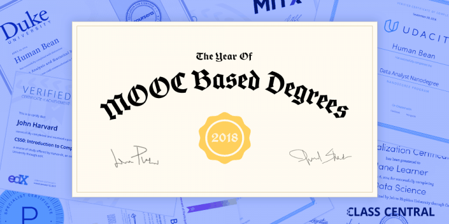
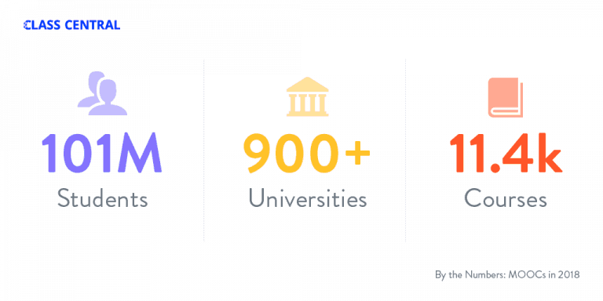
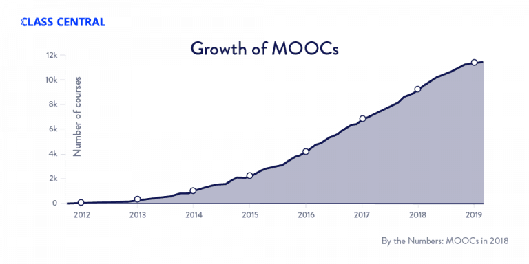

Year of MOOC-based Degrees: A Review of MOOC Stats and Trends in 2018 — Class Central

 **Disclosure:** To support our site, Class Central may be compensated by some course providers.

January 6, 2019

# Year of MOOC-based Degrees: A Review of MOOC Stats and Trends in 2018

 

Written by [Dhawal Shah](https://www.class-central.com/report/author/dhawal/)

 *i* 3 minute read

 [*i1* Comments](https://www.class-central.com/report/moocs-stats-and-trends-2018/#commentSection)

Now in its seventh year, the modern MOOC movement crossed 100 million learners in 2018, to reach a total of 101 million. Two big trends dominated the MOOC landscape this year. First, despite a continued slowdown in the growth of new users, MOOC platforms are seeing an increase in paying customers (and revenues). Second, more and more degrees are being offered through MOOC platforms, pointing the way toward what may ultimately be a lasting revenue model. MOOC-based degrees have [some distinctive features](https://www.class-central.com/report/mooc-based-degrees-vs-traditional-online-degrees/)that distinguish them from earlier online degrees, including lower fees, a more flexible schedule, and a more relaxed admissions process.

In 2018, 20 million new learners signed up for at least one MOOC, down from 23 million the year before. Despite the slowdown, the number of paying users may have increased. MOOC providers’ constant tweaking of the model seems to be paying off, as providers such as  Coursera are hitting record revenues ([$140 million in 2018 for Coursera](https://www.class-central.com/report/coursera-2018-revenue-140-million/)).

Here is a list of top five MOOC providers by registered users:

- Coursera – 37 million
- edX – 18 million
- XuetangX – 14 million
- Udacity – 10 million
- FutureLearn – 8.7 million

By the end of 2018, over [900 universities](https://www.class-central.com/universities) around the world had announced or launched 11.4k MOOCs, with around 2000 new courses added to the list this year (down from 2500 courses in 2017). The number of available MOOCs has grown dramatically in the last few years due to [scheduling policy changes](https://www.class-central.com/report/mooc-trends-increased-flexibility-and-convenience/), but since user growth hasn’t kept up, each course is getting fewer users.

In 2018, MOOC providers focused on big ticket items (or the top two tiers of Class Central’s [Six Tiers of MOOC Monetization](https://www.class-central.com/report/six-tiers-mooc-monetization/)), corporate training and online degrees. This means in 2018 the consumer product remained relatively unchanged from a user experience and monetization perspective. One exception is edX, which announced a [paywall for graded assignments](https://www.class-central.com/report/edx-paywall-graded-assignments/) at the end of 2018.

Microcredentials, which were on the rise for the past few years, are no longer the new hot thing, as the focus has shifted to online degrees, though over 120 over new microcredenials programs were launched this year. There are around 630 microcredentials of 10 different types. A bulk of these came from just two credential types: Coursera’s Specializations and edX’s Professional Certificates.

* * *

**Previous year in reviews**

- [A Product at Every Price: A Review of MOOC Stats and Trends in 2017](https://www.class-central.com/report/moocs-stats-and-trends-2017/)
- [Monetization over Massiveness: A Review of MOOC Stats and Trends in 2016](https://www.class-central.com/report/moocs-stats-and-trends-2016/)
- [Less Experimentation, More Iteration: A Review of MOOC Stats and Trends in 2015](https://www.class-central.com/report/moocs-stats-and-trends-2015/)

* * *

Earlier this year, I called MOOC-based degrees the [Second Wave of MOOC Hype](https://www.class-central.com/report/second-wave-of-mooc-hype/). Since then, 15 more online degrees have been announced, taking the total number of MOOC-based online degrees to over 45, up from 15 last year.

The first online degrees by Coursera, Udacity, and edX have done well, with combined potential revenue of over $80-million based on numbers of currently enrolled students. Over 10,000 students are currently enrolled in a MOOC-based degree program. But the bulk of those of enrolled students come from just two universities and three online degrees: the Online Master’s Degree in Computer Science (Georgia Tech with Udacity), the Online Master of Science in Analytics (Georgia Tech  with edX), and the iMBA (University of Illinois  Urbana Champaign with Coursera).

The initial success of these degrees has led providers including  Coursera, edX, and FutureLearn to launch more online degrees. Many of those degrees that have been announced are not yet live or even accepting applications. Here is a complete list of [MOOC-based degrees](https://www.class-central.com/pricing-charts/mooc-based-degrees).

Between these trends – the increase in paying users, the launch of new online degrees, and a focus on corporate training – we are seeing a steady shift in focus towards paying users. EdX’s new paywall is further evidence of this trend. I remain hopeful that these new business models will act as a safeguard of free content, ensuring its continued availability for those who need it, regardless of their ability to pay. However, one thing is abundantly clear: free users are no longer a focus.

*This article is just one in our 2018 MOOC Roundup Series. [Find the whole series of articles here](https://www.class-central.com/report/tag/mooc-roundup-2018/), and discover everything MOOCs in 2018 — from the most popular classes, to overviews on developments in MOOC platforms, to looking at the MOOC future.*

Category

 [Analysis](https://www.class-central.com/report/category/analysis/)

Tags

 [Microcredentials](https://www.class-central.com/report/tag/microcredentials/)

 [MOOC Monetization](https://www.class-central.com/report/tag/mooc-monetization/)

 [MOOC Roundup 2018](https://www.class-central.com/report/tag/mooc-roundup-2018/)

 [MOOC-based Online Degrees](https://www.class-central.com/report/tag/mooc-based-online-degrees/)

 

###   [Dhawal Shah](https://www.class-central.com/report/author/dhawal/)

Dhawal is the founder and CEO of Class Central.

 [More articles from Dhawal Shah](https://www.class-central.com/report/author/dhawal/)