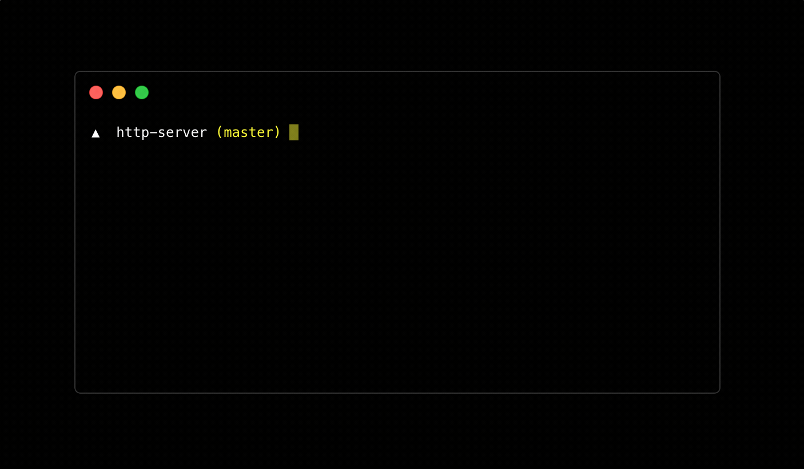
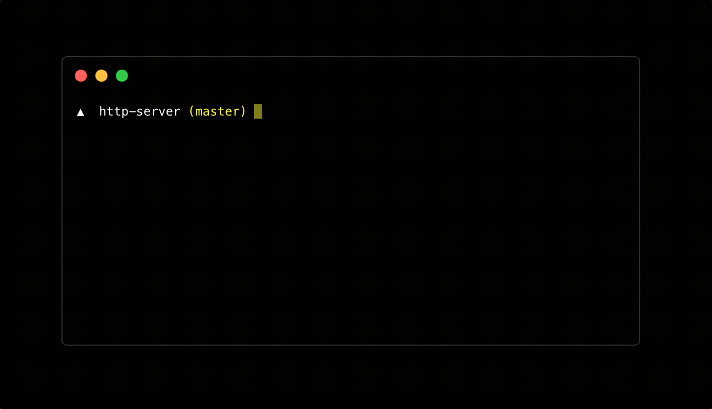
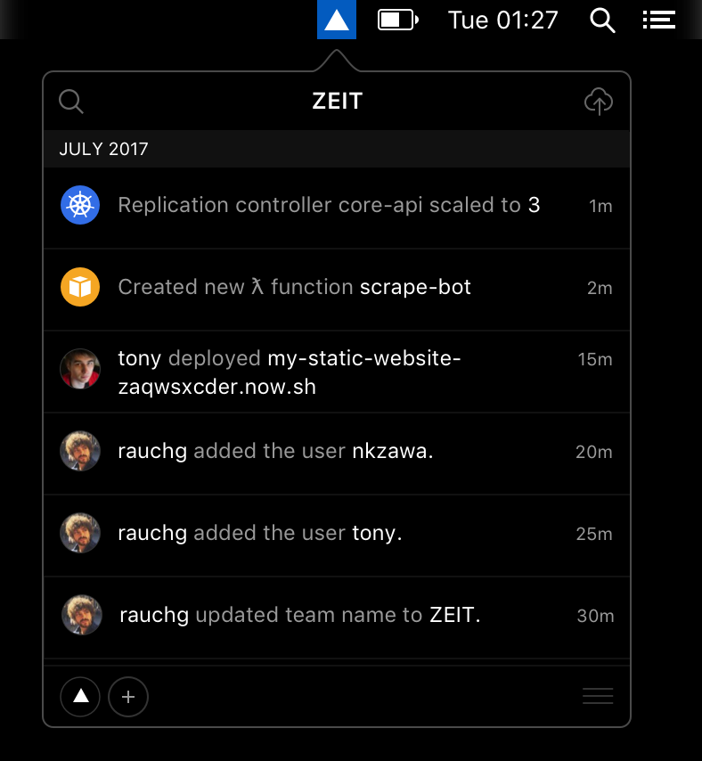

ZEIT – Universal Now: Now, on Every Cloud

Thursday, July 13th 2017 (20d ago)
Universal Now: Now, on Every Cloud

Guillermo Rauch ([@rauchg](http://twitter.com/rauchg))

[About a year ago](https://zeit.co/blog/why-now) we introduced ``now`` to the world. We set out to validate very simple hypotheses. Deployment should generally not take more than one command. It should be serverless and you shouldn’t generally have to touch many knobs to scale.

Most importantly, that it should be built on open standards, be open source and use no proprietary APIs. Today, a quarter million deployments later and thousands of domains in production, we are happy to announce that Now is becoming a universal interface to every cloud provider.

Without further ado, here’s a simple [Node.js deployment to AWS](https://github.com/zeit/now), using Lambda and API Gateway under the hood:

Sounds familiar, doesn't it? Just deploy with now

What do we mean by universal? The following example, deploying the same project to Google Cloud Platform, should explain:

The same command, but check out the output!

### [Under the hood](https://zeit.co/blog/universal-now#under-the-hood)

Most cloud providers have created different proprietary APIs to expose lightweight services to the cloud. We’ve extended the Now client to incorporate this concept directly into our [open-source client](https://github.com/zeit/now).

To set up your deployments to our [https://now.sh](https://zeit.co/now) public cloud, you typically run:

`$ now login`

What happens, however, if your company or organization has already spent months of engineering around, for example, a Google Cloud VPN? Simple! Just run:

`$ now gcp login`

As far as implementation goes, our codebase has been structured around mapping subcommands to providers. The main premise is that the now contract is retained: deployments are immutable, aliases are mutable (used to associate domains with deployments), no new protocols or proprietary APIs, etc.

COMMAND
PURPOSE
NOW.SH
AWS
GCP
KUBERNETES
now [deploy]
CREATE A NEW DEPLOYMENT
SINGLE REST API CALL
AWS LAMBDA
AWS API GATEWAY
GCP FUNCTIONS
GCP ENDPOINTS
POD API
now alias
EXPOSE A DEPLOYMENT
SINGLE REST API CALL
AWS API GATEWAY
AWS ROUTE 53
AWS CERT MANAGER
LB SSL CERTIFICATES
INGRESS CONTROLLERS
now logs
VISUALIZE LOGS
SINGLE REST / WS API
AWS CLOUDWATCH
STACKDRIVER API
POD LOGS API
now domains
MANAGE DOMAINS
SINGLE REST API CALL
AWS ROUTE 53
GOOGLE DOMAINS
-
now secrets
MANAGE DEPLOYMENT SECRETS
SINGLE REST API CALL
AWS KMS
GCP KMS
SECRETS API

Implementations are organized in the codebase under the ``providers/`` folder where each subcommand is defined:

now/
src/
providers/
sh/
aws/
gcp/
index.jsRegisters provider and exposes subcommands
deploy.jsInvoked when `now gcp` or `now gcp deploy` is run
……
Example of the structure of the new directory
Each command exports a callback, invoked with the following parameters:

- -``config`` The global configuration object (``~/.now/config.json``)
- -``authConfig`` The global credentials config object (``~/.now/config/credentials.json``)
- -``argv`` The supplied arguments. Equivalent to ``process.argv``, but easier to test

From then on, commands are not forced into any specific structure, and they’re free to call any APIs or bring in any utilities or third-party modules.

As the table above shows, providers offer solutions for each major category of functionality. For example, all of AWS, Google Cloud and Azure have a concept of “function as a service” that can be exposed over HTTP, but their APIs vary slightly.

For those cases, ``src/serverless/*`` exposes some common utilities that these providers can reuse (like building a project into a zip file).

This solves a major painpoint for users: Now unifies those APIs under open, predictable and easy-to-use protocols. New providers can be added, configured and removed with ease during the lifetime of a project or organization.

### [Universal API](https://zeit.co/blog/universal-now#universal-api)

To stress that last point, let’s take a quick look at the function signatures of the three major cloud providers:

	1exports.handler = (*ev, fn*) => {
	2  // custom lambda API
	3  ev.headers['content-type']
	4  ev.queryStringParameters.param
	5  ev.body.message
	6  *fn(null, { statusCode: 200 })*
	7}

AMAZON LAMBDA

	1exports.handler = (*req, res*) => {
	2  // node.js "express" API
	3  req.get('content-type')
	4  req.query.param
	5  req.body.message
	6  *res.status(200).end()*
	7}

GOOGLE CLOUD FUNCTIONS

	1module.exports = (*ctx, req*) => {
	2  // custom azure API
	3  ev.headers['content-type']
	4  ev.query.param
	5  *ctx.res = { status: 200 }
	6  ctx.done()*
	7}

MICROSOFT AZURE FUNCTIONS
With Now, this becomes:

	1require('http').createServer((req, res) => {
	2  // the normal HTTP API
	3  req.headers['content-type']
	4  req.url
	5  req.on('data', fn)
	6  res.end('Hello world')
	7}).listen(process.env.PORT)

NOW (ANY PROVIDER)

Just expose a simple HTTP server, in any programming language, and Now takes care of the rest. Notice that even when FaaS providers expose a HTTP request / response model, the API details vary drastically.

The remaining differences come down to what runtimes are supported by each of these providers. What particulary sets our [https://now.sh](https://zeit.co/now) backend apart in this regard is our support Dockerfile, which allows you to define the entire execution environment in an open way.

For other providers, in the mean time, we can create bridges and deploy ELF Linux binaries to get as close as possible to a completely flexible and runtime-agnostic environment.

### [Universal Configuration](https://zeit.co/blog/universal-now#universal-configuration)

Each project deployable with ``now`` includes a simple ``now.json`` file that describes what type of project it is (for example: ``nodejs`` or ``static``), and other metadata such as ``name`` or ``description``.

We intend for this configuration file to provide a unification of how projects are specified. It should answer questions like:

- -What region(s) should the project be deployed to?
- -What directory within the project should be deployed? (defaulting to the root)
- -What environmental variables should be supplied by the user upon deployment?
- -Are there existing secrets that should be automatically mapped to env variables?
- -What hardware resources are required for the project to run successfully?

In all cases, we want to keep the file as objective and unopinionated as possible. We are currently looking for community feedback on our [initial v1 specification](https://github.com/zeit/now#project-configuration) (so feel free to [chat with us](https://zeit.chat/)!)

In all cases, differences between providers will exist, and persist. For that reason, we embrace the idea of extending the configuration by passing custom parameters that are specific to a provider. You are free to define an ``aws`` key with custom settings inside, for example.

### [Goals and Directions](https://zeit.co/blog/universal-now#goals-and-directions)

You can check out the preview release of Now with support for multiple providers on [GitHub](https://github.com/zeit/now). It's 100% open source and we look forward to your contributions and feedback. If you haven't already, please join our [Slack Community](https://zeit.chat/)!

With our new providers support, we hope to bring the experience that our [https://now.sh](https://zeit.co/now) customers have been enjoying to an even broader audience. We strive and will continue to strive to make it the fastest, easiest to use and most standards-compliant deployment backend in the market.

Over the coming weeks, we will continue to refine our support for Amazon Web Services, Google Cloud and introduced Microsoft Azure.

Aside from "Function as a Service" providers, we also are working hard on bringing the Now experience to container management solutions such as [Kubernetes](https://kubernetes.io/). These systems provide a lot of power to their administrators, but typically don't offer a great "last mile" experience for product developers and designers.

Finally, we are thrilled to announce our open-source desktop app, [Now Desktop](https://zeit.co/blog/now-desktop-2), will feature event feeds of what you and your team are working on, across all these solutions (and others to come!)

We think this paves the way to many exciting usecases of Now in the enterprise. Whether it’s inside a private cloud network, an existing infrastructure provider or completely on-premise, rest assured that you will be only one command away from the cloud, at all times.