Zero to Hero in Machine Learning using Google Cloud AutoML Tables | Google Cloud Platform| AutoML…

# Zero to Hero in Machine Learning using Google Cloud AutoML Tables | Google Cloud Platform| AutoML Tables |

[Vaibhav Malpani](https://medium.com/@IVaibhavMalpani)
Jun 8·5 min read

Want to produce state-of-the-art Machine Learning models with no prior knowledge?

Want to learn how to Build, Deploy and Scale your models on cloud without writing a single line of code?

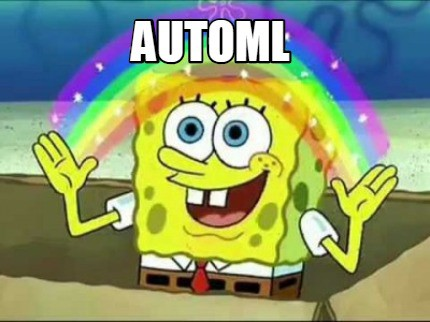

### What is AutoML Tables?

AutoML Tables enables you to automatically build and deploy state-of-the-art machine learning models on structured data at massively increased speed and scale.

* * *

*...*

For this demo we will use public data from kaggle : [**Mobile Price Classification**](https://www.kaggle.com/iabhishekofficial/mobile-price-classification#train.csv)

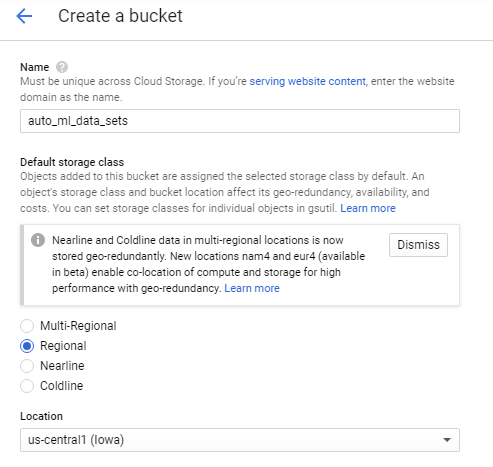

At the time of writing this blog, AutoML takes data from bucket in the ***us-central1*** region.

So please select
Regional → us-central1(lowa)

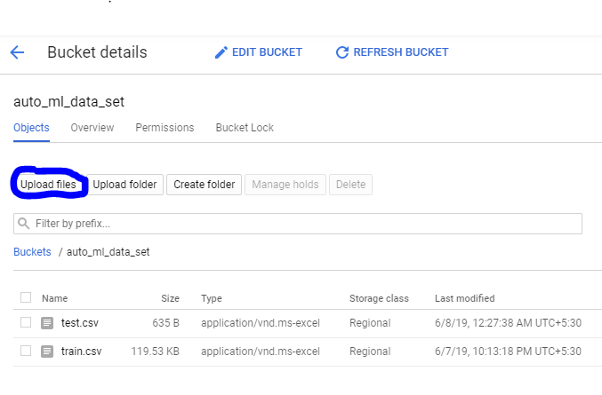

Upload the train.csv and test.csv to the bucket created above.

Now that we have the data required in place, Let’s start building AutoML models from [***here***](https://console.cloud.google.com/automl-tables/datasets). In this problem you have to predict a price range based on other parameters. **Price range has value of 0(low cost), 1(medium cost), 2(high cost) and 3(very high cost).**

* * *

*...*

### Steps to Build models using AutoML Tables:

1. 1.Create new Dataset
2. 2.Import Data
3. 3.Check Schema and Select a target from data
4. 4.Analyze features from data
5. 5.Train the data
6. 6.Evaluate your model
7. 7.Test your model

### **Create new Dataset:**

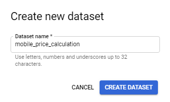

Give a name to your dataset and click “create dataset”. After the dataset is created, open it.

### Import Data:

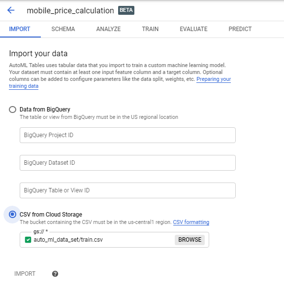

For this demo, we will import data from Cloud Storage.

Click on browse, select your training dataset (in this case: “train.csv”) and click on “IMPORT”

### Check Schema and Select a target from data

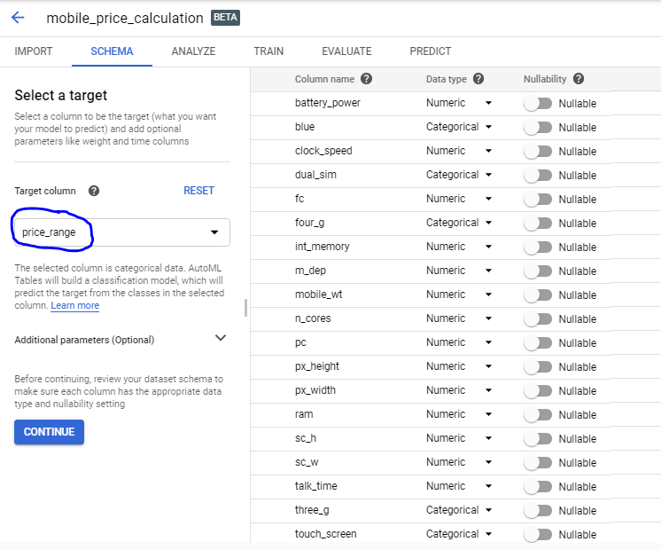

After the data is imported, you can view the schema on the right side. On the left side, you would need to select the “target column”.

Target column is the column on which prediction needs to be done. Classification Model is created on the Target column.

In our demo, we need to predict a price range based on other parameters. So we selected “price_range” as our Target column. Select Continue to analyze your data.

### Analyze features from data:

On selecting the Analyze tab, you get to see the features and their types (Numeric, Categorical etc.).

### Train the data:

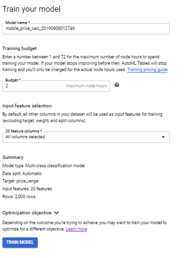

Now select the “TRAIN” tab. you will find your model name already present.

Below that select number of node hours you need the model to be trained. If your model stops improving before the mentioned node hours, AutoML Tables will stop training and you’ll only be charged for the actual node hours used.

Model training costs **$19.32 per hour** of compute resources used to train your model, billed at the granularity of seconds.

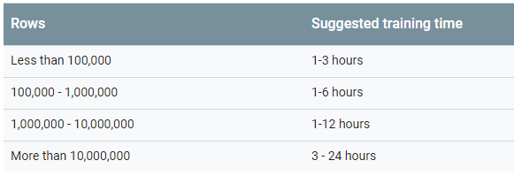

**Suggested training time is related to the number of rows in your training data**

Now click on “Train model” and wait for a email from Google, mentioning that the Training is finished!

### Evaluate your model:

At the top, You get to see all the high level information about performance of your model. We can see that the model has more than **97% Precision!!**

On the Evaluate tab, scroll down to get in-depth information about the your model.

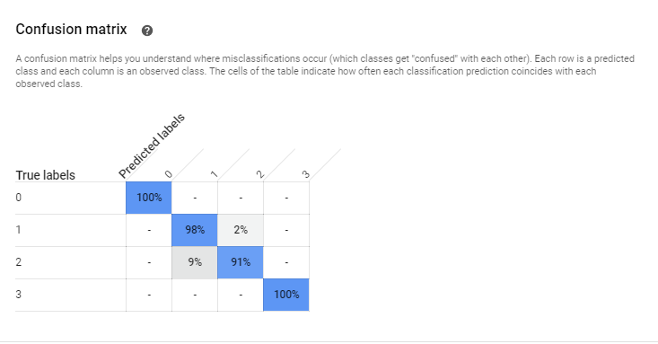

#### **Confusion matrix**:

The confusion matrix helps you understand where misclassifications occur (which classes get “confused” with each other). Each row is a predicted class and each column is an observed class. The cells of the table indicate how often each classification prediction coincides with each observed class.

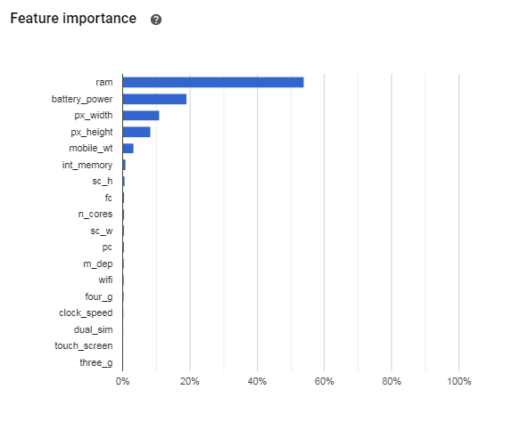

#### **Feature importance**:

AutoML Tables tells you what features it found to be most important for building this model in the Feature importance graph. It is computed by measuring the impact that each feature has on the prediction, when perturbed across a wide spectrum of values sampled from the dataset. Review this information and ensure that all of the most important features make sense for your data.

As we can see in the above feature importance graph, price of mobile mainly does depend on RAM, Battery Power and Size of phone, but not on it being 3G or touch screen. So this feature importance graph makes sense of our data.

### Test your model:

Now moving to the most exciting part of Machine Learning i.e to see how your model actually work on test data.

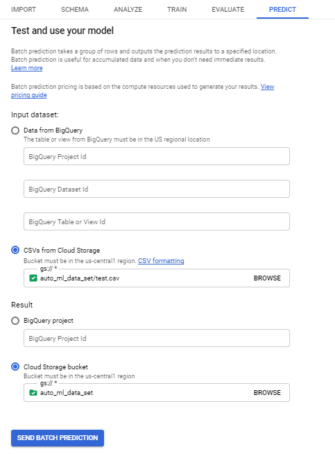

On the Predict Tab, we need to provide 2 things to test our model.
1. 1.Test Data (Input) on which the model needs to be tested.

2. 2.Google Bucket Storage location (Result directory) to save results after prediction.

Now select “Send Batch Prediction” to start the prediction. Time taken might differ from the number of rows in CSV.

After the prediction job you can see the result in the result directory. The folder name might look like “ prediction-mobile_price_calc_20190607101…”.

Below is the test.csv that we had given to the model.

**test.csv**

This is the result that we have got from the model.

tables_1.csv

As you can see in the rightmost side, there are 4 new fields : **price_range_0_score, price_range_1_score, price_range_2_score, price_range_3_score. **Each field represent the possibility of itself being the answer.

Eg: For the 1st row, model is100% sure that the mobile’s price range would be 0 (low cost). Similarly, 3rd row has 99% possibility of being in price range 3 (very high cost).

### Congratulations!! You have successfully built and trained a Machine Learning model, without any code or any prior knowledge.

#### Interesting Case studies:

Fox Sports Australia predicts the fall of a wicket in live cricket matches with AutoML Tables : https://www.computerweekly.com/news/252461706/Fox-Sports-Australia-predicts-wickets-with-AutoML-Tables