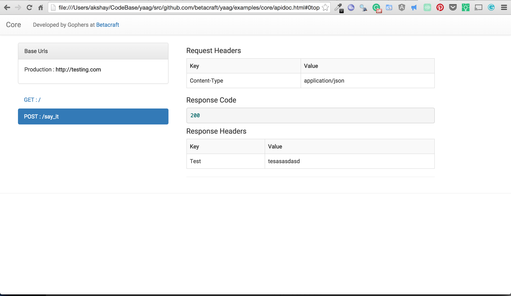
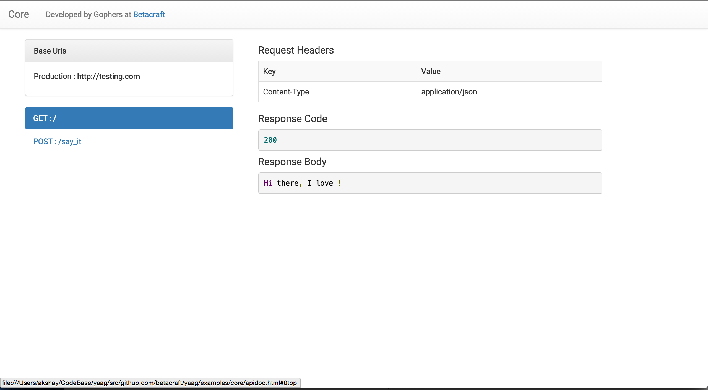

betacraft/yaag

[[Build Status](../_resources/af3359b6a330e8be6d21e0274c77bc30.bin)](https://travis-ci.org/betacraft/yaag)

[Trello Board](https://trello.com/b/jCZlTsNj/yaag)

# [(L)](https://github.com/betacraft/yaag#yaag--yet-another-api-doc-generator)YAAG : Yet Another API doc Generator

Golang is awesome for developing web apps. And people have created a bunch of awesome Web-Frameworks, Web helper libraries. If we consider the entire ecosystem of web apps in Golang everything except API documentation seems to be in place. So we have created the first API doc generator for Golang based web apps and calling it Yet another.

## [(L)](https://github.com/betacraft/yaag#why-)Why ?

Most of the web services expose their APIs to the mobile or third party developers. Documenting them is somewhat pain in the ass. We are trying to reduce the pain, at least for in house projects where you don't have to expose your documentation to the world. YAAG generates simple bootstrap based API documentation without writing a single line of comments.

## [(L)](https://github.com/betacraft/yaag#how-it-works-)How it works ?

YAAG is a middleware. You have to add YAAG handler in your routes and you are done. Just go on calling your APIs using POSTMAN, Curl or from any client, and YAAG will keep on updating the API Doc html. (Note: We are also generating a json file containing data af all API calls)

## [(L)](https://github.com/betacraft/yaag#how-to-use-with-basic-nethttp-package)How to use with basic net.http package

1. Import github.com/betacraft/yaag/yaag
2. Import github.com/betacraft/yaag/middleware

3. Initialize yaag ` yaag.Init(&yaag.Config{On: true, DocTitle: "Core", DocPath: "apidoc.html"}) `

4. Use it in your handlers as ` http.HandleFunc("/", middleware.HandleFunc(handler)) `

#### [(L)](https://github.com/betacraft/yaag#sample-code)Sample code

func  handler(w  http.ResponseWriter, r *http.Request) {
fmt.Fprintf(w, "Hi there, I love %s!", r.URL.Path[1:])
}func  main() {

yaag.Init(&yaag.Config{On: true, DocTitle: "Core", DocPath: "apidoc.html", BaseUrls : map[string]string{"Production":"","Staging":""} })

http.HandleFunc("/", middleware.HandleFunc(handler))
http.ListenAndServe(":8080", nil)
}

## [(L)](https://github.com/betacraft/yaag#how-to-use-with-gorilla-mux)How to use with Gorilla Mux

1. Import github.com/betacraft/yaag/yaag
2. Import github.com/betacraft/yaag/middleware

3. Initialize yaag ` yaag.Init(&yaag.Config{On: true, DocTitle: "Gorilla Mux", DocPath: "apidoc.html"}) `

4. Use it in your handlers as ` r.HandleFunc("/", middleware.HandleFunc(handler)) `

#### [(L)](https://github.com/betacraft/yaag#sample-code-1)Sample code

func  handler(w  http.ResponseWriter, r *http.Request) {
fmt.Fprintf(w, time.Now().String())
}func  main() {

yaag.Init(&yaag.Config{On: true, DocTitle: "Gorilla Mux", DocPath: "apidoc.html"}) r  := mux.NewRouter()

r.HandleFunc("/", middleware.HandleFunc(handler)) http.ListenAndServe(":8080", r)

}

## [(L)](https://github.com/betacraft/yaag#how-to-use-with-martini)How to use with Martini

1. Import github.com/betacraft/yaag/yaag
2. Import github.com/betacraft/yaag/martiniyaag

3. Initialize yaag ` yaag.Init(&yaag.Config{On: true, DocTitle: "Martini", DocPath: "apidoc.html"}) `

4. Add Yaag middleware like ` m.Use(martiniyaag.Document) `

#### [(L)](https://github.com/betacraft/yaag#sample-code-2)Sample Code

func  main() {

yaag.Init(&yaag.Config{On: true, DocTitle: "Martini", DocPath: "apidoc.html"}) m  := martini.Classic()

m.Use(martiniyaag.Document)
m.Get("/", func() string { return  "Hello world!" })
m.Run()
}

## [(L)](https://github.com/betacraft/yaag#how-to-use-with-revel)How to use with Revel

1. Add yaag.record = true in conf/app.conf (before starting to record the api calls)

2. import github.com/betacraft/yaag/filters in app/init.go
3. add 'filters.FilterForApiDoc' in revel.Filters
4. Start recording Api calls

## [(L)](https://github.com/betacraft/yaag#how-to-use-with-gin)How to use with Gin

1. Import github.com/betacraft/yaag/yaag
2. Import github.com/betacraft/yaag/gin

3. Initialize yaag ` yaag.Init(&yaag.Config(On: true, DocTile: "Gin", DocPath: "apidpc.html")) `

4. Add yaag middleware like ` r.User(yaag_gin.Document()) `

#### [(L)](https://github.com/betacraft/yaag#sample-code-3)Sample Code

import ( "net/http" yaag_gin "github.com/betacraft/yaag/gin"  "github.com/betacraft/yaag/yaag"  "github.com/gin-gonic/gin" )func  main() { r  := gin.Default()

yaag.Init(&yaag.Config{On: true, DocTitle: "Gin", DocPath: "apidoc.html", BaseUrls: map[string]string{"Production": "", "Staging": ""}})

r.Use(yaag_gin.Document()) // use other middlewares ... r.GET("/", func(c *gin.Context) {

c.String(http.StatusOK, "Hello World!")
})
r.Run(":8080")
}

## [(L)](https://github.com/betacraft/yaag#screenshots)Screenshots

#### [(L)](https://github.com/betacraft/yaag#api-doc-is-generated-based-on-the-paths)API doc is generated based on the paths

#### [(L)](https://github.com/betacraft/yaag#click-on-any-call-to-see-the-details-of-the-api)Click on any call to see the details of the API

## [(L)](https://github.com/betacraft/yaag#screencast)Screencast

[YAAG ScreenCast](https://www.youtube.com/watch?v=dQWXxJn6_iE&feature=youtu.be)

## [(L)](https://github.com/betacraft/yaag#contributors)Contributors

- Aniket Awati ([aniket@betacraft.co](https://github.com/betacraft/yaagmailto:aniket@betacraft.co))
- Akshay Deo ([akshay@betacraft.co](https://github.com/betacraft/yaagmailto:akshay@betacraft.co))
- Kaustubh Deshmukh ([kaustubh@betacraft.co](https://github.com/betacraft/yaagmailto:kaustubh@betacraft.co))
- Brian Newsom ([Brian.Newsom@Colorado.edu](https://github.com/betacraft/yaagmailto:Brian.Newsom@Colorado.edu))

This project is initiated by Betacraft during GopherGala 2015.