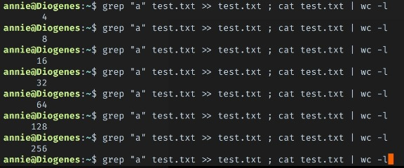
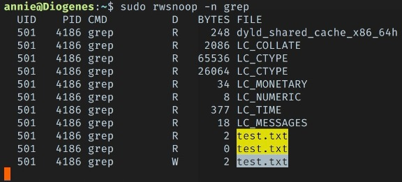
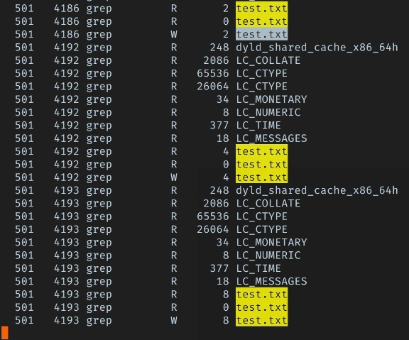
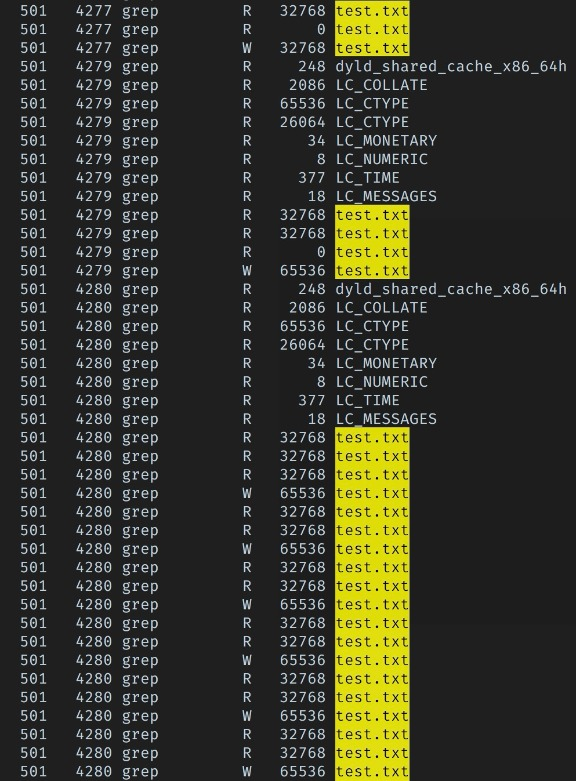
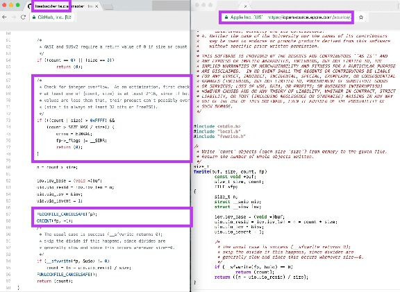

grep your way to freedom

# grep your way to freedom

Jan 2018

I was recently eating lunch with someone who asked a question that I became somewhat obsessed with: what happens when you grep a file and append the contents to the same file? It’s one of these nasty cases of modifying a file that you’re reading from.

Huge thank you to [Mehmet Emre](https://cs.ucsb.edu/~emre/) & [Antal Spector-Zabusky](https://github.com/antalsz) for pair programming down this rabbit hole!

## Problem Spec

To be precise, what happens when you run the following code snippet?

	# Make a junk file that just has the char a in it
	echo "a" > test.txt

	# Grep for a & append back to the same file
	grep "a" test.txt >> test.txt

Okay before you run it, what are some reasonable things that *could* happen? And which of those do you think actually happens?

This nice photo (of the magical [Zion Narrows!](https://www.nps.gov/zion/planyourvisit/thenarrows.htm)) is here to avoid giving it away in case you want to think about it… scroll on for some possible answers.

## Possible Behavior

Okay, here are some reasonable things that could happen:

1.   `grep` could finish scanning the file, then append. If this is the case, the grep would terminate, and if we ran `cat test.txt` we’d see that the test file has two a’s.

2.   `grep` could read from the file, find an ‘a’, and then append that ‘a’ to the file. It could then check if there was any more file to read, and see the ‘a’ it just wrote. If this is the case, grep would get stuck in an infinite loop, and if we killed it we would see that the test file has many a’s in it.

3.   This could be an error. If this is the case, grep could do nothing and return an error code.

4.   Some exciting race condition that causes either a non-deterministic mix of 1 & 2, or maybe a deadlock.

## Okay so what actually happens?

… it depends!

First thing it depends upon is your OS. If you run the GNU grep (ie, on a Linux box) you get this nice error message:

	grep: input file 'test.txt' is also the output

I was actually not expecting any implementation to do error handling like that. That’s nice!

If you run the BSD `grep` (ie, on a Mac) you get:

	$ echo "a" > test.txt
	$ grep "a" test.txt >> test.txt
	$ cat test.txt
	a
	a

So it’s the case where it just terminated. Okay, well that’s boring, so let’s rinse and repeat by running the same command, and then printing out how many lines the file has:

And about 15 up-arrow+enters later:

We get stuck in an infinite loop!
How fun! We’ll look into why this is happening in a second, but first,

## Follow up question

What happens if you try the same kind of command but with `cat` instead of `grep`?

	# Make another junk file that just has the char a in it
	echo "a" > cattest.txt

	# Cat & append back to the same file
	cat cattest.txt >> cattest.txt

## Follow up answer

We get stuck in an infinite loop right off the bat. Inconsistent behavior! Excellent.

Okay, let’s look into what’s actually happening. As you might guess, `cat` is simpler than `grep`, so let’s figure out what’s going on there first.

Since I’m running a mac, I’ll be referring to Apple’s recently opensourced [code for `cat`](https://opensource.apple.com/source/text_cmds/text_cmds-87/cat/cat.c) which unfortunately doesn’t have line numbers- I’ll copy the code we care about below but if you want to follow along in the file, you can control-F for `write`.

	while ((nr = read(rfd, buf, bsize)) > 0)
	  for (off = 0; nr; nr -= nw, off += nw)
	    if ((nw = write(wfd, buf + off, (size_t)nr)) < 0)
	      err(1, "stdout");

So we’ve got a while-loop, where we read into a buffer. If we read any non-zero number of bytes, we go into a for-loop where we drain the buffer by doing writes. Once we’ve drained the buffer, we’ll go back up to the while loop, which will do another read into the buffer, and, if we read anything we’ll keep going.

So just to be really pedantic here, the reason `cat` gets stuck is that, according to [the man page for `write`](https://linux.die.net/man/2/write)

>

> POSIX requires that a read(2) which can be proved to occur after a write() has returned returns the new data.

which means that when we do the `write` in that for-loop, we’re guaranteed that the `read` which happens after in the while-loop must see the result of that `write`. So: we read an “a”, write an “a”, and when we get back to the while-loop we’re guaranteed that the next read will see that “a” we just wrote.

Which is why we get stuck in an infinite loop off the bat.

## Back to grep

Okay so let’s go back to `grep` but before we look at the source, let me point out that there’s a flag that changes the behavior:

	grep --line-buffered "a" test.txt >> test.txt

If we run grep with the line-buffered flag then we get the same behavior as `cat` - it goes into an infinite loop even for very small files. So clearly the answer has something to do with buffering.

## Line buffering

So if we check the [grep source](https://opensource.apple.com/source/text_cmds/text_cmds-99/grep/grep.c.auto.html) for something about line buffering, we’ll find that the `--line-buffered` flag calls something called `setlinebuf`

		if (lbflag)
			setlinebuf(stdout);

[which](https://linux.die.net/man/3/setlinebuf) sets stdout to have this behavior:

>

> line buffered characters are saved up until a newline is output or input is read from any stream attached to a terminal device (typically stdin).

Cool. So if it spins with the `--line-buffered` flag, then probably what’s causing that is that the *write buffer* is being flushed rather than the read buffer. To verify this, let’s snoop on the read & write calls. On mac I’ll call

	sudo rwsnoop -n grep

to start watching for read/write calls; this will give me info about any read/write calls that grep performs. On Linux you can use `strace`. (Sidenote: you’ll need to [let `dtrace` through SIP](https://apple.stackexchange.com/questions/208762/now-that-el-capitan-is-rootless-is-there-any-way-to-get-dtrace-working) to get this to work)

Okay, so after running that in one shell, I’ll pop open another shell and repeat this whole grep experiment from the beginning.

Sweet so we can see that we’ve got two read calls from `grep`, the first of which reads 2 bytes, the second of which reads 0 bytes. Then we’ve got a write of 2 bytes. That seems pretty consistent with the behavior we’re seeing. Running a few more rounds:

Basically the same story; we can see that now we’re reading 4 bytes, and 8 bytes- again exactly what we’d expect. Skipping forward to where we go into the infinite loop:

The last round before we get stuck we can see that we’re doing **two** reads of size 32KB before getting a read of size 0 and doing the write. This means the looping we’re seeing is *definitely* not caused by buffering on the read buffer!

When we do start looping, we do three reads of size 32KB and then a 64KB write; then repeat! Okay, so now all I want to know is where are these buffer sizes coming from?

## grep source

First up: what’s `grep` doing? Well if we look [at the `main`](https://opensource.apple.com/source/text_cmds/text_cmds-99/grep/grep.c.auto.html) it just processes a ton of flags, and then (very near the bottom) calls `procfile`.

`procfile` is in [util.c](https://opensource.apple.com/source/text_cmds/text_cmds-99/grep/util.c.auto.html) along with just about everything else we’re going to care about. `procfile` does two things we care about, first it calls `grep_open` (which will read the file) and then `procline` (which will write the results).

	/*
	 * Opens a file and processes it.  Each file is processed line-by-line
	 * passing the lines to procline().
	 */
	int
	procfile(const char *fn)
	{ ...
	  f = grep_open(fn);
	  ...
	  /* Process the file line-by-line */
			if ((t = procline(&ln, f->binary)) == 0 && Bflag > 0) {
	      ...

#### Where grep reads

`grep_open` is in [file.c](https://opensource.apple.com/source/text_cmds/text_cmds-99/grep/file.c.auto.html). `grep_open` calls `grep_refill`:

	/*
	 * Opens a file for processing.
	 */
	struct file *
	grep_open(const char *path)
	{
	...
		/* Fill read buffer, also catches errors early */
		if (bufrem == 0 && grep_refill(f) != 0)

`grep_refill` does a read into a buffer:

	grep_refill(struct file *f)
	{ ...
	  nr = read(f->fd, buffer, MAXBUFSIZ);

`MAXBUFSIZ` is defined at the top of this file:

	#define	MAXBUFSIZ	(32 * 1024)

and is the exact size of the reads we were seeing. Hooray!
To recap, here’s the control flow:
`main -> procfile -> grep_open -> grep_refill -> read(..., MAXBUFSIZ)`

#### Where grep writes

From before, recall that `procfile`, called `procline`. `procline` eventually calls `printline`:

	/*
	 * Processes a line comparing it with the specified patterns.  Each pattern
	 * is looped to be compared along with the full string, saving each and every
	 * match, which is necessary to colorize the output and to count the
	 * matches.  The matching lines are passed to printline() to display the
	 * appropriate output.
	 */
	static int
	procline(struct str *l, int nottext)
	{
	  ...
	  printline(l, ':', matches, m);

which, if you scroll all the way down, on the penulitimate line, calls `fwrite`:

	/*
	 * Prints a matching line according to the command line options.
	 */
	void
	printline(struct str *line, int sep, regmatch_t *matches, int m)
	{
	  ...
	  fwrite(line->dat, line->len, 1, stdout);
	  putchar('\n');

So where `cat` was doing an honest-to-god `write`, grep goes through `fwrite`. So whatever buffer size we’re using is somehow tied up in the `fwrite` source.

To summarize, here’s the control flow:
`main -> procfile -> procline -> printline -> fwrite`

## fwrite buffer size

Figuring out where `fwrite` sets it’s buffer size was more challenging- props here to Mehmet for his spelunking skills. Here I’ll show you the relevant control flow up front:

`fwrite --> __sfvwrite --> prep_write --> __swsetup --> smakebuf --> __swhatbuf`

I won’t walk you through all those layers of control flow but you can definitely check it out yourself if you want; starting at [`fwrite`](https://opensource.apple.com/source/Libc/Libc-167/stdio.subproj/fwrite.c.auto.html) and ending at [`__swhatbuff`](https://opensource.apple.com/source/Libc/Libc-1244.1.7/stdio/FreeBSD/makebuf.c.auto.html).

**Interesting Side-note!** The implementation of makebuf.c in the latest apple OS (High Sierra) is *rather different* than in the implementation in [an older version](https://opensource.apple.com/source/Libc/Libc-167/stdio.subproj/makebuf.c.auto.html). Perhaps because Apple redid their file system for High Sierra? I know this because I went through an existential crisis (is everything I know a lie?) trying to figure out why the behavior I was seeing was inconsistent with the source code before I figured out it was the wrong version!

Okay, anyways, let’s take a look at the `__swhatbuff` that’s in High Sierra, because that’s what I’m running:

	#ifdef FEATURE_SMALL_STDIOBUF
	# define MAXBUFSIZE	(1 << 12)
	#else
	# define MAXBUFSIZE	(1 << 16)
	#endif

	#define TTYBUFSIZE	4096

	...

	/*
	 * Internal routine to determine `proper' buffering for a file.
	 */
	int
	__swhatbuf(fp, bufsize, couldbetty)
		FILE *fp;
		size_t *bufsize;
		int *couldbetty;
	{
		struct stat st;

		if (fp->_file < 0 || _fstat(fp->_file, &st) < 0) {
			*couldbetty = 0;
			*bufsize = BUFSIZ;
			return (__SNPT);
		}

		/* could be a tty iff it is a character device */
		*couldbetty = (st.st_mode & S_IFMT) == S_IFCHR;
		if (st.st_blksize <= 0) {
			*bufsize = BUFSIZ;
			return (__SNPT);
		}

		/*
		 * Optimise fseek() only if it is a regular file.  (The test for
		 * \_\_sseek is mainly paranoia.)  It is safe to set _blksize
		 * unconditionally; it will only be used if __SOPT is also set.
		 */
		fp->_blksize = *bufsize = st.st_blksize > MAXBUFSIZE ? MAXBUFSIZE : st.st_blksize;
		return ((st.st_mode & S_IFMT) == S_IFREG && fp->_seek == __sseek ?
		    __SOPT : __SNPT);
	}

What I think is going on here is that we’re setting *bufsize which is being “returned” to the caller through the pointer. The first two “ifs” don’t apply to us- we’re not dealing with an empty file, and we’re not a character device. So in the final block of code, we set *bufsize to 2 different values depending on whether `st.st_blksize > MAXBUFSIZE`, either to

`MAXBUFSIZE`
or to
`st.st_blksize`

And actually, the top of the file says `MAXBUFSIZE` is `1 << 16` (which is 64KB) so we’re golden. For fun we can check that the st_blksize is larger than 64KB to be sure that’s the branch we’re taking. A quick c script that looks a lot like `__swhatbuf` will do the trick:

	#include <sys/types.h>
	#include <sys/stat.h>
	#include <unistd.h>
	#include <stdio.h>

	int main()
	{
	    struct stat st;
	    FILE *fp;
	    fp = fopen("test.txt", "r");
	    fstat(fp->_file, &st);
	    printf("st_blksize was: %i\n", st.st_blksize);
	    return 0;
	 }

Compiling and running it:

	$ gcc deleteme.c & ./a.out
	st_blksize was: 4194304

Sweet, so st_blksize is 4MB which is definitely bigger than 64KB. So that’s why that’s the transition point between terminating & going into an infinite loop! 🎉

## Conclusions

1) Weird things happen when you read from files you write from.
2) The behaviors we saw had to do with buffering of the write buffer.

3) It’s rad that you can read open-source code to figure out exactly what’s going on. Grep your way to freedom!

## Appendix

I was looking at both the freebsd & apple’s open source implementations of `fwrite` and they were almost identical… except that freebsd’s version has both an integer overflow check & a lock. It’s a little alarming that apple’s version is missing those…it’d be interesting to see if you can get some weird behavior to trigger.

* * *

Thanks also to [Dan Luu](https://danluu.com/) & [Vaibhav Sagar](http://vaibhavsagar.com/) for their feedback on a draft, and to [Tobin Yehle](http://tobin.yehle.io/pottery) for both proofreading a draft and figuring out I was looking at the wrong version of the makebuf.c file!