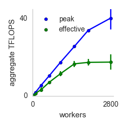

pywren -- run your python code on thousands of cores

# pywren

Pywren lets you run your existing python code at massive scale via AWS Lambda

## Overview

def my_function(b):
x = np.random.normal(0, b, 1024)
A = np.random.normal(0, b, (1024, 1024))
return np.dot(A, x)
pwex = pywren.default_executor()
res = pwex.map(my_function, np.linspace(0.1, 100, 1000))

## Scaling Examples

 

#####  40 TFLOPS on Lambda [[more]](https://github.com/pywren/examples/tree/benchmark_flops)

## Getting started

First, make sure you have an account with [Amazon Web Services](https://aws.amazon.com/). Then download and install pywren via PIP as[outlined in the getting started materials](http://pywren.io/pages/gettingstarted.html) Then enjoy running your code on thousands of cores simultaneously!

## Technology

Key technologies leveraged include:

- [AWS Lambda](https://aws.amazon.com/lambda/) for fast, containerized, stateless compute
- [AWS S3](https://aws.amazon.com/s3/) for event coordination
- [Continuum's Anaconda python distribution](https://www.continuum.io/downloads) for up-to-date python packages
- [cloudpickle](https://github.com/cloudpipe/cloudpickle) for shipping functions back and forth

The overall goal is to [mimic the Python 3.x futures interface](http://pythonhosted.org/futures/) as much as make sense.

Key Limitations:

- low limit of simultaneous workers (maybe 3k if you reserve ahead)
- finite amount of time per worker (300 seconds), but [see support for stand-alone workers!]
- non-trivial function invocation overhead, sometimes 15 sec!

## Publications

*> "Occupy the Cloud: Distributed computing for the 99%"*>   > [> arXiv 1702.0402](https://arxiv.org/abs/1702.04024)>   > [> Eric Jonas](http://ericjonas.com/)> , > [> Shivaram Venkataraman](http://shivaram.org/)> , > [> Ion Stoica](https://people.eecs.berkeley.edu/~istoica/)> , > [> Benjamin Recht](https://people.eecs.berkeley.edu/~brecht/)

## Recent news

2017-10-11  **[Investigating alternative cloud backends for PyWren](http://pywren.io/pywren_backends.html)** - We try out serverless offerings from other cloud providers to see how they compare with AWS Lambda

2017-10-11  **[PyWren 0.3](http://pywren.io/release-0.3.html)** - Annoucing PyWren 0.3, with region-specific runtimes, better error handling, and a storage API

2017-03-27  **[PyWren 0.2](http://pywren.io/release-0.2.html)** - Annoucing PyWren 0.2, bugfix release and interactive setup script.

2017-03-06  **[PyWren 0.1](http://pywren.io/release-0.1.html)** - Annoucing PyWren 0.1, with Python 3 support, large-scale reducers, better logging, support for running on arbitray instances, and a new website!

2016-10-27  **[Microservices and Terabits](http://pywren.io/pywren_s3.html)** - Using Pywren to benchmark S3, we achieve over 80 GB/sec of read performance and 60 GB/sec of write performance using Amazon S3.

2016-10-25  **[Microservices and Teraflops](http://pywren.io/pywren.html)** - Can AWS Lambda be used for scientific computing ? Here we use a new platform, pywren, to achieve over 25 TFLOPS using pure python across thousands of simultaneous workers.

###  Support

PyWren is developed and supported by:

   