yolossn/Prometheus-Basics: A beginner friendly introduction to prometheus 🔥

# Prometheus-Basics

A beginner friendly introduction to prometheus.

 

## Table of Contents

1. [What is prometheus ?](https://github.com/yolossn/Prometheus-Basics#what-is-prometheus-)

2. [What are metrics and why is it important ?](https://github.com/yolossn/Prometheus-Basics#what-are-metrics-and-why-is-it-important)

3. [Basic Architecture of Prometheus](https://github.com/yolossn/Prometheus-Basics#basic-architecture-of-prometheus)

4. [Show me how it is done](https://github.com/yolossn/Prometheus-Basics#show-me-how-it-is-done)

5. [Types of metrics](https://github.com/yolossn/Prometheus-Basics#types-of-metrics)

6. [Create a simple exporter](https://github.com/yolossn/Prometheus-Basics#create-a-simple-exporter)

7. [References](https://github.com/yolossn/Prometheus-Basics#References)

# What is prometheus ?

Prometheus is a system monitoring and alerting system. It was opensourced by SoundCloud in 2012 and was incubated by Cloud Native Computing Foundation. Prometheus stores all the metrics data as time series, i.e metrics information is stored along with the timestamp at which it was recorded, optional key-value pairs called as labels can also be stored along with metrics.

# What are metrics and why is it important?

Metrics in layman terms is a standard for measurement. What we want to measure depends from application to application. For a web server it can be request times, for a database it can be CPU usage or number of active connections etc.

Metrics play an important role in understanding why your application is working in a certain way. If you run a web application and someone comes up to you and says that the application is slow. You will need some information to find out what is happening with your application. For example the application can become slow when the number of requests are high. If you have the request count metric you can spot the reason and increase the number of servers to handle the heavy load. Whenever you are defining the metrics for your application you must put on your detective hat and ask this question **what all information will be important for me to debug if any issue occurs in my application?**

Analogy: I always use this analogy to simply understand what a monitoring system does. When I was young I wanted to grow tall and to measure it I used height as a metric. I asked my dad to measure my height everyday and keep a table of my height on each day. So in this case my dad is my monitoring system and the metric was my height.

# Basic Architecture of Prometheus

The basic components of prometheus are:

- Prometheus Server (The server which scrapes and stores the metrics data).
- Client Library which is used to calculate and expose the metrics.
- Alert manager to raise alerts based on preset rules.

(Note: Apart from this prometheus has push gateways which I am not covering here).

 [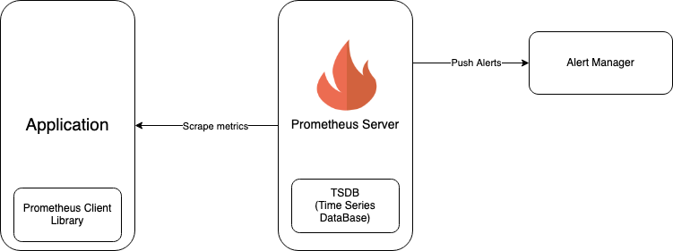](https://github.com/yolossn/Prometheus-Basics/blob/master/images/architecture.png)

Let's consider a web server as an example application. I want to extract a certain metric like the number of API calls processed by my web server. So I add certain instrumentation code using the prometheus client library and expose the metrics information. Now that my web server also exposes its metrics I want it to be scraped by prometheus. So I run prometheus separately and configure it to fetch the metrics from the web server which is listening on xyz IP address port 7500 at a specific time interval, say, every minute.

I set prometheus up and expose my web server to be accessible for the frontend or other client to use.

At 11:00 PM when I make the server open to consumption. Prometheus scrapes the count metric and stores the value as 0

By 11:01 PM one request is processed. The instrumentation logic in my code makes the count to 1. When prometheus scraps the metric the value of count is 1 now

By 11:02 PM two requests are processed and the request count is 1+2 = 3 now. Similarly metrics are scraped and stored

The user can control the frequency at which metrics are scraped by prometheus

| Time Stamp | Request Count (metric) |
| --- | --- |
| 11:00 PM | 0   |
| 11:01 PM | 1   |
| 11:02 PM | 3   |

(Note: This table is just a representation for understanding purposes. Prometheus doesn’t store the values in the exact format)

Prometheus also has a server which exposes the metrics which are stored by scraping. This server is used to query the metrics, create dashboards/charts on it etc. PromQL is used to query the metrics.

A simple Line chart created on my Request Count metric will look like this

 [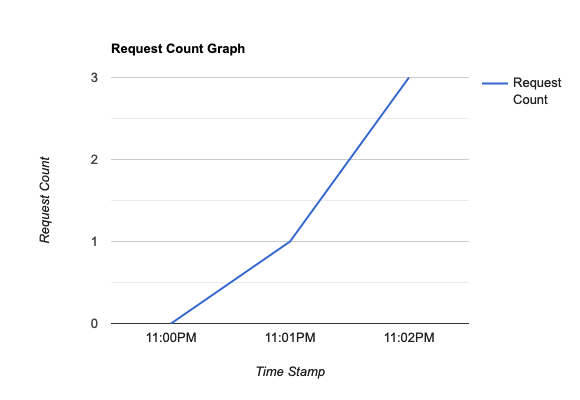](https://github.com/yolossn/Prometheus-Basics/blob/master/images/graph.png)

I can scrape multiple metrics which will be useful to understand what is happening in my application and create multiple charts on them. Group the charts into a dashboard and use it to understand what is happening in my application.

# Show me how it is done.

Let’s get our hands dirty and setup prometheus. Prometheus is written using golang and all you need is the binary compiled for your operating system. Download the binary corresponding to your operating system from [here](https://prometheus.io/download/) and add the binary to your path.

Prometheus exposes its own metrics which can be consumed by itself or another prometheus server.

Now that we have Prometheus, the next step is to run it. All that we need is just the binary and a configuration file. Prometheus uses yaml files for configuration.

*prometheus.yml*
global: scrape_interval: 15s  scrape_configs:

- job_name: prometheus  static_configs:
- targets: ["localhost:9090"]

In the above configuration file we have mentioned the scrape_interval i.e how frequently you want prometheus to scrape the metrics. We have added scrape_configs which has a name and target to scrape the metrics from. Prometheus by default listens on port 9090. So I have added it.

> prometheus --config.file=prometheus.yml

 [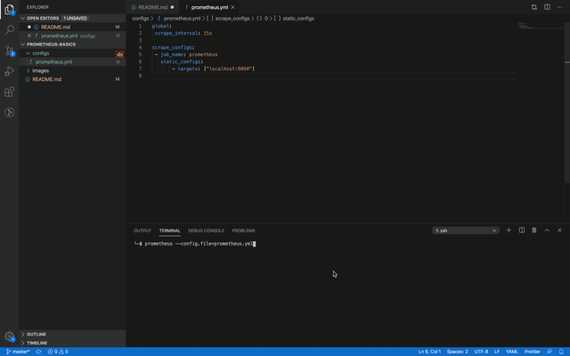](https://github.com/yolossn/Prometheus-Basics/blob/master/images/prometheus1.gif)

Now we have Prometheus up and running and scraping its own metrics every 15s. Prometheus has standard exporters available to export metrics. Next we will run a node exporter which is an exporter for machine metrics and scrape the same using prometheus. Download node metrics exporter from [here](https://prometheus.io/download/#node_exporter)

There are many standard exporters available like node exporter you can find them [here](https://prometheus.io/docs/instrumenting/exporters)

**Run the node exporter in a terminal.**
> ./node_exporter

 

Next Add node exporter to the list of scrape_configs
*node_exporter.yml*
global: scrape_interval: 15s  scrape_configs:

- job_name: prometheus  static_configs:
- targets: ["localhost:9090"] - job_name: node_exporter  static_configs:
- targets: ["localhost:9100"]

> prometheus --config.file=node_exporter.yml

 [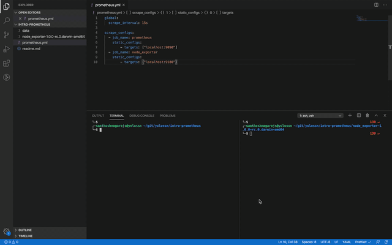](https://github.com/yolossn/Prometheus-Basics/blob/master/images/prometheus2.gif)

# Types of metrics.

There are four types of metrics which prometheus client libraries support as of May 2020. They are:

1. Counter
2. Gauge
3. Histogram
4. Summary

## Counter:

Counter is a metric value which can only increase or reset i.e the value cannot reduce than the previous value. It can be used for metrics like number of requests, no of errors etc.

> go_gc_duration_seconds_count

 

The rate() function takes the history of metrics over a time frame and calculates how fast value is increasing per second. Rate is applicable on counter values only.

> rate(go_gc_duration_seconds_count[5m])

 

## Gauge:

Gauge is a number which can either go up or down. It can be used for metrics like number of pods in a cluster, number of events in an queue etc.

> go_memstats_heap_alloc_bytes

 [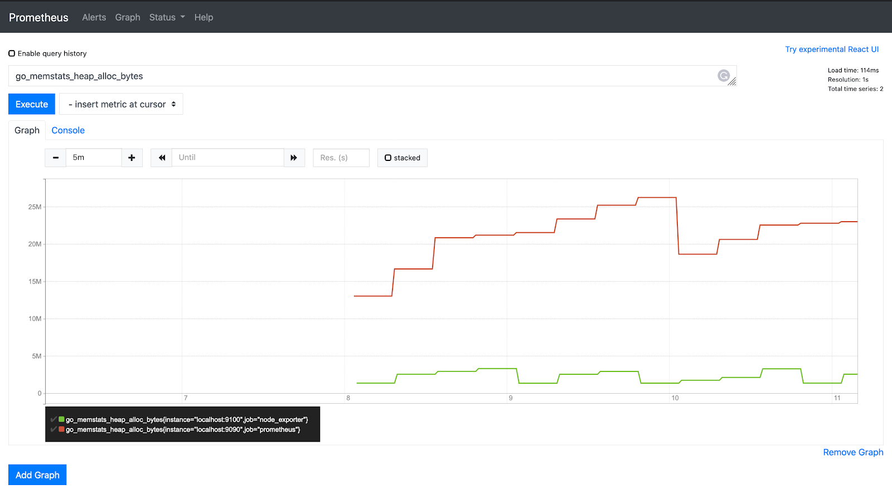](https://github.com/yolossn/Prometheus-Basics/blob/master/images/gauge_example.png)

PromQL functions like max_over_time, min_over_time and avg_over_time can be used to query gauge metrics

## Histogram

Histogram is a little complex metric type when compared to the ones we have seen. Histogram can be used for any calculated value which is counted based on bucket values, the buckets can be configured by the user. It is a cumulative metric and provides sum of all the values by default. This is applicable for metrics like request time, cpu temperature etc

Example: I want to observe the time taken to process api requests. Instead of storing the request time for each request, histogram metric allows us to approximate and store frequency of requests which fall into particular buckets. I define buckets for time taken like 0.3,0.5,0.7,1,1.2. So these are my buckets and once the time taken for a request is calculated I add the count to all the buckets which are higher than the value.

Lets say Request 1 for endpoint “/ping” takes 0.25 s. The count values for the buckets will be.

> /ping

| Bucket | Count |
| --- | --- |
| 0 - 0.3 | 1   |
| 0.3 - 0.5 | 1   |
| 0.5 - 0.7 | 1   |
| 0.7 - 1 | 1   |
| 1 - 1.2 | 1   |
| +Inf | 1   |

Note: +Inf bucket is added by default.

(Since histogram is a cumulative frequency 1 is added to all the buckets which are greater than the value)

Request 2 for endpoint “/ping” takes 0.4s The count values for the buckets will be this.

> /ping

| Bucket | Count |
| --- | --- |
| 0 - 0.3 | 1   |
| 0.3 - 0.5 | 2   |
| 0.5 - 0.7 | 2   |
| 0.7 - 1 | 2   |
| 1 - 1.2 | 2   |
| +Inf | 2   |

Since 0.4 lies in the seconds bucket(0.3-0.5) all the buckets above the calculated values count is increased. Histogram is used to find average and percentile values.

Let's see a histogram metric scraped from prometheus and apply few functions.
> prometheus_http_request_duration_seconds_bucket{handler="/graph"}

 [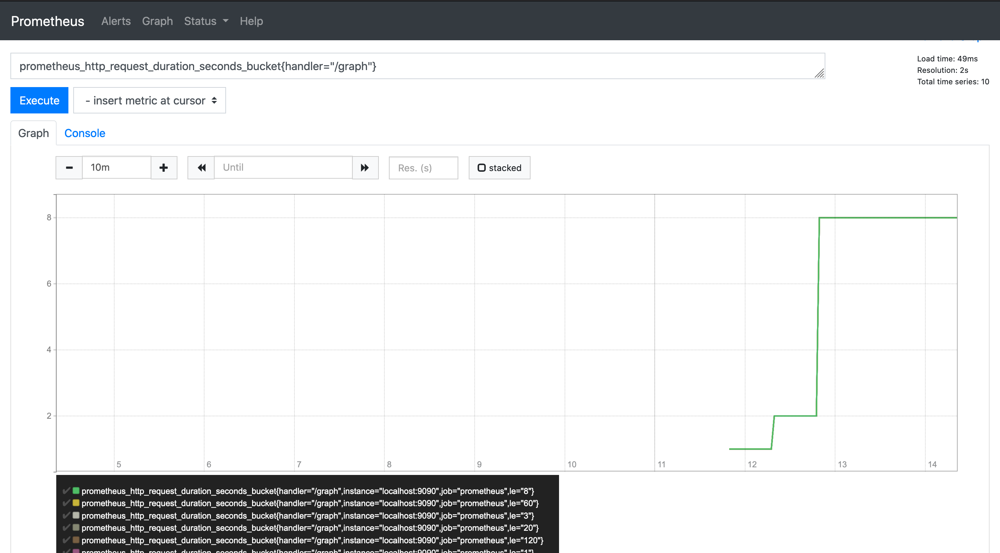](https://github.com/yolossn/Prometheus-Basics/blob/master/images/histogram_example.png)

histogram_quantile() function can be used to calculate calculate quantiles from histogram

 [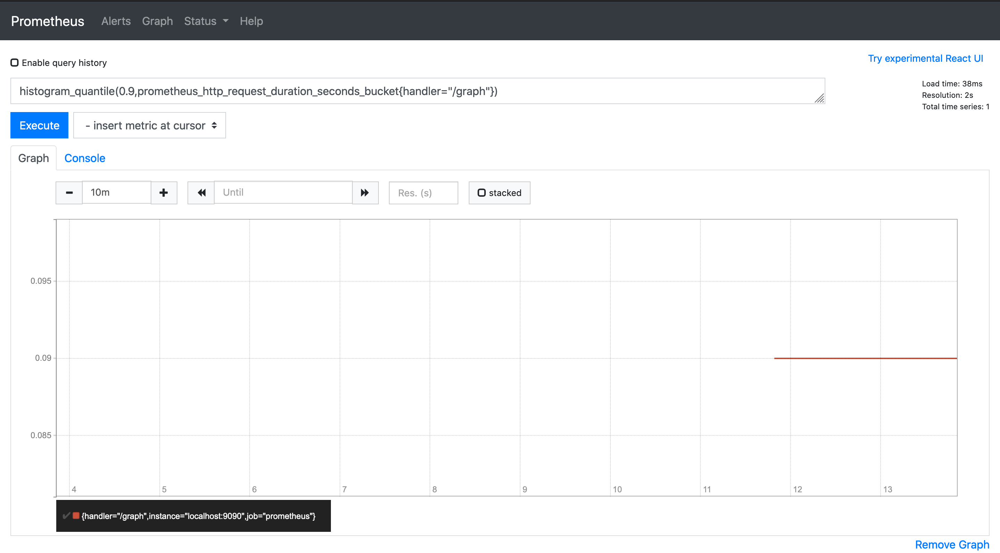](https://github.com/yolossn/Prometheus-Basics/blob/master/images/histogram_quantile_example.png)

The graph shows that the 90th percentile is 0.09, To find the histogram_quantile over last 5m you can use the rate() and time frame

> histogram_quantile(0.9, rate(prometheus_http_request_duration_seconds_bucket{handler="/graph"}[5m]))

 [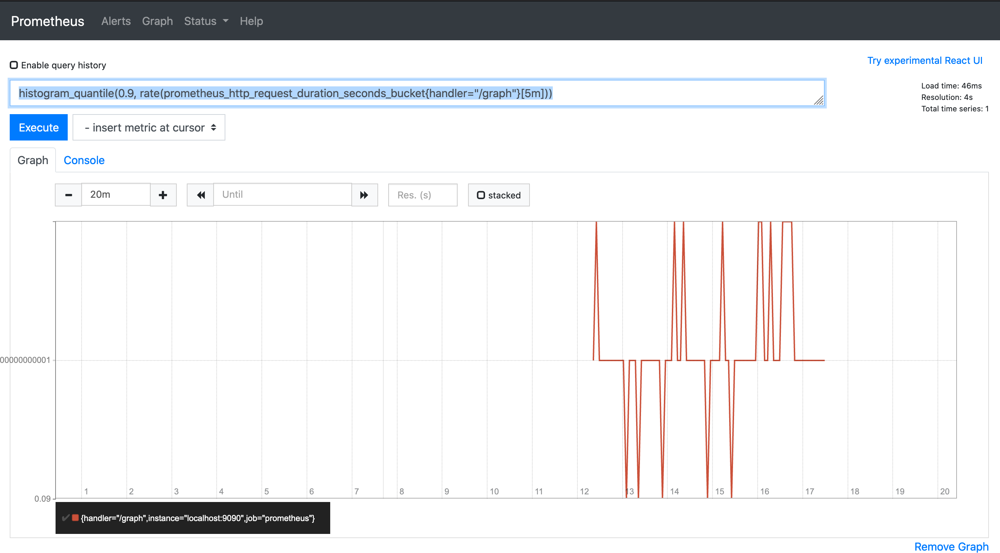](https://github.com/yolossn/Prometheus-Basics/blob/master/images/histogram_rate_example.png)

## Summary

Summary is similar to histogram and calculates quantiles which can be configured, but it is calculated on the application level hence aggregation of metrics from multiple instances of the same process is not possible. It is used when the buckets of a metric is not known beforehand and is highly recommended to use histogram over summary whenever possible. Calculating summary on the application level is also quite expensive and it is not recommended to be used.

### Short Summary on Metric Types:

 [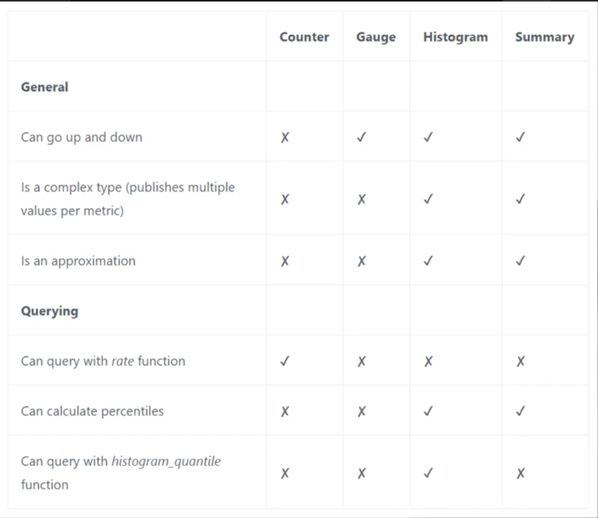](https://github.com/yolossn/Prometheus-Basics/blob/master/images/summary_of_metric_types.png)

[Source](https://www.youtube.com/watch?v=nJMRmhbY5hY)

# Create a simple exporter

We will create a request counter metric exporter using golang.
*server.go*

package main import ( "fmt"  "net/http") func  ping(w http.ResponseWriter, req  *http.Request){ fmt.Fprintf(w,"pong")

} func  main() { http.HandleFunc("/ping",ping) http.ListenAndServe(":8090", nil)

}

We have a simple server which when hit on localhost:8090/ping endpoint sends back pong

 

Now we will add a metric to the server which will instrument the number of requests made to the ping endpoint.

We will use the counter metric type for this as we know the request count doesn’t go down and only increases.

Create a prometheus counter
var  pingCounter  =  prometheus.NewCounter(

prometheus.CounterOpts{ Name: "ping_request_count", Help: "No of request handled by Ping handler",

},
)

Next we update the ping Handler to increase the count of the counter using `pingCounter.Inc()`.

func  ping(w http.ResponseWriter, req  *http.Request) { pingCounter.Inc() fmt.Fprintf(w, "pong")

}
Next we register the counter to the Default Register and expose the metrics.

func  main() { prometheus.MustRegister(pingCounter) http.HandleFunc("/ping", ping) http.Handle("/metrics", promhttp.Handler()) http.ListenAndServe(":8090", nil)

}

The `prometheus.MustRegister` function registers the pingCounter to the default Register. To expose the metrics the golang prometheus client library provides the promhttp package.`promhttp.Handler()` provides a `http.Handler` which exposes the metrics registered in the Default Register.

*serverWithMetric.go*

package main import ( "fmt"  "net/http"  "github.com/prometheus/client_golang/prometheus"  "github.com/prometheus/client_golang/prometheus/promhttp") var  pingCounter  =  prometheus.NewCounter(

prometheus.CounterOpts{ Name: "ping_request_count", Help: "No of request handled by Ping handler",

},

) func  ping(w http.ResponseWriter, req  *http.Request) { pingCounter.Inc() fmt.Fprintf(w, "pong")

} func  main() { prometheus.MustRegister(pingCounter) http.HandleFunc("/ping", ping) http.Handle("/metrics", promhttp.Handler()) http.ListenAndServe(":8090", nil)

}

Now hit the localhost:8090/ping endpoint a couple of times and sending a request to localhost:8090 will provide the metrics.

 [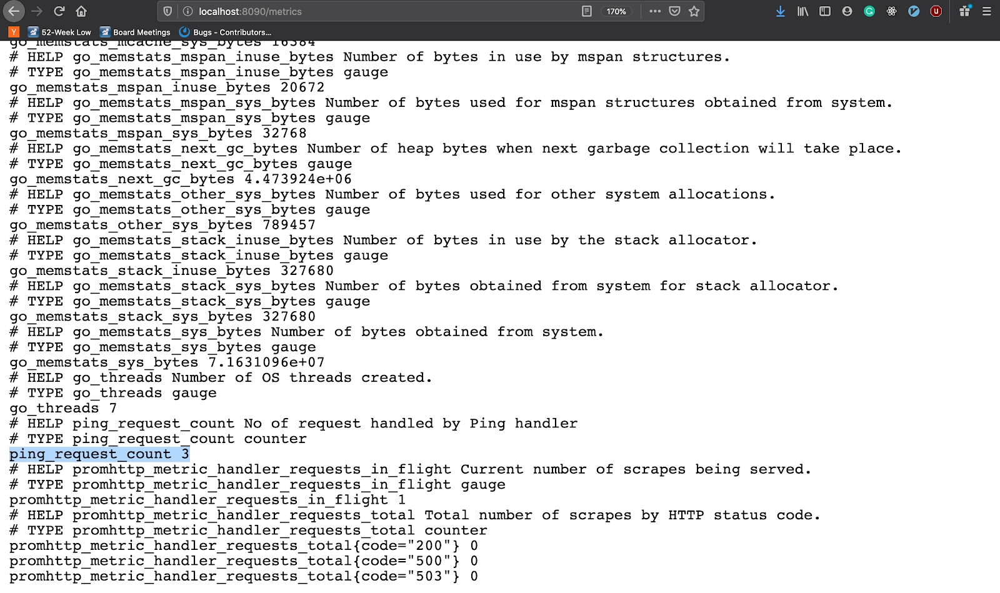](https://github.com/yolossn/Prometheus-Basics/blob/master/images/ping_count.png)

Here the ping_request_count shows that `/ping` endpoint was called 3 times.

The DefaultRegister comes with a collector for go runtime metrics and that is why we see other metrics like go_threads, go_goroutines etc.

We have built our first metric exporter. Let’s update our prometheus config to scrape the metrics from our server.

*simple_server.yml*
global: scrape_interval: 15s  scrape_configs:

- job_name: prometheus  static_configs:
- targets: ["localhost:9090"] - job_name: simple_server  static_configs:
- targets: ["localhost:8090"]

> prometheus --config.file=simple_server.yml

 [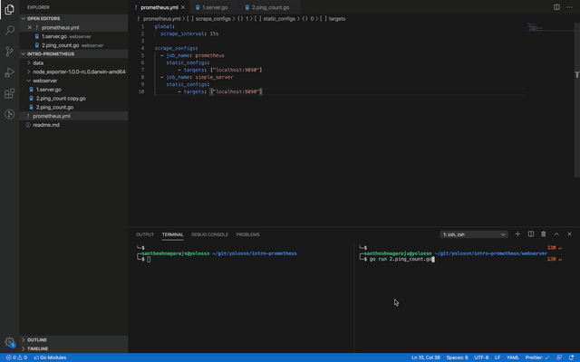](https://github.com/yolossn/Prometheus-Basics/blob/master/images/prometheus3.gif)

Note:

- Make sure the authentication mechanism used by your application is supported by prometheus
- `promhttp.Handler` gzips the response, If you are using a gzip middleware then you must implement some skipper logic to avoid compressing the response twice.

Now that we have our server with `ping_request_count` metric let's create a visualization dashboard. For this, we will use [Grafana](https://grafana.com/). If you wonder why should one use Grafana when we can create graphs using Prometheus. The answer is that the graph that we use to visualize our queries is used for ad-hoc queries and debugging. Prometheus official docs suggest using Grafana or Console Templates for graphs. [Refer](https://prometheus.io/docs/visualization/browser/)

Console Templates is a way to create graphs using golang templates which I am not covering as it has a learning curve. Grafana is an analytics platform that allows you to query,visualize, and set alerts on your metrics. Comparatively Grafana is easy to use for a beginner.

Install Grafana by following the steps for your operating system from [here](https://grafana.com/docs/grafana/latest/installation/requirements/#supported-operating-systems).

Once Grafana is installed successfully go to [localhost:3000](http://localhost:3000/) and Grafana dashboard should be visible. The default username and password is `admin`.

 [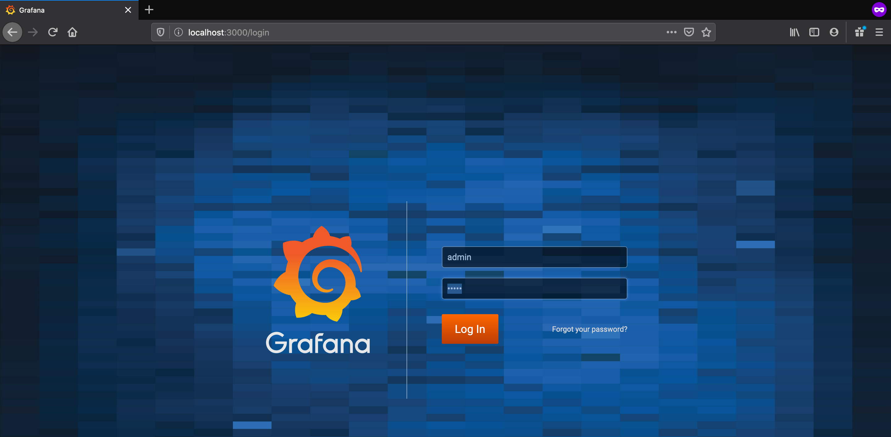](https://github.com/yolossn/Prometheus-Basics/blob/master/images/grafana_login.png)

Let's add a source to grafana by clicking on the gear icon in the side bar and select Data Sources.

> ⚙>  > Data Sources

 [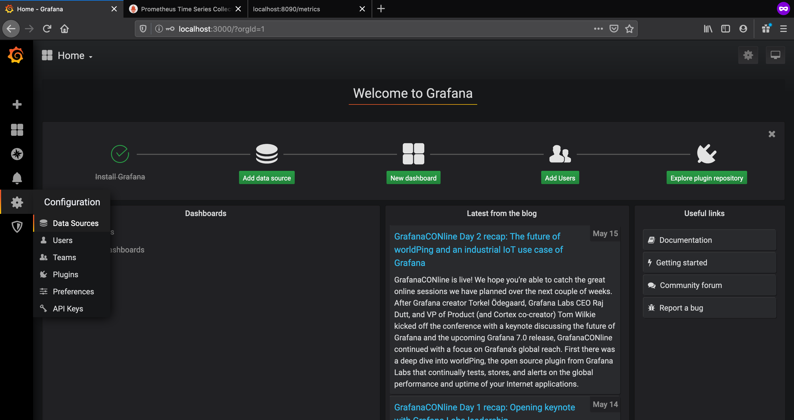](https://github.com/yolossn/Prometheus-Basics/blob/master/images/grafana_add_source.png)

If you see Grafana also supports multiple data sources other than Prometheus like graphite, postgreSQL etc.

> Adding Prometheus as Data Source

 [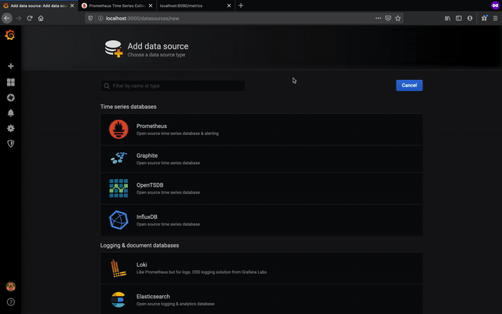](https://github.com/yolossn/Prometheus-Basics/blob/master/images/grafana1.gif)

Now we have successfully added Prometheus as our data source.
> Creating our first dashboard

 

Tada  We have created our first dashboard using Grafana.

I hope I did justice to your time and helped you understand the basics of prometheus.

**Where to go from here:**

- It is important to understand PromQL extensively to take advantage of the metrics which one has collected. Remember the goal is not just to collect metrics but to derive answers for application related questions. [This](https://medium.com/@valyala/promql-tutorial-for-beginners-9ab455142085) is a very good resource to get started with PromQL.

To Do

- Integration with grafana to create dashboards
- Add code samples for all metric types.
- Explain about the concept of Service Discovery for integrating with kubernetes.
- Basic Alerting + Prometheus alerts vs Grafana alerts.
- Integrating alerts with tool like pagerduty.

### References:

- https://prometheus.io/docs/
- https://www.robustperception.io/how-does-a-prometheus-histogram-work
- https://www.robustperception.io/how-does-a-prometheus-summary-work
- https://www.robustperception.io/how-does-a-prometheus-gauge-work
- https://www.robustperception.io/how-does-a-prometheus-counter-work
- https://www.youtube.com/watch?v=nJMRmhbY5hY
- https://godoc.org/github.com/prometheus/client_golang/prometheus